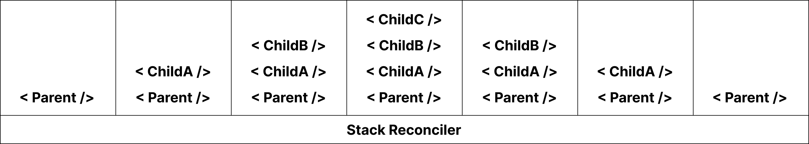
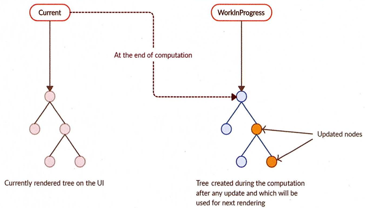

React Fiber라는 아키텍처는 React 16버전부터 Fiber Reconciliation로 변경되었다. 이전에는 Stack Reconciliation을 사용하고 있었다.

어떤 이유로 기존의 스택 재조정자를 파이버 재조정자로 변경하게 되었는지, 각각의 특징은 무엇인지 알아보자.

# Reconciliation
우선 두 아키텍처의 공통점은 재조정(Reconciliation)을 하는데 스택 방식과 파이버 방식으로 나뉘어진다.

그렇다면 리액트에서 말하는 재조정이란 무엇일까?

간단하게 말하면, 리액트에서 변경된 부분만 새롭게 렌더링 하기 위해 가상 DOM과 실제 DOM을 비교하는 작업(알고리즘)이다.

리액트는 render()를 통해 리액트 엘리먼트 트리를 만들고, state나 props가 갱신되면 render()함수는 새로운 리액트 엘리먼트 트리를 반환하게 된다.

n개의 엘리먼트가 있는 트리를 다른 트리로 변환하는 알고리즘의 복잡도는 최소 O(n^3) 가진다.

이는 너무 비싼 연산이므로 리액트에서는 두 가지 가정을 통해 O(n)의 복잡도를 가지는 휴리스틱 알고리즘을 구현했다.

1. 서로 다른 타입의 두 엘리먼트는 서로 다른 트리를 만들어낸다.
2. 개발자가 `key` prop을 통해, 여러 렌더링 사이에서 어떤 자식 엘리먼트가 변경되지 않아야 할지 표시해 줄 수 있다.

조금 더 쉽게 설명하면 다음과 같다.

1. 이전과 다른 타입의 리액트 엘리먼트로 교체하면, 하위 트리는 더 이상 비교하지 않고 리액트 엘리먼트 전체를 교체한다.
2. `key`가 동일한 리액트 엘리먼트는 이전과 동일한 엘리먼트로 취급한다.

## 엘리먼트 타입 비교 방식
리액트는 두 개의 트리를 비교할 때 루트(root) 엘리먼트부터 비교하기 때문에 `루트 엘리먼트 타입`에 따라 바뀐다.

### 엘리먼트 타입이 다른 경우
```jsx
 <div>
   <Element/> // LagacyElement
 </div>

 <span>
   <Element/> // NewElement
 </span>
```
여기서 두 트리의 루트 엘리먼트는 `div`에서 `span`으로 변경됐다.

따라서 엘리먼트 타입이 다르므로 div안에 있는 `Element`는 변하지 않아도 비교하지 않고 새로운 `Element`로 마운트된다. (이러한 이유로 부모가 변경되면 리렌더링이 일어나는 것 같다)

### 엘리먼트 타입이 같은 경우
```html
<div className="before" title="stuff" />

<div className="after" title="stuff" />
```
두 리액트 엘리먼트는 같은 타입이므로, 동일한 속성은 유지하고 변경된 속성들만 갱신한다.

이후 리액트는 해당 노드의 자식들을 재귀적으로 처리하게 된다.

### 자식에 대한 재귀적 처리
루트 엘리먼트가 같으면 이제 자식들을 재귀적으로 처리하는데, 기본적으로 동시에 두 리스트릴 순회하고 차이점이 있으면 변경한다.

두 트리에서 자식 끝에 새로운 엘리먼트를 추가하면 간단하게 변경이 수행되지만, 자식 리스트의 맨 앞에 추가하면 변경할 때 성능이 좋지 않다.
```html
<ul>
  <li>Duke</li>
  <li>Villanova</li>
</ul>

<ul>
  <li>Connecticut</li>
  <li>Duke</li>
  <li>Villanova</li>
</ul>
```
성능이 좋지 않은 이유는 동시에 두 트리를 순회하면서 변경하기 때문에 공통 부분이 있더라도 모든 자식을 변경하게 된다.

이를 해결하기 위해 리액트에서는 `key` 속성을 지원하며, `key` 속성을 가지고 변경점을 확인해 변환 작업이 효율적으로 수행될 수 있다.
```html
<ul>
  <li key="2015">Duke</li>
  <li key="2016">Villanova</li>
</ul>

<ul>
  <li key="2014">Connecticut</li>
  <li key="2015">Duke</li>
  <li key="2016">Villanova</li>
</ul>
```
# Stack Reconciler
과거의 리액트(리액트 16이전)의 Reconciler 알고리즘은 스택으로 이뤄져 있었다.

스택이라는 이름처럼 하나의 스택에 렌더링에 필요한 작업들이 쌓이게 되고, 이 스택이 빌 때까지 동기적으로 작업이 이루어진다.

Stack Reconciler의 동기적으로 리렌더링하는 과정은 다음과 같다.

1. DOMTree의 Root 엘리먼트부터 시작해서 자식 엘리먼트(컴포넌트)까지 재귀로 모든 컴포넌트에 `.render()`를 호출한다. (엘리먼트 트리 만드는중)
2. VirtualDOM에 변경된 사항을 확인한다.
3. 그 중 업데이트(변경점이 있는)가 필요한 컴포넌트를 파악한다.
4. 해당 컴포넌트와 모든 자식 컴포넌트들도 업데이트가 필요한지 파악한다. (위에서 말한 엘리먼트 타입 비교 방식에 의해)
5. 파악한 컴포넌트를 하나씩 업데이트한다.

```jsx
function Stack() {
  return (
    <Parent>
      <ChildA />
      <ChildB />
      <ChildC />
    </Parent>
  );
}
```
해당 코드가 업데이트 된다면 이미지처럼 동작한다.



한 번 업데이트가 진행되면 깊은 콜 스택을 만들어 동기로 진행되다보니 다른 작업이 우선시 되어 수행되고 싶어도 중단할 수 없는 문제가 발생하게 된다.

그러면 앱은 일시적으로 무반응 상태가 되거나 버벅거리게 된다.

[Stack Reconciler Example](https://claudiopro.github.io/react-fiber-vs-stack-demo/stack.html) 데모 사이트를 들어가보면 버벅거리는 현상을 볼 수 있다.

> **프레임 드랍** => 버벅거리는 현상
> 
> 프레임 속도는 연속적으로 이미지가 화면에 나타나는 빈도를 말한다.
> 
> 일반적으로 우리 눈이 영상을 볼 때 부드럽다고 느끼려면 약 `30FPS(초당 프레임 수)`의 속도로 재생되어야 한다.
> 
> 최근 모니터들은 기본 60FPS를 제공하기 때문에 1/60 = 16.67ms 속도가 필요하며 리액트의 작업은 `16.67ms`이내에 해결해야한다.

# Fiber Reconciler
Stack Reconciler에 프레임 드랍 문제를 해결하기 위해 React 16이후 Fiber Reconciler가 등장했다.

Fiber의 목표는 다음과 같다.
- 작업을 작은 단위로 분할하고 우선 순위를 정한다. (Incremental Rendering)
- 이러한 작업은 일시 중지할 수 있고, 나중에 다시 시작할 수 있다.
- 이전에 했던 작업을 다시 재사용하거나 필요없을 경우 폐기할 수 있다.

여기서 `작업의 작은 단위`를 `Fiber`라고 부른다.

> **Incremental Rendering**
> 애플리케이션의 Concurrency를 구현하기 위해 화면 렌더링 테스크에 우선 순위를 매겨 중요한 것을 먼저 처리하는 것을 의미한다.
>
> 우선 순위는 어떻게 정의해야할까?
>
> 예를 들어 테스크가 다음과 같이 주어졌다.
> 1. API 호출의 응답 처리
> 2. 현재 진행 중인 스크롤 애니메이션 업데이트
> 3. 사용자의 버튼 클릭 처리
>
> 사용자에게 부드럽고 reactive한 UI를 제공하기 위해서는 2-3-1번 순으로 렌더 우선 순위를 매겨야한다.
>
> 2번 테스크에서 돌아가던 애니메이션이 16ms 이상 지체된다면 프레임 드랍이 발생하고 사용자는 즉시 발견하게 되기 때문에 제일 우선 순위가 높다.

Fiber는 비동기 렌더링을 지원하고, 업데이트할 컴포넌트들의 우선 순위를 [사전에 작성해둔 카테고리](https://github.com/facebook/react/blob/main/packages/react-reconciler/src/ReactFiberLane.js)를 기반으로 점수를 부여한다.

## Fiber 알고리즘
Fiber는 Reconciliation 작업을 2단계로 나눠서 실행한다.

1. Render Phase - 2개의 Fiber 트리(current와 workInProgress)를 비교하고 변경된 Effect들을 수집 및 트리에 표시하는 작업을 한다. (비동기 작업)
또한 Render Phase에서는 일시 정지 및 다시 시작할 수 있고, 우선 순위에 따라 더 우선시 되는 작업이 실행된다.
즉, Effect들을 수집하여 새로운 Fiber 트리를 만드는 것이 목표다.
2. Commit Phase - Render Phase에서 만든 Fiber 트리에 표시된 Effect들을 모아 실제 DOM에 반영하는 작업을 한다. (동기 작업)
동기적으로 작업이 이루어지기 때문에 일시 정지하거나 취소할 수 없다.

## Fiber 트리
위에서 Fiber 트리는 현재 모습을 담고 있는 `current` 트리와 작업 중인 상태를 나타내는 `workInProgress` 트리가 있다고 했다.

> 트리라고 부르고 있지만 실제 Fiber는 LinkedList로 구현되어 있다.
> 
> LCRS 트리라고 부르는 구조이기 때문에 줄여서 트리라고 부른다.

Fiber 작업이 끝나면 리액트는 단순히 포인터만 변경해 `workInProgress` 트리를 `current` 트리로 바꾸는데 이러한 기술을 `더블 버퍼링`이라고 한다.

리액트에서도 미처 다 렌더링하지 못한 모습을 노출시키지 않기 위해 `더블 버퍼링` 기법을 사용하며, `더블 버퍼링`은 `커밋 단계`에서 수행된다.

> **더블 버퍼링**
> 
> 컴퓨터 그래픽 분야에서 싱글 버퍼링으로 그래픽을 그릴 경우 미처 다 그리지 못한 모습이 발생한다.
> 
> 이러한 상황을 방지하기 위해 보이지 않는 곳에서 다음으로 그려야 할 그림을 미리 그린 후 완성되면 현재 상태를 새로운 그림으로 바꾸는 기법이다.



위 그림의 순서는 다음과 같다.

1. 현재 UI 렌더링을 위해 먼저 존재하는 트리인 current를 기준으로 작업이 시작된다.
2. 만약 업데이트가 발생하면 Fiber는 새로운 workInProgress 트리를 만든다.
3. workInProgress 트리 작업이 끝나면 다음 렌더링에 이 트리를 사용한다.
4. workInProgress 트리가 UI에 렌더링되면 current가 workInProgress 트리로 변경된다.

## Fiber의 작업 순서
Fiber 알고리즘과 Fiber 트리를 이해했다면 일반적인 작동 흐름은 다음과 같다.

1. 리액트는 beginWork() 함수를 실행해 Fiber 작업을 수행한다. 더 이상 자식이 없는 Fiber를 만날 때까지 트리 형식으로 시작한다.
2. 1번에서 작업이 끝났다면 그 다음 completeWork() 함수를 실행해 Fiber 작업을 완료한다.
3. 형제가 있다면 형제로 넘어간다.
4. 2번, 3번이 모두 끝나면 return으로 돌아가 자신의 작업이 완료됐음을 알린다.

[Fiber Reconciliation Animation](https://codepen.io/ejilee/pen/eYMXJPN)

### 참고
- [리액트 공식문서 - 재조정](https://ko.legacy.reactjs.org/docs/reconciliation.html)
- [리액트 공식문서 - React v16.0](https://legacy.reactjs.org/blog/2017/09/26/react-v16.0.html#new-core-architecture)
- [리액트 공식문서 - Stack Reconciler](https://ko.legacy.reactjs.org/docs/implementation-notes.html)
- [리액트 공식문서 - Fiber Reconciler](https://ko.legacy.reactjs.org/docs/codebase-overview.html#fiber-reconciler)
- [React Fiber Architecture](https://github.com/acdlite/react-fiber-architecture)
- [An Introduction to React Fiber - The Algorithm Behind React](https://www.velotio.com/engineering-blog/react-fiber-algorithm)
- [Inside Fiber: in-depth overview of the new reconciliation algorithm in React](https://angularindepth.com/posts/1008/inside-fiber-in-depth-overview-of-the-new-reconciliation-algorithm-in-react)
- [The how and why on React’s usage of linked list in Fiber to walk the component’s tree](https://medium.com/react-in-depth/the-how-and-why-on-reacts-usage-of-linked-list-in-fiber-67f1014d0eb7)
- [Naver D2 - React 파이버 아키텍처 분석](https://d2.naver.com/helloworld/2690975)
- [React Deep Dive — Fiber](https://blog.mathpresso.com/react-deep-dive-fiber-88860f6edbd0)
- [[번역] A deep dive into React Fiber internals](https://bumkeyy.gitbook.io/bumkeyy-code/frontend/a-deep-dive-into-react-fiber-internals)
- [React 효율 개선을 위한 Fiber Reconciler](https://jasonkang14.github.io/react/what-is-fiber-architecture)
- [리액트를 까보자](https://medium.com/@cksal4785911/%EB%A6%AC%EC%95%A1%ED%8A%B8%EB%A5%BC-%EA%B9%8C%EB%B3%B4%EC%9E%90-fbcc5b9c9e00)
- [[React] Fiber 아키텍처의 개념과 Fiber Reconciliation 이해하기](https://m.blog.naver.com/dlaxodud2388/223195103660)
- [모던 리액트 deep dive]()