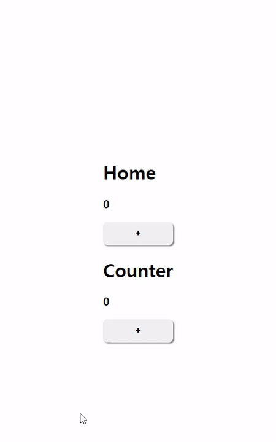
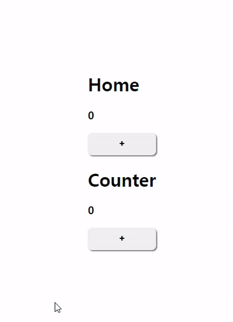
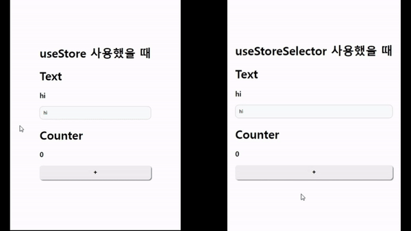

상태를 관리할 때 상태의 위치에 따라 관리할 수 있는 방법이 다르다.

## useState와 useReducer
가장 기본적인 방법은 `useState`와 `useReducer`로 상태를 생성하고 관리할 수 있다.

다음은 `useState`로 `useCounter`라는 Custom Hook을 만든 코드다.
```tsx
function useCounter(initCount: number = 0) {
  const [counter, setCounter] = useState(initCount);
  
  function inc() {
	setCounter(prev => prev + 1); 
  }
  
  return {counter, inc};
}

function Counter1() {
  const { counter, inc } = useCounter();
  
  return (
  	<>
      <h3>Counter1: {counter}</h3>
      <button onClick={inc}>+</button>
    </>
  )
}

function Counter2() {
  const { counter, inc } = useCounter();
  
  return (
  	<>
      <h3>Counter2: {counter}</h3>
      <button onClick={inc}>+</button>
    </>
  )
}
```
useCounter라는 훅이 없었다면 각 컴포넌트에 같은 내용을 구현해야한다.

Custom Hook을 통해 코드를 격리하여 함수형 컴포넌트라면 어디서든 손쉽게 재사용 할 수 있다.

`useReducer` 또한 지역 상태를 관리할 수 있는 훅으로, 실제로 `useState`는 `useReducer`로 구현됐다.
```tsx
type Initializer<T> = T extends any ? T | ((prev: T) => T) : never;

function useStartWithUseReducer<T>(initialState: T) {
  const [state, dispatch] = useReducer(
    (prev: T, action: Initializer<T>) =>
    	typeof action === 'function' ? action(prev) : action,
    initiaState,
    )
  
  return [state, dispatch];
}
```
`useState`를 `useReducer`로 구현한 예제다.

첫 번째 인수는 `reducer`로 action이 함수면 prev를 인자로 넘겨서 실행하고, 아니면 기존 값 그대로 반환한다.

`useReducer` 또한 `useState`로 작성할 수 있다.
```jsx
function useReducerWithUseState(reducer, initialState, initializer) { 
  const [state, setState] = useState( initializer ? () => initializer(initialState): initialState)
  
  const dispatch = useCallback(
    (action) => setState((prev) => reducer(prev, action)),
    [reducer],
  )
  
  return [state, dispatch];
}
```

약간의 구현상 차이만 있을 뿐, 두 Hook 모두 지역 상태 관리를 위해 만들어졌다.

Hook만 가지고는 상태 관리의 모든 문제를 해결해주지 않는다.

예를 들어, `useCounter`는 선언될 때마다 새롭게 초기화되어, 컴포넌트별로 상태의 파편화를 만들어버린다.

즉, 지역 상태는 해당 컴포넌트 내에서만 유효하고 서로 다른 컴포넌트에서 하나의 상태를 바라보는게 어렵다.

### state 끌어올리기
만약 2개의 서로다른 컴포넌트에서 하나의 상태 값인 counter를 동일하게 바라보기 위해서는 상태를 컴포넌트 밖으로 한 단계 끌어올리는 `state 끌어올리기`가 있다.

```tsx
function Counter1({ counter, inc }: { counter: number; inc: () => void }) {
  return (
  	<>
      <h3>Counter1: {counter}</h3>
      <button onClick={inc}>+</button>
    </>
  )
}

function Counter2({ counter, inc }: { counter: number; inc: () => void }) {
  return (
  	<>
      <h3>Counter2: {counter}</h3>
      <button onClick={inc}>+</button>
    </>
  )
}

function Parent() {
  const { counter, inc } = useCounter();
  
  return (
    <>
      <Counter1 counter={counter} inc={inc} />
      <Counter2 counter={counter} inc={inc} />
    </>
  )
}
```
이전에는 각 Counter 컴포넌트마다 `useCounter`를 사용해서 상태를 관리했었는데, 한 단계 위인 Parent 컴포넌트에서 `useCounter`를 사용해서 하위 컴포넌트의 props로 제공했다.

이렇게 해줌으로써 하나의 `useCounter`를 사용해 두 컴포넌트에서 동일한 상태를 관리할 수 있다.

상태 끌어올리기를 통해 문제를 해결할 수 있었지만, 하나의 컴포넌트에서 사용중이던 상태가 다른 컴포넌트에서 동일한 상태로 사용되어야할 경우 부모 컴포넌트로부터 props 형태로 전달 받아야한다는 점은 좋지 못하다.

만약 서로 다른 컴포넌트의 부모가 최상위 컴포넌트일 경우 props로 전달하게 되면 props drilling 이슈가 발생할 수 있다. (컴포넌트 트리를 재설계해야할 수도 있다.)

> Props Drilling이란?
>
> Props를 상위 컴포넌트에서 하위 컴포넌트로 전달하는 것을 의미한다.
>
> 만약 props로 전달하는 개수가 10개 이상으로 많은 과정을 거치게 되면 해당 props를 추적하기 힘들어지는 문제가 발생하게 된다.

## useState의 상태를 바깥으로 분리
리액트에서 제공하는 `useState`가 아닌, 아예 외부로 `counter.ts`라는 파일을 만들고 `useState`와 동일하게 동작하도록 코드를 짜서 직접 상태를 관리하면 어떨까?

이러한 방식은 `리액트 환경`에서 동작하지 않는다.

코드 상으로 문제가 없지만, 여기서 가장 큰 문제는 상태가 변경됐을 때 컴포넌트가 리렌더링되지 않는다는 점이다.

그럼 `useState`를 리렌더링하는 역할로 잡고, 상태는 외부 파일에서 관리하면 어떨가?
```ts
// counter.ts
export type State = { counter: number };

let state: State = {
  counter: 0,
};

export function get(): State {
  return state;
}

type Initializer<T> = T extends unknown ? T | ((prev: T) => T) : never;

export function set<T>(nextState: Initializer<T>) {
  state = typeof nextState === 'function' ? nextState(state) : nextState;
}

// Counter.tsx
const Counter = () => {
  const state = get();
  const [count, setCount] = useState(state);

  function handleClick() {
    set((prev: State) => {
      const newState = { counter: prev.counter + 1 };
      setCount(newState);
      return newState;
    });
  }
  return (
    <>
      <h1>Counter</h1>
      <h3>{count.counter}</h3>
      <button onClick={handleClick}>+</button>
    </>
  );
};

// Home.tsx
const Home = () => {
  const state = get();
  const [count, setCount] = useState(state);

  function handleClick() {
    set((prev: State) => {
      const newState = { counter: prev.counter + 1 };
      setCount(newState);
      return newState;
    });
  }
  return (
    <>
      <h1>Home</h1>
      <h3>{count.counter}</h3>
      <button onClick={handleClick}>+</button>
      <Counter />
    </>
  );
};
```



여기서 문제점은 상태가 외부 파일에서 관리되고 있지만, 리렌더링을 위해 각 컴포넌트 내부에 동일한 useState가 존재해 비효율적인 방식이다.

또한 실제로 버튼을 클릭하면 setState로 인해 상태가 변했을 때 리렌더링이 발생해 값이 변하는 것을 볼 수 있고, 같은 상태를 공유하고 있지만 동시에 렌더링이 되지 않는 문제가 발생한다.

`useState`로 컴포넌트를 리렌더링해서 최신값을 가져오는 방식은 해당 컴포넌트 내에서만 유효하다. 따라서 반대쪽에 있는 다른 컴포넌트에서는 여전히 리렌더링을 일으킬게 없기 때문에 버튼을 클릭해도 다른 컴포넌트는 렌더링이 되지 않는다.

이러한 한계를 통해 함수 외부에서 상태를 참조하고 이를 통해 렌더링까지 일어나려면 다음과 같은 조건이 만족해야한다.

1. window나 global에 있을 필요는 없지만 외부 어딘가에 상태를 두고 여러 컴포넌트가 같이 쓸 수 있어야 한다.
2. 외부에 있는 상태를 사용하는 컴포넌트는 상태의 변경을 알아챌 수 있어야 하고, 상태가 변경될 때마다 리렌더링이 일어나야 한다. 또한 이 상태 감지는 상태를 참조하는 모든 컴포넌트에서 동일하게 작동해야 한다.
3. 상태가 원시 값이 아닌 객체인 경우, 객체안에 현재 사용중이지 않는 값이 변하더라도 리렌더링이 발생해서는 안된다.
예를 들어, `{a: 1, b: 2}`라는 객체 상태가 있고, 컴포넌트에서 a를 2로 업데이트 했을 때 b만 참조하고 있는 컴포넌트에서는 리렌더링이 일어나면 안된다.

### 외부 상태 관리 - createStore
위 조건을 만족시키는 외부 상태 관리를 만들어보자.

```ts
type Initializer<T> = T extends unknown ? T | ((prev: T) => T) : never;

type Store<State> = {
  get: () => State // 항상 최신 값을 가져옴
  set: (action: Initializer<State>) => State // 기존 useState와 동일한 역할
  subscribe: (callback: () => void) => () => void // 해당 store의 변경을 감지하고 싶은 컴포넌트들을 등록
};

export const createStore = <State>(
  initialState: Initializer<State>,
): Store<State> => {
  // store 내부에서 상태 관리
  let state = typeof initialState !== 'function' ? initialState : initialState();

  // 콜백 함수를 저장하는 곳
  const callbacks = new Set<() => void>();

  const get = () => state;
  const set = (nextState: State | ((prev: State) => State)) => {
    state = typeof nextState === 'function' ? (nextState as (prev: State) => State)(state) : nextState;

    // 값이 변경됐으므로 콜백 목록을 순회하면서 모든 콜백을 실행한다.
    callbacks.forEach((callback) => callback());

    return state;
  }

  // 
  const subscribe = (callback: () => void) => {
    // 콜백 등록
    callbacks.add(callback);

    // 클린업 실행 시 삭제해 반복적으로 추가되는 것 방지
    return () => {
      callbacks.delete(callback);
    }
  }

  return {get, set, subscribe};
}
```
`craeteStore`는 자신이 관리해야하는 상태를 내부 변수(state)로 가진 후, get 함수로 해당 변수의 최신 값을 가져올 수 있다.

또한 set 함수로 내부 변수를 최신 값으로 변경할 수 있고, 이 과정에서 등록된 콜백을 모조리 실행함으로써 컴포넌트의 렌더링을 유도한다.

### useStore

이제 `createStore`로 만들어진 store의 값을 참조하고, 이 값에 변경에 따라 컴포넌트 렌더링을 발생시킬 사용자 정의 훅 `useStore`를 만들어보자.

```ts
// useStore.tsx
const useStore = (store: Store<State>) => {
  // 컴포넌트의 렌더링 유도
  const [state, setState] = useState<State>(() => store.get());

  useEffect(() => {
    const unsubscribe = store.subscribe(() => {
      setState(store.get());
    })

    return unsubscribe;
  }, [store])
  return [state, store.set] as const;
}
```
여기서 중요한 점은 useEffect 안에 작성된 부분이다.

useEffect는 store의 현재 값을 가져와 setState를 subscribe에 콜백 함수로 등록했다.

그 이유는 store 내부에서 값이 변경될 때마다 등록된 모든 callback함수를 실행하고, useStore에서 store 값이 변경되면 useEffect에서 감지하게 된다.

store의 값이 변경될 때마다 state의 값이 변경되는 것을 보장할 수 있다.

또한 클린업 함수를 통해 useEffect의 작동이 끝난 이후에는 콜백에서 해당 함수를 제거해 계속 쌓이는 것을 방지할 수 있다.

```tsx
// Home.tsx
const store = createStore({ counter: 0 });

const Home = () => {
  const [state, setState] = useStore(store);

  function handleClick() {
    setState(prev => ({ counter: prev.counter + 1 }));
  }
  
  return (
    <>
      <h1>Home</h1>
      <h3>{state.counter}</h3>
      <button onClick={handleClick}>+</button>
      <Counter store={store} />
    </>
  );
};

// Counter.tsx
const Counter = (props: { store: Store<{ counter: number }> }) => {
  const { store } = props;
  const [state, setState] = useStore(store);

  function handleClick() {
    setState(prev => ({ counter: prev.counter + 1 }));
  }
  return (
    <>
      <h1>Counter</h1>
      <h3>{state.counter}</h3>
      <button onClick={handleClick}>+</button>
    </>
  );
};
```
실제로 실행해보면 store의 상태가 변경됨과 동시에 두 컴포넌트가 정상적으로 리렌더링 되는 것을 확인할 수 있다.



하지만 여기서도 문제가 발생할 수 있다.

store의 구조가 원시값이면 상관없지만 객체인 경우 일부 값만 변경한다면, 현재는 store의 값이 변경되면 무조건 리렌더링이 발생하게 된다.

### useStoreSelector

따라서 useStore에서 원하는 값만 변경됐을 때 리렌더링이 되도록 `useStoreSelector` Hook으로 수정해보자.
```tsx
export type State = { counter: number; text: string };

const useStoreSelector = (
  store: Store<State>,
  selector: (state: State) => unknown, // store 값에서 어떤 값을 가져올지 정의하는 함수
) => {
  const [state, setState] = useState(() => selector(store.get()));

  useEffect(() => {
    const unsubscribe = store.subscribe(() => {
      const value = selector(store.get());
      setState(value);
    });

    return unsubscribe;
  }, [store, selector]);
  return state;
};
```
이전 `useStore`와 차이점은 두 번째 인수로 selector라는 함수를 받는다.

setState는 값이 변경되지 않으면 리렌더링을 수행하지 않으므로 store의 값이 변경되더라도 `selector(store.get())`가 변경되지 않으면 리렌더링이 일어나지 않는다.

```tsx
// Home.tsx
const store = createStore({ counter: 0, text: 'hi' });

const Home = () => {
  return (
    <>
      <h1>useStoreSelector 사용했을 때</h1>
      <Text store={store} />
      <Counter store={store} />
    </>
  );
};

// Text.tsx
const Text = (props: { store: Store<{ counter: number; text: string }> }) => {
  const { store } = props;
  const text = useStoreSelector(
    store,
    useCallback(state => state.text, []),
  );
  function handleChange(e: ChangeEvent<HTMLInputElement>) {
    store.set(prev => ({ ...prev, text: e.target.value }));
  }

  return (
    <>
      <h1>Text</h1>
      <h3>{text}</h3>
      <input value={text} onChange={handleChange} />
    </>
  );
};

// Counter.tsx
const Counter = (props: {
  store: Store<{ counter: number; text: string }>;
}) => {
  const { store } = props;
  const counter = useStoreSelector(
    store,
    useCallback(state => state.counter, []),
  );

  function handleClick() {
    store.set(prev => ({ ...prev, counter: prev.counter + 1 }));
  }
  return (
    <>
      <h1>Counter</h1>
      <h3>{counter}</h3>
      <button onClick={handleClick}>+</button>
    </>
  );
};
```
여기서 주의할 점은 selector를 컴포넌트 밖에 선언하거나, 밖에 선언이 안된다면 useCallback을 사용해 참조를 고정시켜줘야한다. 만약 이를 해주지 않으면 컴포넌트가 리렌더링될 때마다 함수도 계속 재생성되어 리렌더링이 발생할 것이다.



이제 select해서 필요한 값만 변경됐을 때 리렌더링이 발생한다.

React 외부 상태 관리 훅을 직접 구현해보면서 값을 어떻게 관리해야하고, 상태의 변경에 대한 추적과 리렌더링이 발생되는 과정에 대해 알아봤습니다.