CSR과 SSG 렌더링 방식의 배포는 대부분 SSR 배포와는 다르게 어렵지 않다.

SSR렌더링 방식을 지원하는 Next.js에서 App Router를 배포해보는 방식에 대해 알아보려고한다.

# SaaS 서비스
SaaS란 Software as a Service의 줄임말로  브라우저를 통해 사용자에게 애플리케이션을 제공하고, 해당 서비스를 사용하면 서비스 유지 관리 방식이나 인프라 관리 방식에 대해 고민할 필요 없이 사용이 가능하다.

주로 이러한 SaaS 서비스는 정적 사이트를 쉽게 배포할 수 있다.
## Netlify
대표적으로 Netlify는 프론트엔드 스택(JAMstack)으로만 구성된 정적 애플리케이션을 배포하는 용도로 최적화된 서비스다.

### 추가 기능
배포외에도 추가 기능을 제공해준다.

- 알림: 배포와 관련된 알림을 제공, 배포 성공 및 실패와 같은 내용들
- 도메인 연결: 별도로 구매한 외부 도메인을 Netlify DNS를 통해 연결 가능
- 서비스 통합(Integrations): 다양한 서비스를 프로젝트와 연계 가능
- 서버리스 함수: 별도의 서버 구축 없이 서버에서 실행할 수 있는 함수 사용 가능
- Identity: 인증이 포함된 웹서비스를 쉽게 처리 가능
- 사용자 초대: 한 번 생성된 팀으로 다른 개발자를 초대해 동시에 관리 가능

## 가격
기본적으로 무료지만 몇가지 제약 사항이 존재한다.
- 대역폭: 월 대역폭이 최대 100GB로 제한
- 빌드 시간: 빌드에 소비할 수 있는 시간이 최대 300분
- 동시 빌드: 한 번에 한 곳만 빌드 가능

## Vercel
Vercel은 Next.js를 비롯한 Turborepo, SWC를 만든 회사이며, 클라우드 플랫폼 서비스다.

Vercel은 Next.js 프로젝트를 별도의 설정 없이 쉽게 배포할 수 있다.

### 추가 기능

- 알림: 특정 타깃 브랜치에 커밋이나 PR이 발생하면 알림을 보내주는 기능
- 도메인 연결: 별도로 구매한 도메인을 연결해서 사용 가능
- Serverless Function: 서버 없이 함수를 클라우드에 구축해서 실행 가능
> 여기서 특이한 점은 Next.js에서 사용하는 app/api도 서버리스 함수로 구분되어 접근 로그나 오류 등을 확인할 수 있다.
> 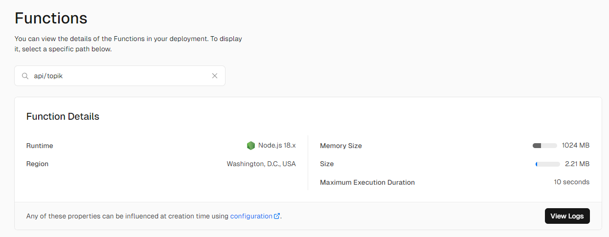
- 다양한 템플릿 지원: 별도의 코드 작성 없이 구축할 수 있는 기본적인 웹 사이트를 제공 (블로그, 쇼핑몰 등)

### 가격
무료로 사용이 가능하지만 약간의 제약이 있다.
- 대역폭: 월 대역폭이 최대 100GB로 제한
- 이미지 최적화: Vercel은 사이트에서 제공해주는 이미지 최적화를 사용하는데, 이 최적화 이미지가 1000개로 제한
- 서버리스 함수: 함수의 총 실행 시간이 100GB로 제한, 함수 실행 시간은 10초 이내로 제한(만약 10초 이상 걸리면 타임아웃 처리)
- 동시 빌드: 동시에 하나만 빌드 가능
- 배포: 하루에 100개로 제한

# AWS

## Amplify
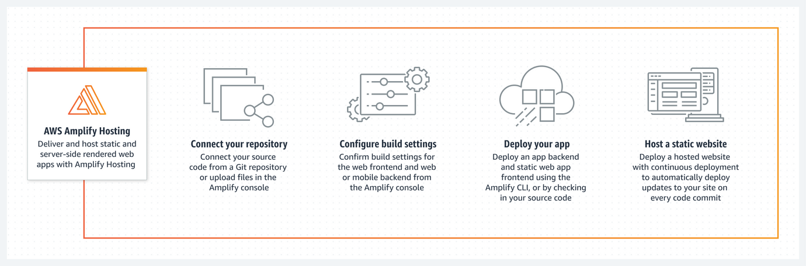

AWS 기반의 풀스택 애플리케이션을 빠르게 구성할 수 있도록 도와주는 프레임워크다.

Amplify를 이용하면 풀 스택 웹 및 모바일 애플리케이션을 손 쉽게 빌드 및 배포할 수 있다.

또한 서버리스로써 실제 사용한만큼의 비용만 지불하여 가격적인 부담도 덜 수 있다.

### 1. Amplify Hosting
다음은 실제 AWS Amplify를 통해 배포하는 과정이다.

> **AWS Amplify 콘솔에 접속하여 Amplify Hosting 시작하기 버튼을 클릭**
>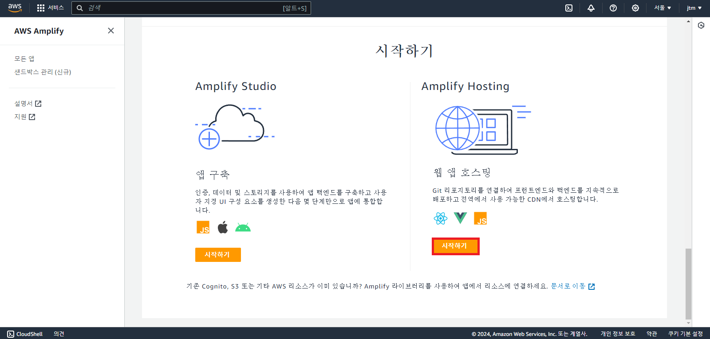

> **Next.js 프로젝트 있는 저장소를 선택 후 계속 버튼 클릭**
> 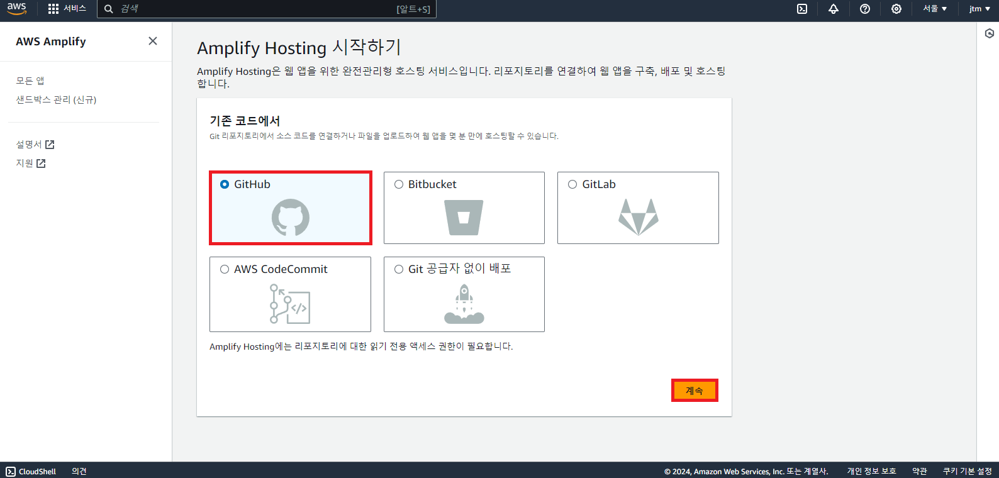

> **Github에 로그인한 뒤 AWS Amplify에게 접근 권한 허용**
> 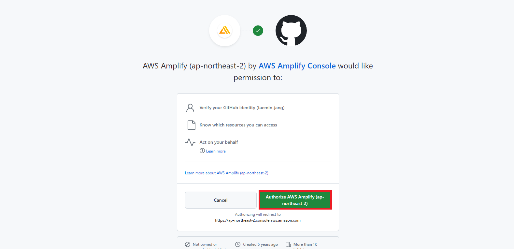

> **배포할 Next.js 프로젝트 Repository 선택**
> 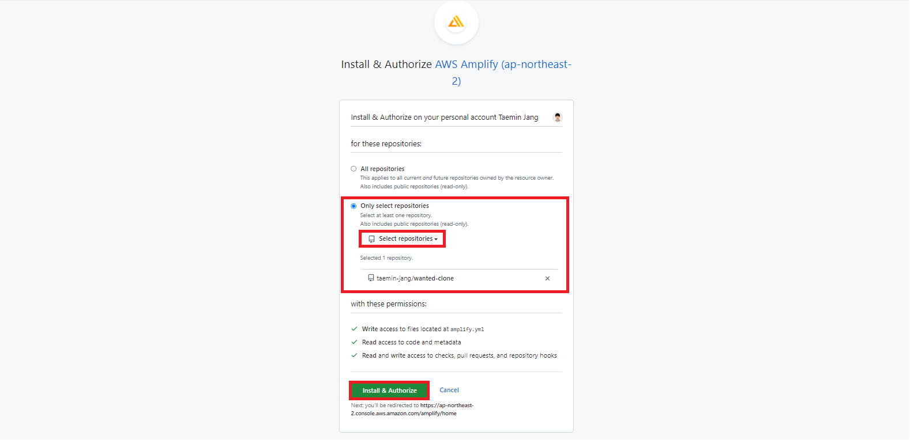

> **선택이 완료되면 AWS Amplify에서 리포지토리와 브랜치를 선택**
> 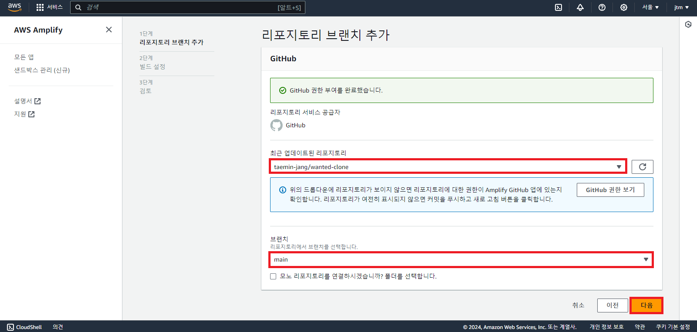

> **앱 이름 확인 후 고급 설정에서 환경 변수가 있으면 추가하고 저장 및 배포**
> [주의할 점] Next.js로 배포할 경우 환경 변수명 앞에 `NEXT_PUBLIC_`를 붙여서 사용해야한다.
> 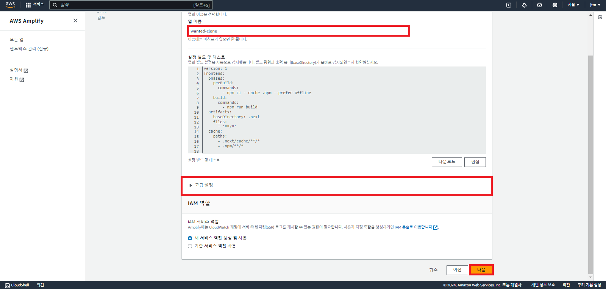

> **생성이 완료되면 Amplify가 자동으로 빌드 및 배포 진행**
> 만약 빌드가 실패되면 빌드를 눌러서 들어가면 로그 확인 가능
> 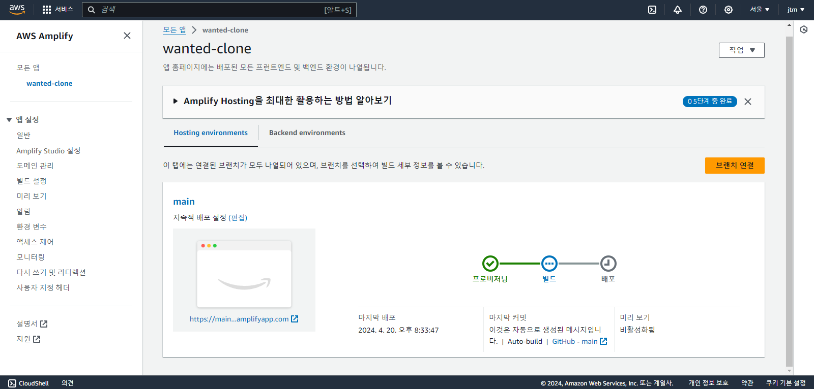

> **배포가 완료되면 아래 주소를 클릭**
> [Next.js로 개발한 원티드 클론 사이트 배포](https://main.d2vc02picn4kra.amplifyapp.com/wdlist)
> 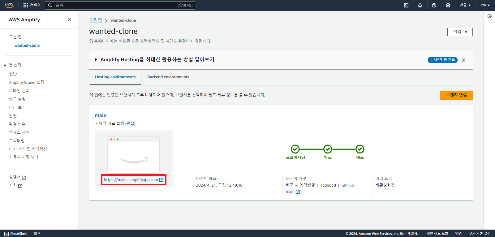

> **배포가 정상적으로 된 것을 확인**
> 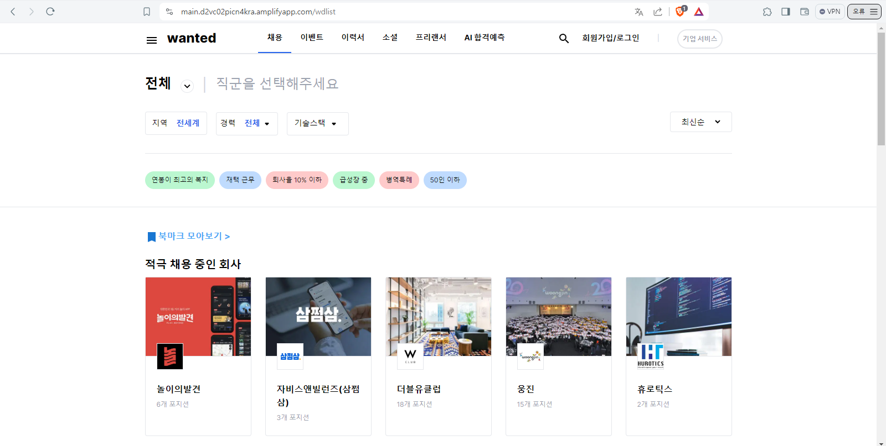

### 2. Dev 브랜치 추가
Production 단계의 배포가 아닌, 개발환경에서 배포도 관리할 수 있다.

> **Amplify 애플리케이션 대시보드에서 브랜치 연결 클릭**
> 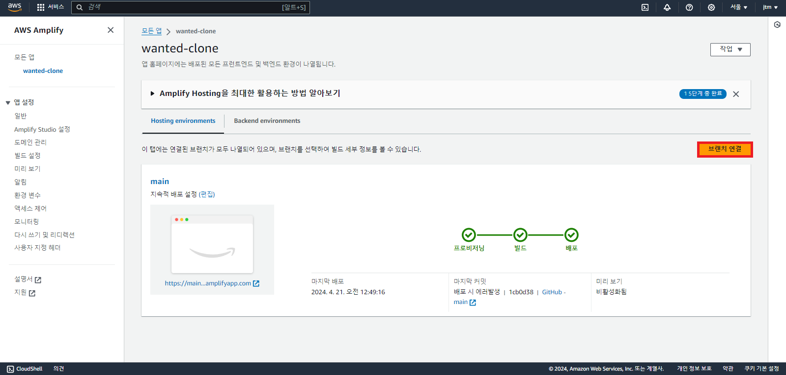

> **원하는 브랜치 선택 후 저장 및 배포 (개발 테스트를 위해 develop)**
> 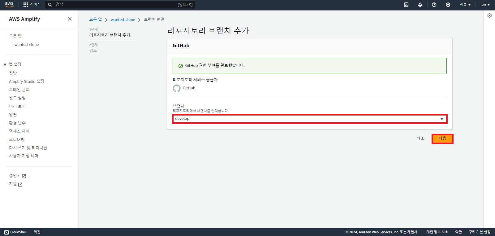

> **main 브랜치와 같이 CI/CD 파이프라인 동작을 확인 가능**
> 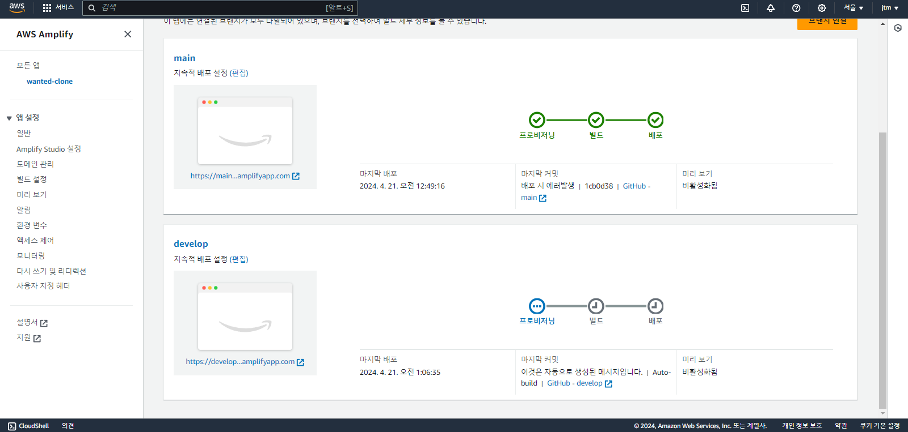

### 3. 미리 보기
Amplify는 미리 보기 기능을 제공하여, Pull Request 요청을 병합하기 전에 변경 사항을 미리 볼 수 있다.

> **미리 보기 활성화 버튼을 클릭하면 볼 수 있다**
> 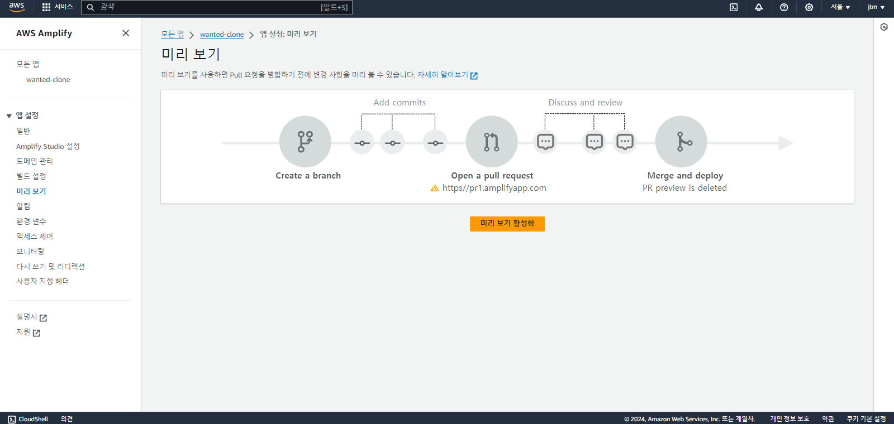

하지만 Github 애플리케이션이 설치 된 상태에서만 가능하다고 한다.

### 배포 후기
AWS Amplify로 Next.js 13 App Router를 배포해 봤다.

Amplify에 모든 기능을 사용해보진 않았지만 빌드 및 배포할 때 만큼은 어렵지 않게 배포할 수 있었다.

Amplify에서 제공하는 기능과 AWS 서비스들을 함께 이용하면 프로젝트 개발 환경을 쉽게 구축할 수 있어보인다.

**정리**
정리하자면, 서비스별로 제공하는 기능과 가격을 비교해보고 현재의 상황과 Next.js 버전등을 고려해서 판단해야한다.

한 번 선택한 서비스를 변경하는 것은 쉽지 않기 때문이다.

## 참고
- [Amplify 환경 변수](https://docs.aws.amazon.com/ko_kr/amplify/latest/userguide/environment-variables.html#amplify-console-environment-variables)