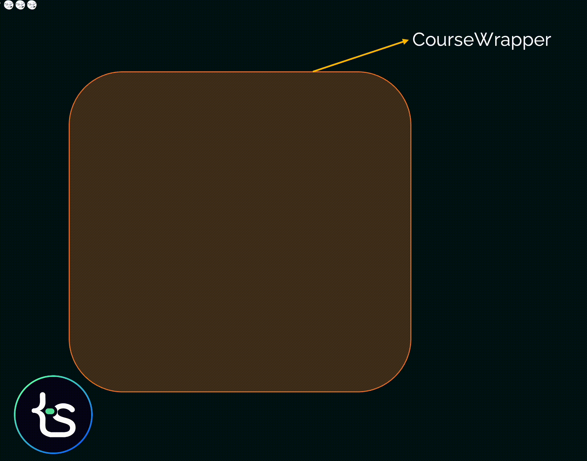
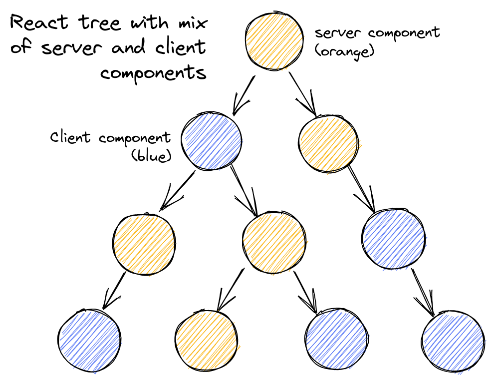
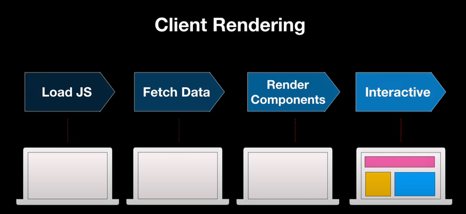
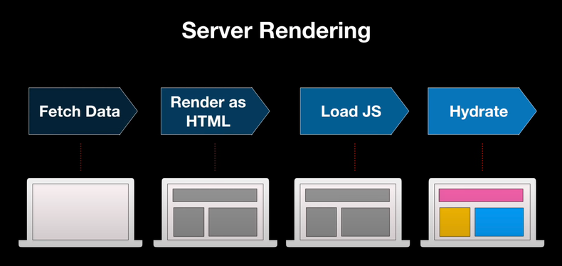
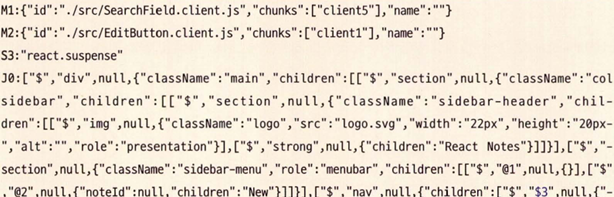

# App 디렉토리
Next.js 13버전 이전까지 공통 레이아웃을 구성하려면 _app 파일 내에서만 가능했다.

하지만 그 방식 마저도 각 페이지별로 서로 다른 레이아웃을 적용하는데도 무리가 있었다.

> _app: app은 페이지를 초기화하기 위한 용도로 사용되며, 다음과 같은 작업이 가능하다.
>
> - 페이지 변경 시에 유지하고 싶은 레이아웃
> - 페이지 변경 시 상태 유지
> - 페이지간 추가적인 데이터 삽입
> - global CSS 주입

이러한 한계를 극복하기 위해 13버전 이후부터 App 디렉토리가 나오게 됐다.

## 라우팅
기존 13버전 이전에는 라우팅을 /pages로 정의하던 방식이 /app 디렉터리로 이동했다.

> **Next.js 12이하**: /pages/a/b/index.tsx => /a/b로 라우팅
> 
> **Next.js 13 app**: /app/a/b => /a/b로 라우팅

Next.js 13의 app 디렉토리 내부 파일명은 라우팅 명칭에 아무런 영향이 없고, app 내부에서 가질 수 있는 파일명은 예약어로 제한되어있다.

### layout.tsx
layout 파일은 페이지의 기본적인 레이아웃을 구성한다. 해당 폴더에 layout이 있다면 그 하위 폴더 및 주소에 모두 영향을 미친다.

```tsx
// app/layout.ts
import { ReactNode } from 'react';

export default function AppLayout({ children }: { children: ReactNode }) {
  return (
    <html lang="ko">
      <head>
        <title>안녕하세요</title>
      </>
      <body>
        <h1>웹 페이지입니다.</h1>
        <main>{children}</main>
      </body>
    </html>
  )
}

// app/blog/layout.tsx
import { ReactNode } from 'react';

export default function BlogLayout({ children }: { children: ReactNode }) {
  return <section>{children}</section>
}
```
루트 layout은 모든 페이지에 영향을 미치는 공통 레이아웃으로 단 하나의 layout만 만들 수 있다.

이처럼 주소별 공통 레이아웃을 만들 수 있고, layout 파일 내에서는 HTML에서 기본으로 제공하는 `<html/>` 태그 등을 추가하고 수정할 수 있다.

> **layout 파일에서 주의할 점**
>
> - app 디렉터리 내부에서 사용되는 예약어로, 무조건 layout.{js|jsx|ts|tsx}로 사용해야 한다.
> - layout은 children을 props로 받아서 렌더링해야 한다. (children은 같은 경로 page.tsx에 작성된 내용을 전달받게 된다.)
> - layout 내부에서도 API요청과 같은 비동기 작업 수행이 가능하다. (서버 컴포넌트이므로 `use client`를 사용할 수 없다.)

### page.tsx
app 디렉토리 안에서 page도 예약어이며, 일반적으로 이전에 다뤘던 페이지를 의미한다.
```tsx
export default function BlogPage() {
  return <>블로그 글 내용</>
}
```
page가 받는 props는 다음과 같다.
- **params**: 옵셔널 값으로, `[...id]`와 같은 동적 라우트 파라미터를 사용할 경우 해당 파라미터 값이 들어온다.
- **searchParams**: QueryString 값이 들어오게 된다. 예시로 `?a=1&b=2`로 접근하면 `{a: '1', b:'2' }`라는 객체 값이 들어온다. 해당 값은 page 내부에서만 수행가능하다.

> **page 파일에서 주의할 점**
>
> - app 디렉토리 내부에서 사용되는 예약어로, 무조건 page.{js|jsx|ts|tsx}로 사용해야 한다.
> - 내부에서 반드시 export default로 내보내는 컴포넌트가 있어야 한다.

### error.tsx
해당 라우팅 영역에서 사용되는 공통 에러 컴포넌트로, 특정 라우팅별로 서로 다른 에러 UI를 렌더링할 수 있다.

```tsx
'use client'

import { useEffect } from 'react'

exort default function Error({ error, reset }: { error: Error, reset: () => void }) {
  useEffect(() => {
    console.log('logging error:', error);
  }, [error])
  
  return (
    <>
      <div>
        <strong>Error:</strong> {error?.message}
      </div>
      <div>
        <button onClick={() => reset()}>에러 리셋</button>
      </div>
    </>
  )
}
```

2개의 props를 전달받는다.

`error`는 에러 정보를 담고 있고,`reset`은 에러 바운더리를 초기화할 수 있다.

> **error 파일 주의할 점**
>
> - 에러 바운더리는 클라이언트에서만 작동하므로 error 컴포넌트도 클라이언트 컴포넌트여야 하기 때문에 상단에 `use client`를 작성했다.
> - 같은 수준의 layout에서 에러가 발생할 경우 해당 error 컴포넌트로 이동하지 않는다. 그 이유는 아래와 같은 구조로 페이지가 렌더링되기 때문이다.
```tsx
 <Layout>
  <Error>
    {children}
  </Error>
 </Layout>
```
> 만약 Layout에서 발생한 에러를 처리하려면 상위 컴포넌트에서 error를 사용하거나 app의 루트 에러처리를 하는 app/global-error.js 페이지를 사용하면 된다.

### not-found.tsx
not-found 파일은 특정 라우팅 하위의 주소를 찾을 수 없는 404 페이지를 렌더링할 때 사용한다.

```tsx
export default function NotFound() {
  return (
    <>
      <h2>Not Found</h2>
      <p>404</p>
   	</>
  )
}
```

error와 마찬가지로 전체 애플리케이션에서 404를 노출하려면 `app/not-found.tsx`를 생성하면 된다.

### loading.tsx
loading은 리액트 Suspense를 기반으로 해당 컴포넌트가 불러오는 중임을 나타낼 때 사용한다.

```tsx
export default function Loading() {
  return 'Loading...';
}
```

### route.ts
Next.js 13.4.0에서 app 디렉토리가 정식으로 출시되면서 /app/api 기준으로 디렉토리 라우팅을 지원하며 route.ts로 통일했다.
```ts
// /api/users/[id]/route.ts

import { NextRequest } from 'next/server';

export async function GET(request: NextRequest, context: { params: { id: string }}) {
  const response = await fetch(`https://jsonplaceholder.typicode.com/users/${context.params.id}`);
  // ...
  return new Response(JSON.stringify(result), {
    status: 200,
    headers: {
      'content-type': 'application/json'
    },
  })
}

export async function HEAD(request: NextRequest) {}

export async function POST(request: NextRequest) {}

export async function PUT(request: NextRequest) {}

export async function DELETE(request: NextRequest) {}

export async function PATCH(request: NextRequest) {}

export async function OPTIONS(request: NextRequest) {}
```
이렇게 route.ts 파일 내에서 REST API의 HTTP 메서드명을 예약어로 선언해두면 HTTP 요청에 맞게 해당 메서드를 호출한다.

`route.ts` 파일이 있는 폴더 안에는 `page.tsx`가 존재할 수 없다.

- **request**: NextRequest 객체이며, fetch의 Request를 확장한 Next.js만의 Request이다. 이 객체에는 cookie, headers뿐 아니라 nextUrl 같은 주소 객체도 확인할 수 있다.
- **context**: params만을 가지고 있는 객체로, 동적 라우팅 파라미터 객체가 포함된다. `/app/api/users/[id]/route.ts`라면 `id`값을 사용할 수 있다.

# 리액트 서버 컴포넌트 (RSC)
리액트 18에서 새로 도입된 리액트 서버 컴포넌트는 서버 사이드 렌더링과 완전히 다른 개념이다.

기존 리액트로 앱을 개발할 때 문제가 있다.

1. 컴포넌트가 렌더링될 때 레이아웃이 갑자기 이동되는 문제
```jsx
<CourseWrapper>
  <CourseList /> // fetch로 데이터 호출
  <Testimonials /> // fetch로 데이터 호출
</CourseWrapper>
```


위 그림과 같이 `Testimonials` 컴포넌트가 먼저 렌더링되고 그 다음에 `CourseList` 컴포넌트가 렌더링되면서 레이아웃이 이동하는 문제가 발생한다.

1. Waterfall 문제
```jsx
function Course() {
  return (
    <CourseWrapper> // fetch로 데이터 호출
      <CourseList /> // fetch로 데이터 호출
      <Testimonials /> // fetch로 데이터 호출
    </CourseWrapper>
  )
}
```
부모 컴포넌트인 `CourseWrapper`가 먼저 호출하고 데이터를 가져오는 동안 자식 컴포넌트의 렌더링은 일어나지 않는다.

이처럼 현재 작업을 시작하기 위해 이전 작업이 완료되기를 기다리는 것을 `Waterfall`이라고 부른다.

이러한 Waterfall 문제를 해결하기 위해 각각의 컴포넌트에서 호출하는 것이 아닌 부모 컴포넌트에서 단일 호출하도록 네트워크 호출 로직을 끌어 올릴 수 있다.

3. 유지 보수 문제
```jsx
function Course() {
    const info = fetchAllDetails();
    return(
    	<CourseWrapper
        	ino={info.wrapperInfo} >
            <CourseList
        		ino={info.listInfo} />
            <Testimonials
        		ino={info.testimonials} />
        </CourseWrapper>     
    )
 }
```
이렇게 최상위 컴포넌트에서 API 호출을 하고 자식 컴포넌트에 Props로 전달하면 자식 컴포넌트는 부모 컴포넌트에 종속되어 재사용하기 어려워지는 유지 보수 측면에서 문제가 발생할 수 있다.

4. 성능 비용 문제
리액트는 CSR로써 클라이언트에서 애플리케이션을 로드하기 위해 필요한 리소스를 다운로드하게 된다.

만약 해당 애플리케이션에 종속되어 있는 외부 라이브러리가 많다면, 해당 리소스를 다운로드 하는 시간이 더욱 길어지고 이는 UX에 좋지 않은 영향을 미칠 수 있다.

이러한 문제들을 해결하기 위해 리액트 서버 컴포넌트가 등장하게 된다.

## 서버 컴포넌트
서버와 클라이언트 모두에서 컴포넌트를 렌더링할 수 있는 기법을 서버 컴포넌트라고 한다.

서버에서 할 수 있는 일은 서버가 처리하고, 그 외는 클라이언트인 브라우저에서 수행한다.

이러한 서버 컴포넌트는 서버에 있으므로 데이터를 더 빨리 가져올 수 있으며, 파일 시스템 및 데이터 저장소와 같은 서버 인프라에 접근할 수 있다.

여기서 명심해야할 것은 클라이언트 컴포넌트는 서버 컴포넌트를 import할 수 없다.



이런 구조가 가능한 이유는 `children`으로 자주 사용하는 `ReactNode`에 있다.
```tsx
// ClientComponent.tsx
'use client'
// import ServerComponent from './ServerComponent 이렇게 클라이언트 컴포넌트에서 서버 컴포넌트를 불러올 수 없다.
export default function ClientComponent({ children }: { children: React.ReactNode }) {
  return (
    <div>
      <h1>클라이언트 컴포넌트</h1>
      {children}
    </div>
  )
}

// ServerComponent.tsx
export default function ServerComponent() {
  return <span>서버 컴포넌트</span>
}

// ParentServerComponent.tsx
// 이 컴포넌트는 서버 컴포넌트 or 클라이언트 컴포넌트일 수 있기에 두 컴포넌트 모두 사용할 수 있다.
import ClientComponent from './ClientComponent';
import ServerComponent from './ServerComponent';
export default function ParentServerComponent() {
  return (
    <ClientComponent>
      <ServerComponent/>
    </ClientComponent>
  )
}
```

**서버 컴포넌트**
- 요청이 오면 그 순간 서버에서 딱 한 번 실행되기에 상태를 가질 수 없다. 따라서 리액트에서 사용하는 훅을 사용할 수 없다.
- 렌더링 생명주기도 사용할 수 없다.
- effect나 state에 의존하는 Custom hook도 사용할 수 없고, 서버에서 제공할 수 있는 기능만 사용하는 훅은 사용할 수 있다.
- 브라우저에서 실행되지 않으므로 DOM API나 window, document에 접근할 수 없다.
- DB, 파일 시스템 등 서버에 있는 데이터를 async/await으로 접근할 수 있다.
- 다른 서버 컴포넌트나 클라이언트 컴포넌트 렌더링이 가능하다.

**클라이언트 컴포넌트**
- 브라우저 환경에서만 실행되므로 서버 컴포넌트를 불러오거나, 서버 전용 훅 등을 불러올 수 없다.
- 클라이언트 컴포넌트가 자식으로 서버 컴포넌트를 갖는 구조는 가능하다.
> 서버 컴포넌트를 직접 호출하는 것은 브라우저 환경이라 컴포넌트 트리를 생성하는게 불가능하지만, 자식으로 가지면 클라이언트는 `이미 만들어진` 서버 컴포넌트 트리를 보여주기만 하면 되기 때문에 가능하다.
- 일반적으로 우리가 아는 리액트 컴포넌트와 같고, 상태관리 훅, 브라우저 API를 사용할 수 있다.

**공용 컴포넌트**
- 이 컴포넌트는 서버와 클라이언트 모두 사용 가능하다.
- 기본적으로 모든 컴포넌트를 공용으로 판단하고 명시적으로 `use client`를 작성하면 클라이언트 컴포넌트라고 판단한다.

## 리액트 서버 컴포넌트와 서버 사이드 렌더링
리액트는 기본적으로 클라이언트 사이드 렌더링(CSR)으로 동작한다.


애플리케이션 페이지 진입 시 HTML, 자바스크립트와 모든 데이터가 로드되고 컴포넌트 렌더링이 끝나기 전까지 사용자는 아무런 기능이 없는 빈 화면만 보게 된다.



반면 서버 사이드 렌더링(SSR)은 서버에서 먼저 HTML로 렌더링 한다.

그리고 자바스크립트 번들을 모두 다운로드하고 하이드레이션이 완료되어야 정상적으로 페이지가 동작하게 된다.

그렇다면 리액트 서버 컴포넌트는 서버 사이드 렌더링과 어떻게 다를까?

- 서버 컴포넌트의 코드는 클라이언트로 전달되지 않지만, SSR의 모든 컴포넌트 코드는 자바스크립트 번들에 포함되어 클라이언트로 전송된다.
- 서버 컴포넌트는 클라이언트 상태를 유지하며 refetch 될 수 있다. 그 이유는 HTML이 아닌 특별한 형태로 컴포넌트를 전달하기 때문에 클라이언트 상태를 유지하며 여러번 데이터를 가져오고 리렌더링하여 전달할 수 있다.
하지만 SSR의 경우 HTML로 전달되기 때문에 refetch를 하게 되면 HTML 전체를 리렌더링하므로 클라이언트 상태를 유지할 수 없다.


서버 사이드 렌더링으로 초기 HTML 페이지를 빠르게 보여주고, 서버 컴포넌트로는 클라이언트로 전송되는 자바스크립트 번들 사이즈를 감소시킨다면 사용자에게 훨씬 빠르게 인터렉티브한 페이지를 제공할 수 있다.

# Next.js에서 RSC
Next.js 13 App 디렉토리에서는 과거 서버 사이드 렌더링과 정적 페이지 제공을 위해 이용하던 `getServerSideProps`, `getStaticProps`, `getInitialProps`가 /app 디렉토리 내부에서는 삭제됐다.

그 대신 모든 데이터 요청은 웹에서 제공하는 표준 API인 fetch를 기반으로 이뤄진다.
```tsx
async function getData() {
  const result = await fetch('https://api.example.com/');
  
  if (!result.ok) {
    // 이렇게 에러를 던지면 가장 가까운 에러 바운더리에 전달된다.
    throw new Error('데이터 불러오기 실패');
  }
  return result.json();
}

// async 서버 컴포넌트 페이지
export default async function Page() {
  const data = await getData();
  
  return (
    <main>
      <Children data={data} />
    </main>
  )
}
```

