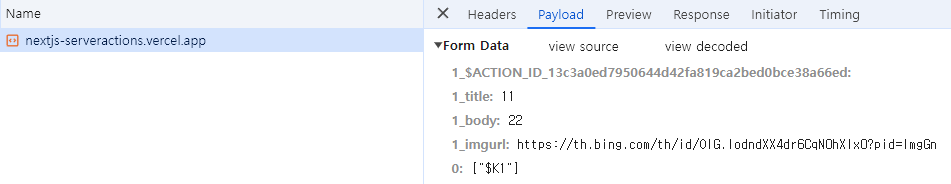

서버 액션은 서버에서 실행되는 비동기 함수로써, 서버 및 클라이언트 컴포넌트에서 form 제출 및 데이터 변경을 처리하는데 사용할 수 있다.

즉 API를 생성하지 않더라도 함수 수준에서 서버에 직접 접근해 데이터 요청 등을 수행할 수 있다.

### 규칙

서버 액션을 만들려면 `async` 함수 내부 또는 파일 상단에 `use server` 지시어로 선언해야한다.

```tsx
// Server Component
export default function Page() {
  // Server Action
  async function create() {
    'use server'
 
    // ...
  }
 
  return (
    // ...
  )
}
```

또는 파일 상단에 선언하면 클라이언트 컴포넌트나 서버 컴포넌트에서 가져다 사용할 수 있다.

```tsx
// app/actions.ts
'use server'
 
export async function create() {
  // ...
}

// app/ui/button.tsx
import { create } from '@/app/actions'
 
export function Button() {
  return (
    // ...
  )
}
```

## Forms
React는 HTML form 요소를 확장하여 `action` 프로퍼티로 서버 액션을 호출할 수 있다.

form에서 action이 호출되면 `FormData` 객체를 자동으로 전달 받고, 필드를 관리하기 위해 `useState`를 사용할 필요가 없이 `FormData` 메서드를 사용하여 데이터를 추출할 수 있다.

```tsx
export default function Page() {
  async function createInvoice(formData: FormData) {
    'use server'
 
    const rawFormData = {
      customerId: formData.get('customerId'),
      amount: formData.get('amount'),
      status: formData.get('status'),
    }
 
    // mutate data
    // revalidate cache
  }
 
  return <form action={createInvoice}>...</form>
}
```

### 추가 인수 전달
만약 서버 액션에 추가 인수를 전달하기 위해서는 `bind`메서드를 사용해서 전달할 수 있다.

```tsx
function AddToCart({productId}) {
  async function addToCart(productId, formData) {
    "use server";
    //...
  }
  const addProductToCart = addToCart.bind(null, productId);
  return (
    <form action={addProductToCart}>
      <button type="submit">Add to Cart</button>
      //<input type="hidden" name="productId" value={productId} />
    </form>
  );
}
```

### useFormStatus
Form이 제출되는 동안 보류 중인 상태를 표시하기 위해 `useFormStatus` 훅을 사용할 수 있다.

해당 훅은 특정 Form의 상태를 반환하기 때문에 `<form>` 요소의 자식으로 정의되어야 한다.

또한 훅은 클라이언트 컴포넌트에서 사용해야한다.

```tsx
// app/submit-button.tsx
'use client'
 
import { useFormStatus } from 'react-dom'
 
export function SubmitButton() {
  const { pending } = useFormStatus()
 
  return (
    <button type="submit" disabled={pending}>
      Add
    </button>
  )
}

// app/page.tsx
import { SubmitButton } from '@/app/submit-button'
import { createItem } from '@/app/actions'
 
// Server Component
export default async function Home() {
  return (
    <form action={createItem}>
      <input type="text" name="field-name" />
      <SubmitButton />
    </form>
  )
}
```

### Network
서버 액션을 통해 구현한 [데모 사이트](https://nextjs-serveractions.vercel.app/)가 있다.

여기서 todo title과 body를 입력하고 `Add` 버튼을 클릭하고 네트워크 탭을 보면 다음처럼 보인다.



페이로드를 보면 ACTION_ID라는 서버 액션과 입력한 데이터를 볼 수 있다.

서버 액션을 실행하면 클라이언트에서 현재 라우트 주소와 ACTION_ID, 입력한 데이터를 보내게 된다.

그러면 서버에서 요청 받은 데이터를 바탕으로 실행해야 하는 서버 액션을 찾고 서버에서 직접 실행한다.

`use server`로 선언 되어 있는 내용은 클라이언트 번들링에 포함되지 않고 서버에서만 실행되고, 따라서 CORS 이슈가 발생하지 않는다.

## Form이 아닌 요소
보통 `<form>` 요소 내에서 서버 액션을 사용하지만, 이벤트 핸들러나 useEffect와 같은 코드 내에서도 호출할 수 있다.

```tsx
// app/like-button.tsx
'use client'
 
import { incrementLike } from './actions'
import { useState } from 'react'
 
export default function LikeButton({ initialLikes }: { initialLikes: number }) {
  const [likes, setLikes] = useState(initialLikes)
 
  return (
    <>
      <p>Total Likes: {likes}</p>
      <button
        onClick={async () => {
          const updatedLikes = await incrementLike()
          setLikes(updatedLikes)
        }}
      >
        Like
      </button>
    </>
  )
}
```
`onClick`과 같은 이벤트 핸들러에서 서버 액션을 호출하여 좋아요 수를 늘릴 수 있다.

## Revalidating
`revalidatePath API`를 사용하여 서버 액션 내에서 Next.js 캐시 유효성을 재검증할 수 있다.

```tsx
'use server'
 
import { revalidatePath } from 'next/cache'
 
export async function createPost() {
  try {
    // ...
  } catch (error) {
    // ...
  }
  revalidatePath('/posts')
}
```
또한 `revalidateTag API`도 동일하게 동작한다.

```tsx
'use server'
 
import { revalidateTag } from 'next/cache'
 
export async function createPost() {
  try {
    // ...
  } catch (error) {
    // ...
  }
  revalidateTag('posts')
}
```

### 참고
- [Next.js - server actions](https://nextjs.org/docs/app/building-your-application/data-fetching/server-actions-and-mutations)
- [Nextjs-server-actions Github Example](https://github.com/UGoingNoWhereBoy/Nextjs-Server-Actions)