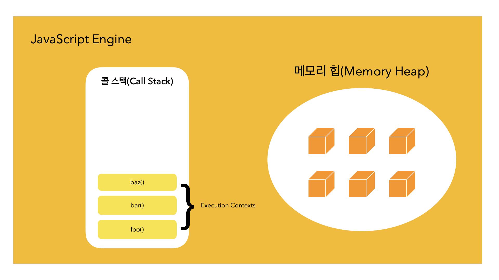
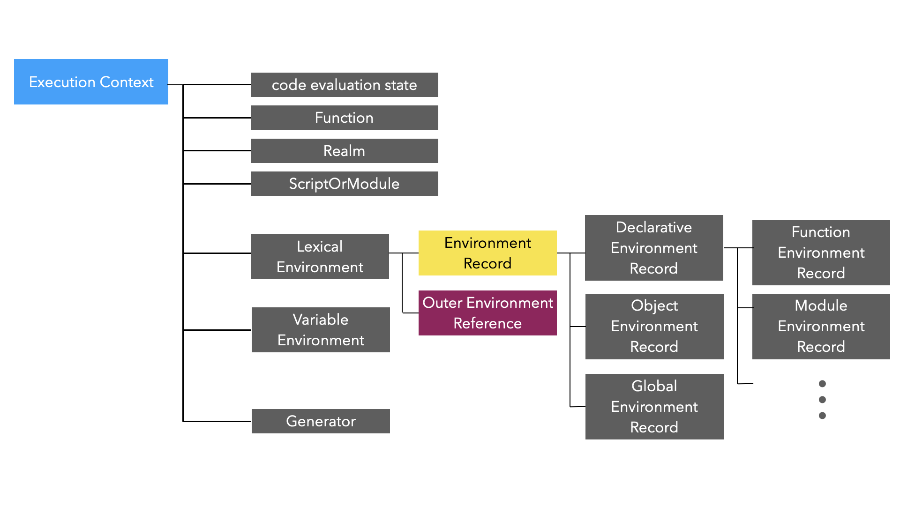

# 클로저

## 클로저의 정의
> "함수와 함수가 선언된 렉시컬 스코프의 조합" - MDN

> "클로저는 내부 함수가 외부 함수의 변수에 접근할 수 있는 함수입니다.<br>내부 함수는 외부 함수의 실행 컨텍스트에 있는 변수들에 접근할 수 있는데,<br>이는 외부 함수가 이미 실행을 마친 뒤에도 가능합니다." - 클로드 ai

클로저는 "스코프"와 "실행 컨택스트"의 개념과 밀접하게 관련되어 있습니다.

꼬리 질문 하기 좋은 주제이므로 간단하게 설명하겠습니다.

## 클로저 설명에 필요한 개념

### 실행 컨택스트

**실행할 코드에 제공할 환경 정보들을 모아놓은 객체** 입니다.

### 자바스크립트 코드 실행에 필요한 환경 정보

A. 변수 : 전역 변수, 지역 변수, 매개 변수, 객체의 프로퍼티

B. 함수 선언

C. 변수의 유효범위

D. this

### JS 엔진과 동작


JS 엔진은 크게 `Heap`과 `Call Stack` 으로 구성되어 있는 인터프리터 라고 정의 할 수 있습니다


실행가능한 JS 소스 코드를 `평가` 와 `실행` 단계로 나누어 처리합니다

바로 `평가` 단계에서 실행 컨택스트를 생성합니다

| 타입 | 설명 |	실행 컨텍스트 종류|
|---|---|---|
| 전역 코드 (global code)| 전역에 존재하는 소스코드 | Global Execution Context (전역 실행 컨텍스트)|
| 함수 코드 (function code)| 함수 내부에 존재하는 소스코드 | Functional Execution Context (함수 실행 컨텍스트)|
| eval 코드 (eval code)| 빌트인 전역 함수인 eval 함수에 인수로 전달되어 실행되는 소스코드 | Eval Function Execution Context|



JS 엔진은 `script` 태그를 처음 만나는 순간 `전역 실행 컨텍스트` 를 생성하고 Call Stack 에 push 합니다.
그리고 엔진이 함수 호출을 찾을 때마다 해당 함수에 대한 새로운 함수 실행 컨택스트를 생성하고 Call Stack 에 push 합니다.

실행 컨택스트의 생성은 Creation 단계와 Execution 단계로 구분됩니다.

1. Creation Phase
  - `Lexical Environment` 구성 요소가 생성됩니다.
  - `Variable Environment` 구성 요소가 생성됩니다.

`Lexical Environment` 의 `Environment Record` 와 `Outer Environment Record` 바로 이 부분이 클로저의 정의에서 등장한 `렉시컬 스코프` 입니다.


### 스코프

스코프(Scope)는 변수나 함수에 접근할 수 있는 유효 범위를 의미합니다.
|타입|정의|특징|
|---|---|---|
|전역 스코프(Global Scope)|코드 전체에서 접근 가능한 최상위 스코프|전역 변수와 전역 함수가 정의|
|지역 스코프 또는 함수 스코프(Function Scope)|함수 내부에서 정의된 변수와 함수는 함수 스코프|함수 외부에서는 접근할 수 없습니다.|
|3. 블록 스코프(Block Scope)|{ } 코드 블록 내에서 정의된 변수는 블록 스코프| let, const 로 정의된 변수는 블록 스코프 <br> var 로 정의된 변수는 함수 스코프|
|4. 렉시컬 스코프(Lexical Scope)|함수를 어디서 호출하는지가 아니라 어디에 선언하였는지에 따라 정의됨|`중첩된 내부 함수는 외부 함수의 변수에 접근할 수 있습니다`.|

내부 함수가 외부 함수의 변수에 접근할 수 있는 이유는 실행 컨텍스트가 소멸되지 않고 스코프 체인을 통해 상위 스코프의 변수에 접근할 수 있기 때문입니다.

클로저의 정의를 다시 보면 은근히 잘 설명한 것 같습니다.

## 클로저의 활용

React의 함수형 컴포넌트에서 클로저는 함수형 컴포넌트의 대부분의 기술이 클로저에 의존하고 있습니다.

- 함수형 컴포넌트의 구조와 작동 방식
- Hook 의 원리
  - 캡슐화를 통한 상태 은닉 및 업데이트
- 의존성 배열 등
### 캡슐화
전역 변수 카운터
```javascript
var counter = 0
function Counter() {
  counter++
}
```
누구나 접근 가능하여 상태 추적이 어렵다.
https://ui.dev/javascript-visualizer 에서 아래의 코드를 실행시켜 보자

```javascript
function Counter() {
  var counter = 0
  return {
    increase: function () {
      return ++counter
    }
    decrease: function () {
      return --counter
    }
    counter : function () {
      return counter
    }
  }
}

var c = Counter()
console.log(c.increase()) // 1
console.log(c.increase()) // 2
console.log(c.increase()) // 3
console.log(c.decrease()) // 2
console.log(c.counter()) // 2
```

### Hooks
```javascript
function Component () {
  const [state, setState] = useState()

  function handleClick () {
    // useState 호출은 위에서 끝났지만
    // setState는 계속 내부의 최신값 (prev)를 알고 있다
    setState((prev)=> prev + 1)
  }
}
```
외부 함수 (useState) 가 반환한 내부 함수 (setState) 는 외부 함수의 호출이 끝났음에도 자신이 선언된 외부함수가 선언된 환경 (state 가 저장된 실행 컨택스트)을 참조하고 있기 때문이다.

## 클로저 사용 시 주의점

프로그래머의 의도는 0부터 시작해 1초 간격으로 콘솔에 0,1,2,3,4를 차례대로 출력하는 것이다.

```javascript
  for (var i = 0; i < 5; i++) {
    setTimeout( function () {
        console.log(i)
      }
    , i * 1000)
  }
```
`i` 가 선언된 함수의 스코프는 전역 스코프 이므로 전역 변수로 작동하기 때문에 실행 결과는 5,5,5,5,5 이다 

### 블록 스코프를 갖는 let 사용
```javascript
  for (let i = 0; i < 5; i++) {
    setTimeout( function () {
        console.log(i)
      }
    , i * 1000)
  }
```
### 즉시 실행 함수로 스코프 만들기
```javascript
  for (var i = 0; i < 5; i++) {
    setTimeout( 
      (function (sec) { // foo
        return function () { // bar
          console.log(sec)
        }
      })(i)
    , i * 1000)
  }
```
i 를 파라미터로 받는 즉시 실행 함수 foo 는 i 값을 sec 변수에 저장하고 setTimeout 의 콜백 함수에 전달한다.

setTimeout 에 전달된 `i 값이 저장된 sec 변수를 참조`하는 클로저는 즉시 실행 함수이므로 for 문마다 생성되고 실행되어 각각의 함수는 고유한 스코프를 가지게 되므로 의도대로 실행된다.

### 비용
클로저는 생성될 때마다 그 선언적 환경을 기억해야 하므로 추가적인 메모리 할당이 필연적이다.

클로저에 꼭 필요한 작업만 남겨두지 않는다면 메모리를 불필요하게 잡아먹고 적절한 스코프에 가둬두지 않는다면 성능에 영향을 미친다.