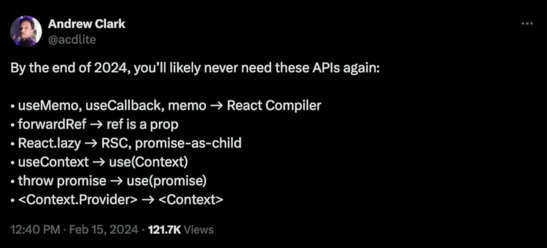
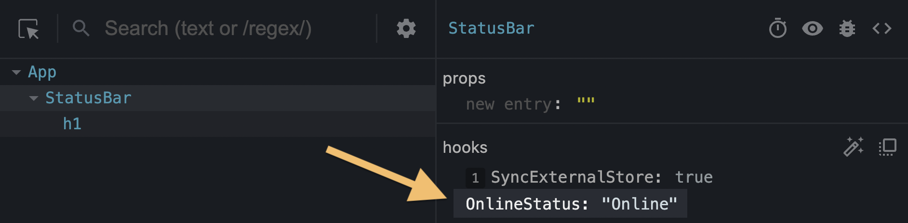
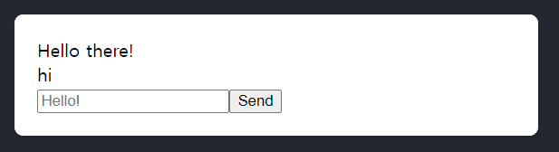
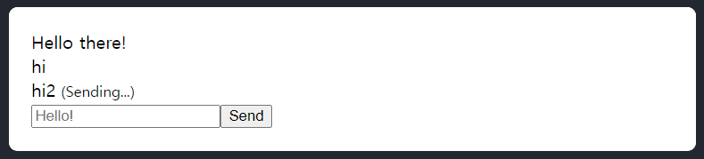
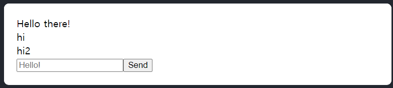

# Hooks -2

## useContext

### Context API 와 Props Drilling

- **Props Drilling** : 부모 컴포넌트에서 자식 컴포넌트로 props 를 전달할 때 중간에 있는 컴포넌트들을 경유해야 하는 상황

- **Context API** : Props Drilling 문제를 해결하기 위해 등장한 개념

### Context API

`Provider` 로 값을 전달하고 `Consumer` 를 통해 값을 구독하여 사용한다
  ```typescript
  const MyContext = createContext('defaultValue'); // context 생성

  function Parent() {
    return (
      // provider를 사용한 context 제공
      <MyContext.Provider value="myValue"> 
        <Child />
      </MyContext.Provider>
    );
  }

  function Child() {
    return (
      // consumer를 사용하여 provider의 value 값을 구독
      // 함수를 사용한다
      <MyContext.Consumer> 
        {(value) => <div>{value}</div>} 
      </MyContext.Consumer>
    );
  }
  ```
- **Provider** : 

  Context 를 생성하고, 이를 하위 컴포넌트들에게 제공하는 컴포넌트. 
  
  공유할 상태를 value prop 으로 넘겨주면, 하위 컴포넌트들이 이 상태를 사용할 수 있다.

- **Consumer** : 

  Provider 에서 제공하는 상태를 사용하는 컴포넌트를. 
  
  Provider의 상태를 구독하고, 상태가 변경될 때마다 리렌더링 된다.

### useContext

Consumer 보다 간결한 문법을 제공하기 위해 제공된 hook

상위 컴포넌트에서 같은 context 에서 복수의 값을 전달한 경우 **가장 가까운 Provider 의 값** 을 가져온다.

```typescript
const Context = createContext<{ hello: string } | undefined>();

function ContextProvider({children, text}: PropsWithChildren<{ text : string }>) {
  return (
    <Context.Provider value={{ hello : text }}>
      {children}
    </Context.Provider>
  )
}

// 컴포넌트 트리가 복잡해질수록 커스텀 훅으로 초기화 여부를 확인하는 방법이 예기치 못한 에러를 방지한다.
function useMyContext() {
  const context = useContext(Context)
  if(context === undefined){
    throw new Error("useMyContext 는 ContextProvider 내부에서만 사용할 수 있습니다.")
  }
  return context
}

function Parent() {
  return (
    <>
      <ContextProvider text={"react"}> 
        <Context.Provider value={{ hello : "javascript" }}> 
          <Child />
        </Context.Provider>
      </ContextProvider>
    </>
  );
}

// Child
function Child() {
  const value = useMyContext()
  return <div>{value ? value.hello : ""}</div> // react 가 아니라 javascript 가 반환
}
```

### useContext 사용시 주의할 점

useContext 를 사용하게 되는 *자식 컴포넌트*는 Provider 에 대해 의존성이 생기므로 재활용이 어려워진다는 것을 염두해야 한다.

context 의 범위를 최대한 좁게 만들어야 한다 컴포넌트의 Root 에서 사용하게 된다면 최대한 변화될 가능성이 적은 테마와 같은 부분에 적용해야 한다.

context 와 상태관리는 다른 개념이다. context 는 상태를 주입해주는 API 일 뿐이다.

- 상태관리 라이브러리가 되기 위한 최소한의 조건
  - 어떠한 상태를 기반으로 다른 상태를 만들어 낼 수 있어야 한다.
  - 필요에 따라 이러한 상태를 최적화할 수 있어야 한다.

context 는 둘 중 어느것도 하지 못한다.

리렌더링 최적화 문제

```typescript
// Context.js
export const MyContext = createContext();

export const MyProvider = ({ children }) => {
  const [value, setValue] = useState(0);

  const incrementValue = () => {
    setValue(value + 1);
  };

  return (
    <MyContext.Provider value={{ value, incrementValue }}>
      {children}
    </MyContext.Provider>
  );
};

// App.js
const App = () => {
  return (
    <MyProvider>
      <Parent />
    </MyProvider>
  )
};

export default Parent;

// Parent.js
const Parent = () => {
  console.log('Parent rendered');
  return <Child />;
};

export default Child;

// Child.js
const Child = () => {
  console.log('Child rendered');
  const { value, incrementValue } = useContext(MyContext);

  return (
    <div>
      <p>Value: {value}</p>
      <button onClick={incrementValue}>Increment</button>
    </div>
  );
};

export default GrandChild;
```
Increment 버튼을 누를 때마다 콘솔에 다음과 같이 출력된다.

모든 컴포넌트가 리렌더링된다
```
Parent rendered
Child rendered
```
### 최상단 Provider 의 state 를 업데이트하면 하위의 모든 컴포넌트가 리렌더링되는 성능 이슈
두 가지 방식으로 해결 가능

1. Provider 를 구독하지 않는 컴포넌트를 React.memo() 로 메모이제이션
    ``` typescript
    export default memo(Parent);
    ```
2. provider 분리
    ```typescript
    export const MyStateContext = createContext();
    export const MyDispatchContext = createContext();

    const MyProvider = ({ children }) => {
    const [value, setValue] = useState(0);

      const incrementValue = () => {
        setValue(value + 1);
      };

      return (
        <MyStateContext.Provider value={value}>
          <MyDispatchContext.Provider value={incrementValue}>
            {children}
          </MyDispatchContext.Provider>
        </MyStateContext>
      )
    }
    ```
    다소 지저분해 보이고 더 복잡한 상태를 관리한다면 object 는 상태가 부분적으로 변경되어도 매번 새로 생성되기 때문에 컨텍스트를 사용하는 모든 컴포넌트가 리렌더링 될 것이다. 
    
    매번 Context 를 나누고 추가할 때마다 Provider 로 매번 감싸줘야하기 때문에 Provider hell을 야기할 수 있다.

### ??? : Provider 컴포넌트를 React.memo() 로 메모이제이션 하면 되지 않느냐?
MyProvider를 React.memo로 감싸면 효과가 없다.

매 렌더링 마다 children prop가 바뀌기 때문에 `children`을 props로 받는 컴포넌트는 React.memo 가 효과가 없다.

구체적으로 설명하자면 JSX 는 React.createElemet 로 표현됩니다. React.createElement는 매 렌더링 때마다 새로운 react element를 생성해 반환하는데 이 react element는 object 형태로 존재한다.

즉, 결과적으로 children의 데이터 자체는 변경되지 않아도 새롭게 반환된 react element object의 참조값이 변경되기 때문에 React.memo는 props가 변경되었다고 인식하여 매번 렌더링하게 된다.

참고 : [https://velog.io/@2ast/React-children-prop에-대한-고찰feat.-렌더링-최적화](https://velog.io/@2ast/React-children-prop%EC%97%90-%EB%8C%80%ED%95%9C-%EA%B3%A0%EC%B0%B0feat.-%EB%A0%8C%EB%8D%94%EB%A7%81-%EC%B5%9C%EC%A0%81%ED%99%94)

## useReducer

주로 복잡한 상태 로직을 컴포넌트 밖으로 분리하여 관리할 용도로 사용한다.

인자
- `reducer`: 상태 업데이트 로직을 정의하는 리듀서 함수입니다. 이 함수는 현재 상태와 액션을 받아 새로운 상태를 반환합니다.
- `initialState`: 초기 상태 값을 나타냅니다.
- `init`: 초기 상태 값을 지연해서 생성하고 싶을 때 사용하는 함수. 필수는 아니며 initialState 를 인수로 실행된다.

반환값
- `state`: 현재 상태 값입니다.
- `dispatch`: 액션을 발생시키는 함수입니다. `dispatch(action)`으로 호출하면 리듀서 함수를 실행하여 상태를 업데이트합니다.

```typescript
import React, { useReducer } from 'react';

// 액션 타입 정의
type Action =
  | { type: 'increment' }
  | { type: 'decrement' }
  | { type: 'reset' };

// 상태 타입 정의
type State = {
  count: number;
};

// 무거운 연산이 포함된 초기화 함수
function init(count:State):State {
  // State 를 받아서 작업 수행
  return count
}

// 초기 상태 정의
const initialState: State = {
  count: 0,
};

// 리듀서 함수 정의
function reducer(state: State, action: Action): State {
  switch (action.type) {
    case 'increment':
      return { count: state.count + 1 };
    case 'decrement':
      return { count: state.count - 1 > 0 ? state.count - 1 : 0 };
    case 'reset':
      return init( action.payload || initialState);
    default:
      throw new Error(`Unexpected action type ${action.type}`);
  }
}

const Counter: React.FC = () => {
  const [state, dispatch] = useReducer(reducer, initialState, init);

  return (
    <div>
      <p>Count: {state.count}</p>
      <button onClick={() => dispatch({ type: 'increment' })}>Increment</button>
      <button onClick={() => dispatch({ type: 'decrement' })}>Decrement</button>
      <button onClick={() => dispatch({ type: 'reset' })}>Reset</button>
    </div>
  );
};

export default Counter;
```

복잡한 형태의 state 를 사전에 정의한 dispatch를 통해서만 수정할 수 있게 만들어 state 값에 대한 접근은 컴포넌트에서만 하고 업데이트 로직은 reducer 로 분리하는 state 관리 전략

## useImperativeHandle 명령형 핸들링
useImperativeHandle 을 설명하기 전에 ref 와 forward ref 를 설명해야 합니다

### forwardRef

ref 를 예약어 `ref` 로 자식 컴포넌트에 전달하면 `ref` 는 props 로 사용할 수 없다는 경고문과 `undefined` 를 반환한다

예약어로 지정된 `ref` 대신 다른 props 명으로 ref 를 전달하면 의도대로 전달된다. 하지만 props 명의 자유도가 높아 일관성을 해칠 수 있다.

forwardRef는 ref 전달에 일관성을 제공하기 위해서 네이밍의 자율성이 높은 props 대신 forwardRef 를 통해 ref 를 전달할 것을 예측할 수 있다

```typescript
function Child({ ref }) {
  useEffect(() => {
    console.log(ref) //undefined
  }, [ref])

  return <div>hi</div>
}

function ForwardChild = forwardRef((props,ref) => {
  useEffect(() => {
     // { current: undefined }
     // { current: HTMLInputElement }
    console.log(ref)
  }, [ref])

  return <div>hi</div>
})

function Parent() {
  const inputRef = useRef()

  return (
    <>
      <input ref={inputRef} >
      <ForwardChild ref={inputRef} />
      <Child ref={inputRef} />
      {/* 'ref' is not a prop. Trying to access it will result in 'undefined' being returned.
        if you need to access the same value with the child component, you should pass as a different prop */}
    </>
  )
}

```
근데 React 코어 팀의 개발자 *Andrew Clark* 의 말에 따르면 forwardRef 는 React v19 에서 사용할 필요가 없다고 합니다.



### useImperativeHandle 이란?
부모에서 넘겨 받은 ref 를 커스터마이징할 수 있는 hook
DOM 객체가 아닌 컴포넌트 내부에서 커스터마이징한 객체로 변경할 수 있다. 즉, 자식 컴포넌트에서 노출하고 싶은 ref 객체를 따로 정의할 수 있다

```typescript
function ChildComponent(props, ref) {
  useImperativeHandle(ref, () => {
    return {
      getText: () => 'useImperativeHandle 테스트'
    };
  }, []);

  return <span>children ref 테스트</span>
}

const ForwardedChild = forwardRef(ChildComponent);

function ParentComponent() {
  const childRef = useRef(null);
  
  useEffect(() => {
    console.log(childRef.current?.getText()); // 'useImperativeHandle 테스트'
  }, []);

  return (
    <div>
      <ForwardedChild ref={childRef} />
    </div>
  );
}
```
단, state 와 props 를 통해 선언적인 상태 관리를 지향하는 React 에서 명령형(imperative) 함수를 자식 컴포넌트에 추가하는 useImperativeHandle 은 자주 사용하지 않는다.

## useLayoutEffect

```typescript
const Counter = () => {
  const [count, setCount] = useState(0);

  useEffect(() => {
    console.log('useEffect');
    return () => {
      console.log('useEffect cleanup');
    };
  }, []);

  useLayoutEffect(() => {
    console.log('useLayoutEffect');
    return () => {
      console.log('useLayoutEffect cleanup');
    };
  }, []);

  console.log('render');

  const handleIncrement = () => {
    setCount((prev) => prev + 1);
  };

  return (
    <div>
      <p>Count: {count}</p>
      <button onClick={handleIncrement}>Increment</button>
    </div>
  );
};

export default Counter;
```
<details>
<summary>초기 렌더링 실행순서</summary>

```bash
1. 리액트가 DOM을 업데이트
2. render
3. useLayoutEffect
4. 브라우저에 변경사항을 반영
5. useEffect
```
</details>

<details>
<summary>카운터 증가 후 실행순서</summary>

```bash
1. 리액트가 DOM을 업데이트
2. render
3. useLayoutEffect cleanup // 이전 렌더링에서 사용된 Hook 클린업 함수가 실행
4. useLayoutEffect
5. 브라우저에 변경사항을 반영
6. useEffect cleanup
7. useEffect
```
</details>

<details>
<summary>결론</summary>

useLayoutEffect가 useEffect보다 먼저 실행되며, `렌더링 직후에 동기적으로 실행`된다는 것을 확인할 수 있습니다.
useLayoutEffect는 DOM 변화 후에 동기적으로 실행되므로, 레이아웃에 영향을 주는 작업을 수행할 때 사용합니다.

DOM 은 계산됐지만 화면에 반영하기 전에 하고 싶은 작업이 있을 때 사용
특정 요소 기반 애니메이션, 스크롤 위치 제어등
</details>

## useDebugValue
React 개발자 도구에서 커스텀 hook의 값을 디버깅할 수 있게 해주는 hook 오직 다른 hook 안에서만 사용가능 컴포넌트 레벨에서는 작동하지 않음

```typescript
useDebugValue(value, formatFn?)
```
value: 개발자 도구에 표시할 값 아무 타입 가능
formatFn? (optional): 값을 포맷팅하는 함수입니다. 이 함수는 value를 인자로 받습니다.
```typescript
// 공식문서 예제
function useOnlineStatus() {
  // ...
  useDebugValue(isOnline ? 'Online' : 'Offline');
  // ...
}
// 현재 시간을 반환하는 사용자 정의 훅
function useDate() {
  const date = new Date()
  useDebugValue(date, (date)=> `현재 시간: ${date.toISOString()}`)
  return date
}
```
  

## use
[공식문서](https://react.dev/reference/react/use)

Promise 또는 Context 와 같은 리소스의 값을 읽을 수 있게 해주는 Hook

### Reference

파라미터

- 값을 읽으려는 데이터의 소스입니다. 리소스는 Promise 또는 컨텍스트일 수 있습니다.

반환 값 

- 리소스에서 읽은 값을 반환

주의사항

- Component나 Hook 내부에서 호출되어야 합니다. (=== 클로저로 호출할 수 없다.)

- RSC 를 fetch 할 때는 `use` 보다 async 및 await 를 사용한다. async 및 await 는 await가 호출된 지점에서 렌더링을 대기하는 반면, `use` 은 데이터가 resolve 된 후 컴포넌트를 리렌더링한다.

- RCC (클라이언트 컴포넌트)에서 Promise 를 생성하는 것보다 RSC 에서 Promise 을 생성하여 RCC 에 전달해 사용한다. RCC 에서 생성된 Promise 는 렌더링할 때마다 다시 생성된다. 반면 RSC 에서 RCC 로 전달된 Promise 는 다시 렌더링할 때 다시 생성되지 않아 안정적이다.

```typescript
import { use } from 'react';

function MessageComponent({ messagePromise }) {
  const message = use(messagePromise);
  const theme = use(ThemeContext);
```

### 특징
다른 모든 React Hooks 와 달리 use 는 루프 및 if 와 같은 조건문 내에서 호출할 수 있다

다른 React Hooks 와 마찬가지로 호출하는 함수는 Component 또는 Hook 이어야 한다.

### 동작
Promise와 함께 호출되면 `use` 은 Suspense 및  error boundaries 와 통합됩니다.

use 를 호출하는 컴포넌트는 use 에 전달된 Promise 가 pending 중인 동안 일시 중지 (suspends) 된다.

호출하는 컴포넌트가 Suspense 로 래핑된 경우 fallback 이 표시된다.

Promise 가 resolve 되면 Suspense fallback 은 `use` 에서 반환된 데이터를 사용하여 렌더링된 컴포넌트로 대체된다.

Promise가 reject 되면 가장 가까운 error boundaries 의 fallback 이 표시된다.

### Reading context with `use`
[공식문서](https://react.dev/reference/react/use#reading-context-with-use)

use 의 파라미터로 Context 를 전달하면 `useContext` 와 같다 하지만 `use` 는 조건문에서 호출할 수 있고 `useContext` 는 컴포넌트의 top-level 에서만 호출 가능하기 때문에 `use` 를 사용한다.

`use` 는 전달한 Context 에 대한 Context 값을 반환한다. 

Context 값을 결정하기 위해 React는 컴포넌트 트리를 검색하고 특정 Context 에 대해 위에서 가장 가까운 Context Provider 를 찾는다

[예제 링크](https://codesandbox.io/p/sandbox/silly-dijkstra-68ryxj?file=%2Fsrc%2FApp.js&utm_medium=sandpack)
```typescript
import { createContext, use } from 'react';

const ThemeContext = createContext(null);

export default function MyApp() {
  return (
    <ThemeContext.Provider value="dark">
      <Form />
    </ThemeContext.Provider>
  )
}

function Form() {
  return (
    <Panel title="Welcome">
      <Button show={true}>Sign up</Button>
      <Button show={false}>Log in</Button>
    </Panel>
  );
}

function Panel({ title, children }) {
  const theme = use(ThemeContext);
  const className = 'panel-' + theme;
  return (
    <section className={className}>
      <h1>{title}</h1>
      {children}
    </section>
  )
}

function Button({ show, children }) {
  if (show) {
    const theme = use(ThemeContext); // dark
    const className = 'button-' + theme;
    return (
      <button className={className}>
        {children}
      </button>
    );
  }
  return false
}
```


### Streaming data from the server to the client 
[공식문서](https://react.dev/reference/react/use#streaming-data-from-server-to-client)

RSC 에서 RCC 로 Promise 를 prop 으로 전달하여 데이터를 서버에서 클라이언트로 스트리밍할 수 있다.

[예제링크](https://codesandbox.io/s/8dg646?file=%2Fsrc%2Fmessage.js&utm_medium=sandpack)

```typescript
// RSC
import { fetchMessage } from './lib.js';
import { Message } from './message.js';

export default function App() { 
  const messagePromise = fetchMessage();
  return (
    <Suspense fallback={<p>waiting for message...</p>}>
      <Message messagePromise={messagePromise} />
    </Suspense>
  );
}

// message.js
// RCC
'use client';

import { use } from 'react';

export function Message({ messagePromise }) {
  const messageContent = use(messagePromise);
  return <p>Here is the message: {messageContent}</p>;
}
```

RCC 는 전달 받은 Promise를 prop 으로 사용하여 `use` 에 전달한다. 이를 통해 RCC 는 RSC 에 의해 처음 생성된 Promise 의 값을 읽을 수 있다.

Message 컴포넌트는 Suspense 로 래핑되므로 Promise 가 resolve 될 때까지 fallback 이 표시된다.

Promise 가 resolve 되면 Hook 사용으로 값을 Message 컴포넌트가 Suspense fallback 을 대체한다.

RSC 에서 RCC 로 Promise 를 전달할 때 resolve 된 값은 서버와 클라이언트 간에 전달되도록 직렬화 가능해야 한다. 함수와 같은 데이터 유형은 직렬화할 수 없으며 resolve 값이 될 수 없습니다.

또한 아래와 같이 RSC 에서 await 를 사용해 Promise 를 resolve 한 값을 prop 으로 넘겨주는 것도 가능하나 Promise 가 resolve 될 때 까지 렌더링을 블록한다.

```typescript
export default async function App() {
  const messageContent = await fetchMessage();
  return <Message messageContent={messageContent} />
}
```

### Dealing with rejected Promises
[공식문서](https://react.dev/reference/react/use#dealing-with-rejected-promises)

`try-catch` 블록에서는 `use` 를 호출할 수 없다. `try-catch` 블록 대신 컴포넌트를 error boundary 로 래핑하거나 Promise 의 .catch 메서드와 함께 사용할 대체 값을 제공하여 reject 값을 핸들링한다.

1. error boundary 를 사용하여 사용자에게 오류를 표시
2. Promise.catch 메소드를 사용하여 대체 값을 제공

### Displaying an error to users with an error boundary 

컴포넌트를 error boundary 로 래핑 하여 Promise 가 reject 된다면 error boundary 의 fallback 이 표기된다.

[예제링크](https://codesandbox.io/s/dzl7jd?file=%2Fsrc%2Fmessage.js&utm_medium=sandpack)
```typescript
"use client";

import { use, Suspense } from "react";
import { ErrorBoundary } from "react-error-boundary";

export function MessageContainer({ messagePromise }) {
  return (
    <ErrorBoundary fallback={<p>⚠️Something went wrong</p>}>
      <Suspense fallback={<p>⌛Downloading message...</p>}>
        <Message messagePromise={messagePromise} />
      </Suspense>
    </ErrorBoundary>
  );
}

function Message({ messagePromise }) {
  const content = use(messagePromise);
  return <p>Here is the message: {content}</p>;
}
```
### Providing an alternative value with Promise.catch
```typescript
import { Message } from './message.js';

export default function App() {
  const messagePromise = new Promise((resolve, reject) => {
    reject();
  }).catch(() => {
    return "no new message found.";
  });

  return (
    <Suspense fallback={<p>waiting for message...</p>}>
      <Message messagePromise={messagePromise} />
    </Suspense>
  );
}
```
## useOptimistic
[공식문서](https://react.dev/reference/react/useOptimistic)

UI 를 낙관적으로 업데이트할 수 있는 React Hook

form 제출의 결과를 UI 에 바로 반영하여 비동기 작업이 진행되는 동안 다른 상태의 복사본을 표시하여 작업이 실제로 완료되는 데 시간이 걸리더라도 일반적으로 사용자에게 작업 수행 결과를 즉시 제시하는 목적

### Reference
파라미터
- state: 처음에 반환될 값과 pending 중인 작업이 없을 때마다 반환된다.
- updateFn(currentState, optimisticValue): 현재 상태(currentState)와 addOptimistic에 전달된 낙관적 값(optimisticValue)을 가져와 결과 낙관적 상태를 반환하는 순수 함수.
  - 반환값 : currentState와 optimisticValue의 병합된 값
반환값
- optimisticState: 결과 낙관적 상태입니다. 작업이 보류 중인 경우를 제외하고 상태와 동일하며, 이 경우 updateFn에서 반환된 값과 동일하다.
- addOptimistic: addOptimistic은 낙관적 업데이트가 있을 때 호출할 디스패치 함수.


### 사용법  Optimistically updating forms 
[예제링크](https://codesandbox.io/p/sandbox/nostalgic-cdn-hsvs2d?file=%2Fsrc%2FApp.js&utm_medium=sandpack)

[참고용강의링크 - web dev simplified](https://www.youtube.com/watch?v=M3mGY0pgFk0)
```typescript
import { useOptimistic, useState, useRef } from "react";
import { deliverMessage } from "./actions.js";

function Thread({ messages, sendMessage }) {
  const formRef = useRef();
  async function formAction(formData) {
    addOptimisticMessage(formData.get("message"));
    formRef.current.reset();
    await sendMessage(formData);
  }
  const [optimisticMessages, addOptimisticMessage] = useOptimistic(
    messages, // 원본 배열
    (state, newMessage) => [
      ...state, // 원본의 복사본 + 낙관적인 상태 
      {
        text: newMessage,
        sending: true
      }
    ]
  );

  return (
    <>
      {optimisticMessages.map((message, index) => (
        <div key={index}>
          {message.text}
          {!!message.sending && <small> (Sending...)</small>}
        </div>
      ))}
      <form action={formAction} ref={formRef}>
        <input type="text" name="message" placeholder="Hello!" />
        <button type="submit">Send</button>
      </form>
    </>
  );
}

export default function App() {
  const [messages, setMessages] = useState([
    { text: "Hello there!", sending: false, key: 1 }
  ]);
  async function sendMessage(formData) {
    const sentMessage = await deliverMessage(formData.get("message"));
    setMessages((messages) => [...messages, { text: sentMessage }]);
  }
  return <Thread messages={messages} sendMessage={sendMessage} />;
}
```




실제 api 작업이 완료되면 낙관적인 상태를 실제 원본으로 교체한다

## hook 의 규칙

- ESLint 규칙 react-rules-of-hooks 

1. 최상위에서만 hook 을 호출해야한다. 반복문이나 조건문, 중첩된 함수 내에서 훅을 실행할 수 없다. 이 규칙을 따라야한 함수 컴포넌트가 렌더링될 때마다 항상 동일한 순서로 hook 이 호출됨을 보장할 수 있다.

2. hook 을 호출할 수 있는 것은 리액트 함수형 컴포넌트, 혹은 사용자 정의 hook 두가지 경우 뿐이다. 일반 자바스크립트 함수에서는 훅을 사용할 수 없다.