# 간단한 web 의 역사

## TLDR
1989년 팀 버너스리가 WWW 를 발명한 이후 CGI(1993), 템플릿 엔진, 데이터베이스 연동 등의 기술 발전을 통해 웹이 정적에서 동적으로 진화하면서 현대적인 웹 애플리케이션의 기반이 마련되었습니다.

CSS 표준화 (1994), JavaScript 도입 (1995) , AJAX (1999) 등으로 웹페이지에 스타일, 상호작용성, 동적 데이터 처리 기능이 추가되면서 현대적인 웹 애플리케이션 개발이 가능해졌습니다.

웹 애플리케이션 프레임워크는 jQuery 를 지나 Angular(2009), React(2013), Vue(2014) 등의 현대적 프레임워크로 발전해왔으며, 각 세대별로 특징적인 기능들이 추가되었습니다.

2017년 이후 웹 기술이 네이티브 앱 수준의 기능, 정적 사이트에서도 풍부한 앱 경험 제공, 다양한 언어 통합, 탈중앙화 등의 발전이 이루어졌습니다.

## 초기 웹의 탄생
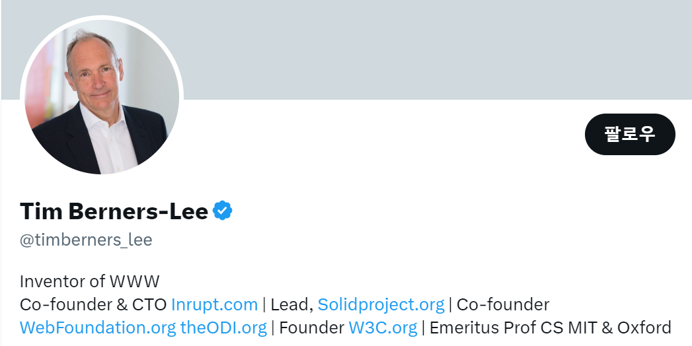

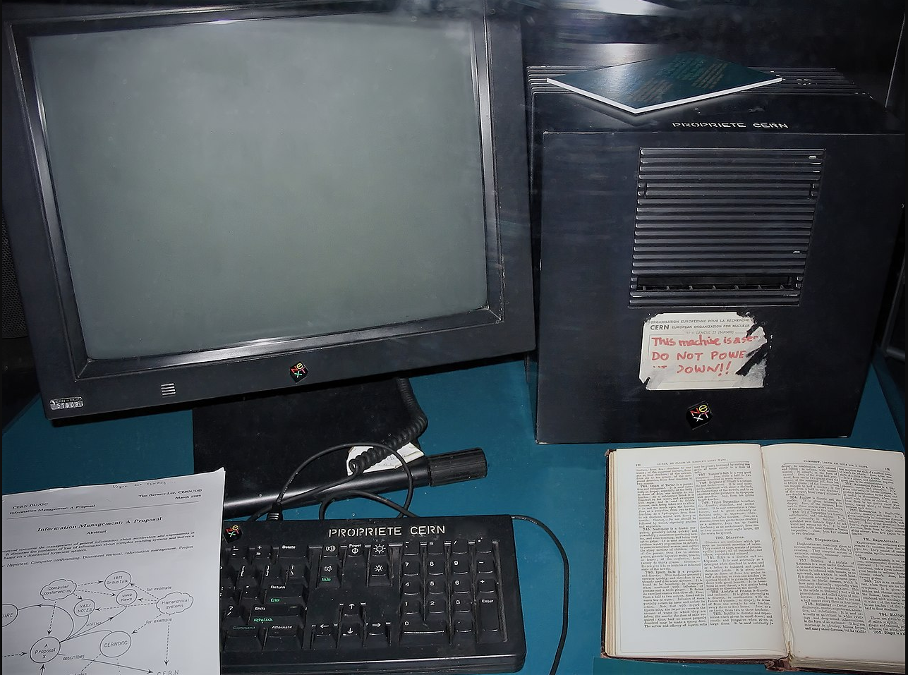
[image credit](https://en.wikipedia.org/wiki/World_Wide_Web#/media/File:First_Web_Server.jpg)

1989년 팀 버너스리가 월드 와이드 웹(WWW)을 발명했습니다. 웹 서버, 웹 브라우저, 웹 페이지가 처음 등장했습니다. 웹 페이지는 HTML(Hypertext Markup Language) 언어로 작성된 문서입니다.

### 동적 웹의 시작
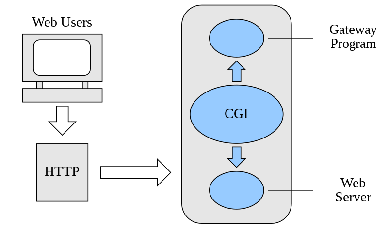

[image credit](https://ko.wikipedia.org/wiki/%EA%B3%B5%EC%9A%A9_%EA%B2%8C%EC%9D%B4%ED%8A%B8%EC%9B%A8%EC%9D%B4_%EC%9D%B8%ED%84%B0%ED%8E%98%EC%9D%B4%EC%8A%A4#/media/%ED%8C%8C%EC%9D%BC:CGI_common_gateway_interface.svg)

1993년 CGI(Common Gateway Interface)가 등장하면서 서버에서 프로그램과 스크립트를 실행할 수 있게 되었습니다. 이를 통해 웹사이트가 정적에서 동적으로 변화했습니다.

### 템플릿팅
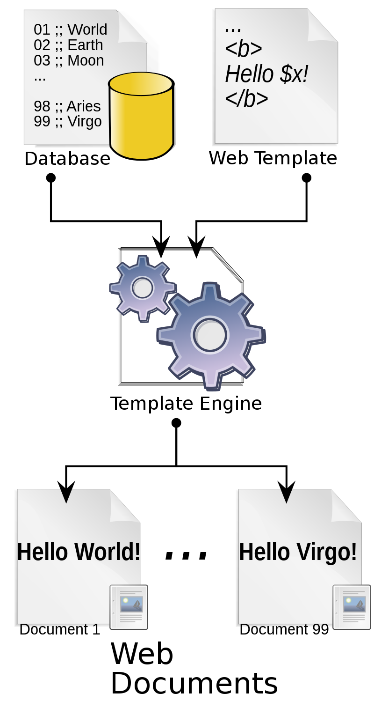

[image credit](https://en.wikipedia.org/wiki/Web_template_system#/media/File:TempEngWeb016.svg)

템플릿 엔진을 사용하면 공통 요소를 재사용하고 루프, 조건문 등을 사용하여 HTML 코드를 생성할 수 있게 되었습니다. 이를 통해 대규모 웹사이트 구축이 용이해졌습니다.

### 데이터 처리
서버 측 스크립트가 데이터베이스에 연결되면서 템플릿을 사용하여 페이지 콘텐츠를 동적으로 변경할 수 있게 되었습니다. 이는 상호작용 가능한 웹 애플리케이션의 시작을 알렸습니다.

## 1993년 이후 웹 기술의 진화 과정

### CSS 표준화
1994년 CSS(Cascading Style Sheets)가 제안되었고, HTML4에서 CSS 지원이 추가되면서 W3C 권고안이 되었습니다.

### JavaScript의 등장

[image credit](https://ko.wikipedia.org/wiki/%EB%B8%8C%EB%A0%8C%EB%8D%98_%EC%95%84%EC%9D%B4%ED%81%AC#/media/%ED%8C%8C%EC%9D%BC:Brendan_Eich_Mozilla_Foundation_official_photo.jpg)

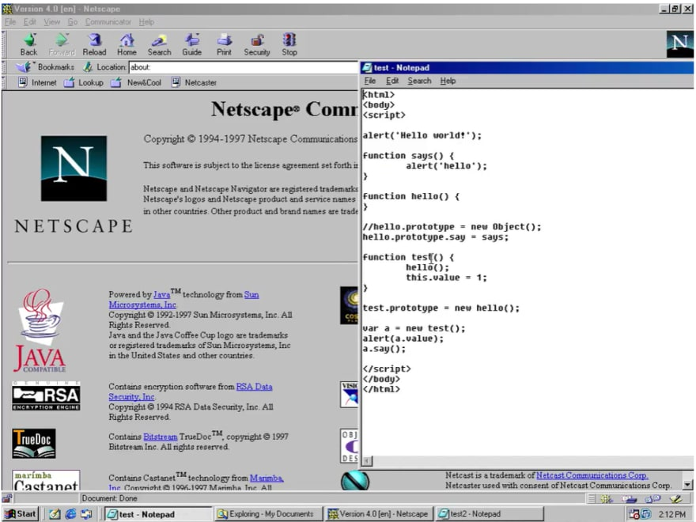
[image credit](https://res.cloudinary.com/practicaldev/image/fetch/s--qvQ1OK3O--/c_limit%2Cf_auto%2Cfl_progressive%2Cq_auto%2Cw_880/https://dev-to-uploads.s3.amazonaws.com/uploads/articles/igqeto02f5c5wcsv7e4d.png)

1995년 넷스케이프 브라우저에서 브랜든 아이크가 개발한 JavaScript가 지원되면서 웹페이지에 상호작용을 추가할 수 있게 되었습니다. 1997년 JavaScript는 ECMAScript 버전 1로 표준화되었습니다.

### AJAX

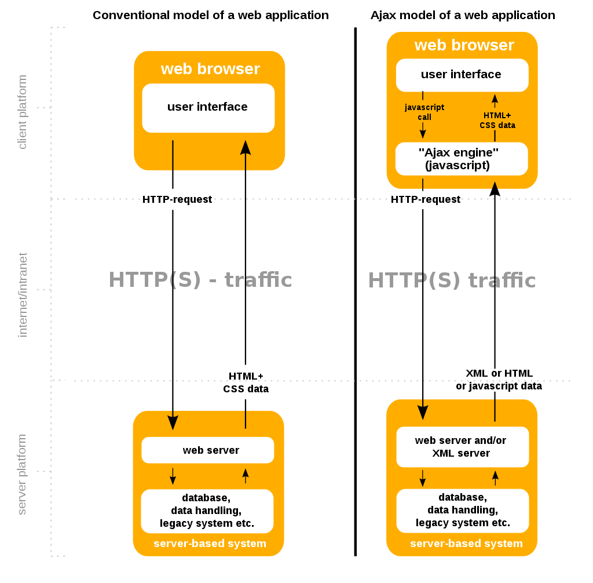
[image credit](https://ko.wikipedia.org/wiki/Ajax#/media/%ED%8C%8C%EC%9D%BC:Ajax-vergleich-en.svg)

1999년에 개발된 이후 2006년 XMLHTTPRequest(XHR) 객체가 W3C 표준으로 제정되면서, 웹 애플리케이션에서 페이지 새로고침 없이 데이터를 비동기적으로 주고받을 수 있게 되었습니다. 이를 AJAX(Asynchronous JavaScript and XML)라고 부릅니다. 서버에서 HTML 대신 XML/JSON 데이터를 반환하고, 자바스크립트에서 템플릿을 적용하여 브라우저에 렌더링하는 클라이언트 렌더링 방식이 가능해졌습니다.

## 웹 애플리케이션 프레임워크의 발전 과정

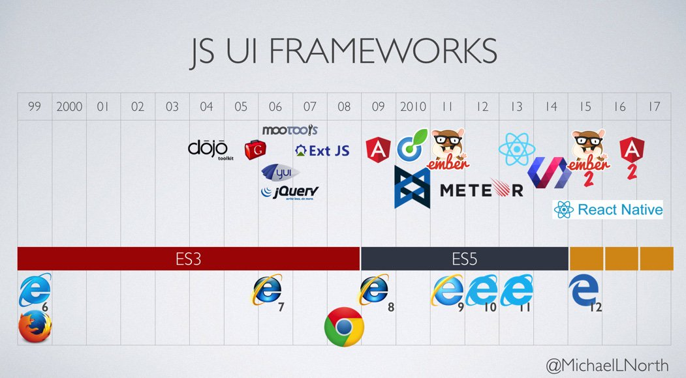
[image credit](https://twitter.com/michaellnorth/status/720030263905005568)

### 제1세대
2006년 jQuery가 출시되며 DOM 조작, AJAX, UI 위젯 기능을 제공했습니다. Dojo Toolkit(2004), Mootools, YUI 등의 라이브러리도 있었지만 jQuery가 가장 인기있었습니다.

### 제2세대
2009년 ES5 발표 후 사용자 기대치 증가로 Angular(2009), Backbone.js(2010), Ember, Meteor(2011) 등의 프레임워크가 등장했습니다. 양방향 데이터 바인딩, 템플릿 기능이 주요 특징이었습니다. 2013년 React, 2014년 Vue, Polymer가 출시되었습니다. 2009년 Node.js가 서버 사이드 JavaScript 런타임으로 등장했습니다.

### 제3세대
2015년 ES6 발표로 화살표 함수, 템플릿 리터럴 등의 기능이 추가되었습니다. 이 시기에는 상태 관리, UI 컴포넌트 구축, 가상 DOM 등에 중점을 두었습니다. Angular가 2016년 리부트되며 Angular.js에서 Angular로 전환되었습니다. React와 Vue의 인기가 높아졌습니다.

## 2017년 이후 웹 개발의 최신 동향과 미래

### 3rd Party API 통합(Integrations)
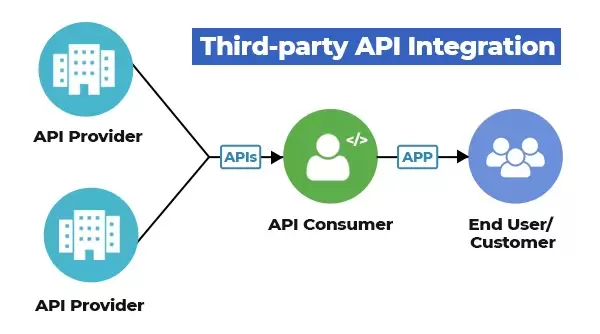
[image credit](https://itechindia.co/blog/third-party-api-integrations/)

웹 서비스, 제3자 API, SDK 등을 통해 기존 제품과 서비스를 통합할 수 있습니다.

### 싱글 페이지 앱(SPA)
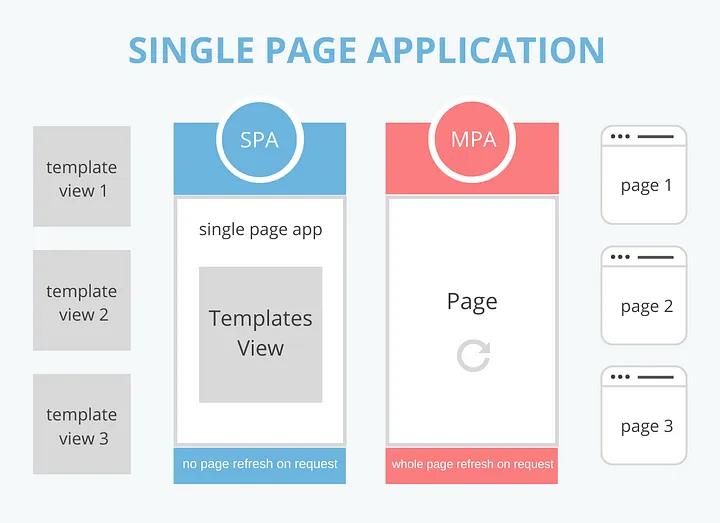
[image credit](https://medium.com/@teamtechsis/single-page-applications-spa-48b1b845b446)

AJAX의 발전으로 페이지 전환 없이 컨텐츠를 재작성하는 SPA 아키텍처가 등장했습니다.
라우팅을 통해 URL을 변경하고 뷰를 바꿔 페이지 이동을 시뮬레이션합니다.

### 서버 사이드 렌더링(SSR)
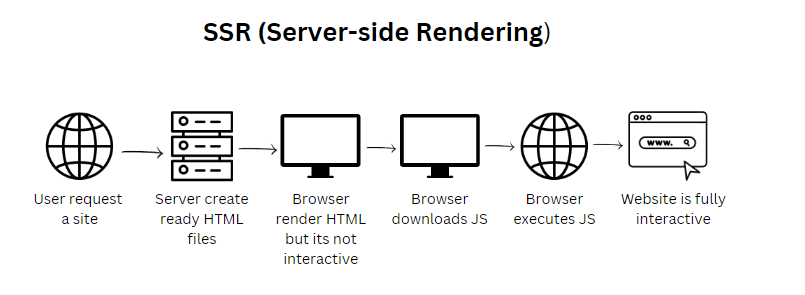
[image credit](https://www.linkedin.com/pulse/enhancing-web-performance-comprehensive-guide-server-side-c1bhe/)

SPA의 장점을 살리면서 서버에서 초기 렌더링을 수행하여 로딩 속도를 개선합니다.
Next.js 등의 프로젝트에서 SSR을 지원합니다.

### JAMstack
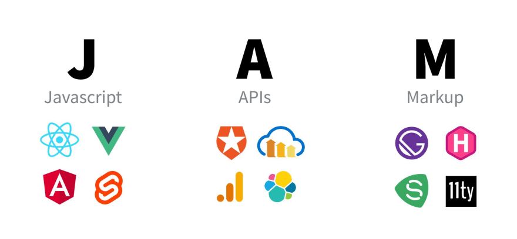
[image credit](https://www.freecodecamp.org/news/what-is-the-jamstack-and-how-do-i-host-my-website-on-it/)

정적 사이트에서도 API 통합으로 풀스택 앱 경험을 제공할 수 있습니다.
React, Gatsby 등으로 정적 사이트를 생성하고 Headless CMS로 컨텐츠를 관리합니다.

### 프로그레시브 웹 앱(PWAs)

2015년 PWA 개념이 등장해 Service Worker 등의 API로 네이티브 앱 수준의 기능을 웹에서 제공합니다.

### 웹 어셈블리(WebAssembly)

저수준 코드를 브라우저에서 실행할 수 있는 WebAssembly가 등장해 다양한 언어 애플리케이션을 웹에 포팅할 수 있게 되었습니다.

### Web 3

Web 3는 블록체인, 탈중앙화, 에지 컴퓨팅을 통해 현재 인터넷을 진화시키려는 구상입니다.