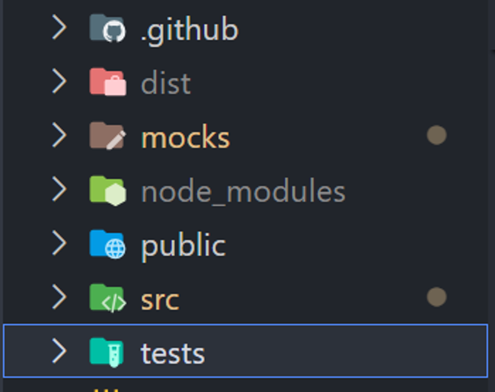
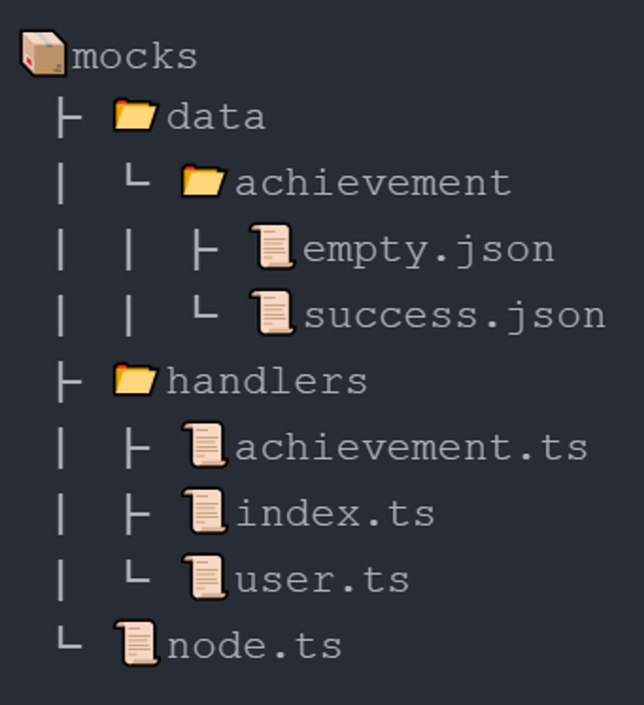

# 환경설정

## JS 테스트 프레임워크

Vite, Webpack 등의 개발 환경에 따라 적합한 선택이 달라질 수 있다.

### **Jest**

- Facebook에서 개발한 오픈소스 테스트 프레임워크
- 대규모 프로젝트에서 많이 사용되며, 안정성과 확장성이 좋음
- React 프로젝트에서 주로 사용되었지만, 다른 프레임워크에서도 활용 가능
- 스냅샷 테스팅, 코드 커버리지, 모의 객체(mock) 등 다양한 기능 지원
- Jest 자체가 테스트 러너이므로 별도의 테스트 러너가 필요 없음
- 초기 설치 및 설정이 다소 복잡할 수 있음

### **Vitest**

- Vite에서 공식적으로 지원하는 테스트 프레임워크
- Vite 프로젝트에서 사용하기에 최적화되어 있음
- Jest와 유사한 API를 제공하여 Jest에서 Vitest로 마이그레이션하기 쉬움
- Jest보다 가볍고 빠른 테스트 실행 속도
- Vite의 네이티브 ES 모듈 지원으로 인한 빠른 테스트 속도
- 초기 설치 및 설정이 Jest보다 간단함
- Jest에 비해 아직 생태계가 작고 지원 기능이 부족할 수 있음

### **React + Vite**

- React + Vite 프로젝트에서는 Vitest가 가장 적합하다. Vite와 완벽하게 통합되어 있고, 설정이 간단하며 빠른 테스트 실행 속도를 제공한다.
- Webpack과 함께 사용하는 경우, Jest를 사용하는 것이 더 나을 수 있다. Webpack과 Jest의 통합이 오랜 기간 동안 검증되어 왔기 때문이다.

### **React + Webpack**

- React + Webpack 프로젝트에서는 Jest가 가장 일반적인 선택이다. React 생태계에서 오랫동안 사용되어 왔고, Webpack과의 통합이 원활하다.
- 그러나 Vitest를 사용해도 문제없다. Jest와 유사한 API를 제공하므로 학습 곡선이 낮고, 빠른 테스트 실행 속도를 제공한다.

본 가이드는 **React + Vite** 프로젝트 환경으로 다음과 같은 파일 구조로 진행한다.



## Vitest 환경 구성

### **Vitest 설치**

```bash
npm install -D vitest
```

### **package.json 수정**

`package.json` 파일에 다음 스크립트를 추가

```json
{
  "scripts": {
    "test": "vitest",
    "coverage": "vitest run --coverage",
    "test-ui": "vitest --ui"
  }
}
```

### **vite.config.ts 파일 수정**

프로젝트 루트에 `vitest.config.ts` 파일을 생성하고 다음 내용을 추가

```tsx
/// <reference types="vitest" />/// <reference types="vite/client" />

import react from '@vitejs/plugin-react';
import { defineConfig } from 'vitest/config';

export default defineConfig({
  plugins: [react()],
  build: {
    outDir: 'dist', // 빌드 결과물 출력 디렉터리
    emptyOutDir: true, // 빌드 전 outDir 디렉터리 비우기
    rollupOptions: {
      input: {
        main: '/src/main.tsx', // 엔트리 파일 지정
      },
      external: [ // 제외할 디렉터리 및 파일 패턴 설정
        '/tests/',
        '/tests/**/*',
        '/mocks/',
        '/mocks/**/*',
        '/node_modules/**/*',
      ],
    },
  },
  test: {
    setupFiles: './test/setup.ts',
  },
})
```

### **Test Setup 파일 생성**

`src/test/setup.ts` 파일을 생성하고 다음 내용을 추가.

```tsx
import '@testing-library/jest-dom/vitest';
```

이 파일은 Jest DOM 매쳐를 설치하여 테스트에서 `.toBeInTheDocument()` 같은 DOM 관련 assertion을 사용할 수 있다

---

## MSW 환경 구성

```bash
npm install -D msw
```



### 서버 환경 세팅

[MSW 브라우저 세팅 공식문서](https://mswjs.io/docs/integrations/browser/)

```tsx
import { setupServer } from 'msw/node';
import { handlers } from './handlers';

export const server = setupServer(...handlers);
```

### 핸들러 구성 및 분할

```tsx
// /handlers/index.ts

import { achievementHandlers } from './achievement';
import { userHandlers } from './user';

// network description array.
export const handlers = [...userHandlers, ...achievementHandlers];
```

- userHandlers.ts
    
    ```tsx
    import { http, HttpResponse } from 'msw';
    import { BASE_URL } from '../../src/apis';
    
    export const userHandlers = [
      http.get(`${BASE_URL}login`, ({ request }) => {
        const url = new URL(request.url);
        const userId = url.searchParams.get('userId') || '';
        if (
          typeof userId !== 'string' ||
          userId === 'undefined' ||
          userId === 'notExistId' ||
          !userId.trim()
        ) {
          return HttpResponse.json(404, { status: 200 });
        }
        return HttpResponse.json(200, { status: 200 });
      }),
    ];
    
    ```
    
- achievementHandlers
    
    ```tsx
    import { http, HttpResponse } from 'msw';
    import { BASE_URL } from '../../src/apis';
    import success_data from '../data/achievement/success.json';
    import empty_data from '../data/achievement/empty.json';
    
    export const achievementHandlers = [
      http.get(`${BASE_URL}achievement`, ({ request }) => {
        const url = new URL(request.url);
        const userId = url.searchParams.get('id');
    
        if (
          typeof userId !== 'string' ||
          userId === 'undefined' ||
          !userId.trim()
        ) {
          return new HttpResponse(
            `AxiosError: Request failed with status code 404`,
            {
              status: 404,
              statusText: `AxiosError: Request failed with status code 404`,
            },
          );
        }
    
        if (userId === 'notExistId') {
          return new HttpResponse(
            `AxiosError: Request failed with status code 502`,
            {
              status: 502,
              statusText: `AxiosError: Request failed with status code 502`,
            },
          );
        }
    
        if (userId === 'empty') {
          return HttpResponse.json(empty_data, { status: 200 });
        }
    
        return HttpResponse.json(success_data, { status: 200 });
      }),
    ];
    
    ```
    

### 목 데이터 생성

- empty.json
    
    ```json
    {
      "data": [
        {
          "solved_problem": [],
          "solved_count": 0,
          "solved_recent": 0,
          "updated_at": null,
          "review_count": 0,
          "solved_total_count": 0,
          "solved_day": 0
        }
      ]
    }
    ```
    
- success.json
    
    ```json
    {
      "data": [
        {
         "solved_problem": [
          {
            "problemNum": "11052",
            "problemLink": "/problem/11052",
            "language": "Java 11",
            "solvedTime": "2024-04-16 17:37:49"
          },
          {
            "problemNum": "12026",
            "problemLink": "/problem/12026",
            "language": "Java 11",
            "solvedTime": "2024-04-15 16:56:46"
          },
          ...
          ],
          "solved_count": 100,
          "solved_recent": 11052,
          "updated_at": "2024-04-16T20:52:27.341Z",
          "review_count": 29,
          "solved_total_count": 100,
          "solved_day": 16
        }
      ]
    }
    ```
    

### setup.ts 파일 수정

모든 테스트가 실행될 때 MSW 서버를 시작한다

각 테스트에 대해 독립적인 환경을 제공하도록 요청이 종료되면 핸들러를 초기화한다

모든 테스트가 종료되면 MSW 서버를 종료한다 

```tsx
import '@testing-library/jest-dom/vitest';
import { beforeAll, afterEach, afterAll } from 'vitest';
import { server } from '../mocks/node';

beforeAll(() => server.listen());
afterEach(() => server.resetHandlers());
afterAll(() => server.close());
```

---

## React Testing Libraray 환경 구성

### 정의

react component 를 component 내부 구현 사항에 의존하지 않고 사용자 관점에서 UI 테스트 가능하게 도와주는 라이브러리

자식 컴포넌트를 모두 렌더링하기 때문에 자식 컴포넌트를 모킹해 테스트한다.

### **React Testing Library 설치**

```bash
npm install -D @testing-library/react @testing-library/jest-dom
```

### setup.ts 파일 수정

```tsx
// Jest-DOM 유틸리티 함수를 Vitest에 추가
import '@testing-library/jest-dom/vitest';

// Vitest 유틸리티와 훅(hook)을 임포트
import { expect, beforeAll, afterEach, afterAll } from 'vitest';

// React Testing Library의 cleanup 함수를 임포트
import { cleanup } from '@testing-library/react';

// Jest-DOM 매처를 임포트
import matchers from '@testing-library/jest-dom/matchers';

// 모의(mock) API 서버를 임포트
import { server } from '../mocks/node';

// react-testing-library의 matcher를 확장한다.
// `@testing-library/jest-dom`의 matcher를 사용할 수 있게 된다.
expect.extend(matchers);

// 모든 테스트 실행 전에 모의 API 서버를 시작
beforeAll(() => server.listen());

// 각 테스트 케이스 후에 모의 API 서버의 핸들러를 리셋하고, React Testing Library에서 렌더링된 요소를 정리(cleanup)
afterEach(() => {
  server.resetHandlers();
  cleanup();
});

// 모든 테스트 실행 후에 모의 API 서버를 종료
afterAll(() => server.close());

```

### vite.config.ts 파일 수정

```tsx
/// <reference types="vitest" />
import { defineConfig, type PluginOption } from 'vite';
import react from '@vitejs/plugin-react';
import path from 'path';
import svgr from 'vite-plugin-svgr';
import { visualizer } from 'rollup-plugin-visualizer';

export default ({ mode }: { mode: string }) => {
  return defineConfig({
    plugins: [
      svgr({
        svgrOptions: {
          // svgr options
        },
      }),
      react(),
      mode === 'analyze'
        ? (visualizer({
            template: 'treemap', // or sunburst, treemap, network
            open: true,
            gzipSize: true,
            brotliSize: true,
            filename: 'analyze.html', // will be saved in project's root
          }) as PluginOption)
        : [],
    ],
    resolve: {
      alias: [
        { find: '@', replacement: path.resolve(__dirname, './src') },
        {
          find: '@components',
          replacement: path.resolve(__dirname, './src/components'),
        },
      ],
    },
    build: {
      outDir: 'dist', // 빌드 결과물 출력 디렉터리
      emptyOutDir: true, // 빌드 전 outDir 디렉터리 비우기
      rollupOptions: {
        input: {
          main: '/src/main.tsx', // 엔트리 파일 지정
        },
        // 제외할 디렉터리 및 파일 패턴 설정
        external: [
          '/tests/',
          '/tests/**/*',
          '/mocks/',
          '/mocks/**/*',
          '/node_modules/**/*',
        ],
      },
    },
    test: {
      globals: true,
      environment: 'jsdom',
      setupFiles: './tests/setup.ts',
    },
  });
};

```

### 예제

```tsx
// 리액트 테스팅 메서드 임포트
import {render, screen} from '@testing-library/react'
// userEvent 라이브러리는 브라우저에서 사용자 상호작용이 일어났을 때 발생하는 이벤트를 디스패치하여 사용자 상호작용을 시뮬레이션합니다.
import userEvent from '@testing-library/user-event'
// jest-dom에서 커스텀 jest 매쳐를 추가합니다.
import '@testing-library/jest-dom'
// 테스트할 컴포넌트
import Fetch from './fetch'

test('loads and displays greeting', async () => { 
	// DOM에 리액트 엘리먼트를 렌더링합니다.
	render(<Fetch url="/greeting" />) 
	
	await userEvent.click(screen.getByText('Load Greeting')) 
	// 엘리먼트를 찾을 수 없는 경우 에러를 throw하기 전에 대기합니다.
	await screen.findByRole('heading') 
	
	// jest-dom의 커스텀 매쳐 toHaveTextContent를 사용하여 경고 메시지가 올바른지 assert합니다.
	expect(screen.getByRole('heading')).toHaveTextContent('hello there') 
	expect(screen.getByRole('button')).toBeDisabled()
})
```

주의사항:

컨텍스트 api, 전역 스토어 react-router-dom을 포함하는 사용자 정의 render 함수를 정의하는 것이 유용하다.

- 전역 설정을 위한 wrapper 컴포넌트
    
    ```tsx
    import { render, fireEvent } from '../test-utils';
    import React, {ReactElement} from 'react'
    import {render, RenderOptions} from '@testing-library/react'
    import {ThemeProvider} from 'my-ui-lib'
    import {TranslationProvider} from 'my-i18n-lib'
    import defaultStrings from 'i18n/en-x-default'
    
    const AllTheProviders = ({children}: {children: React.ReactNode}) => {
      return (
        <ThemeProvider theme="light">
          <TranslationProvider messages={defaultStrings}>
            {children}
          </TranslationProvider>
        </ThemeProvider>
      )
    }
    
    const customRender = (
      ui: ReactElement,
      options?: Omit<RenderOptions, 'wrapper'>,
    ) => render(ui, {wrapper: AllTheProviders, ...options})
    
    export * from '@testing-library/react'
    export {customRender as render}
    ```
    

---

## ESLint 설정 추가

### **ESLint 플러그인 설치**

Vitest와 ESLint를 통합하기 위해 `@vitest/ui` 플러그인을 설치해야 한다.

```bash
npm install -D @vitest/ui
```

### **ESLint 설정 파일 수정**

ESLint 설정 파일(`.eslintrc.js` 또는 `.eslintrc.json`)에 다음 내용을 추가.

```jsx
javascriptCopy code// .eslintrc.js
module.exports = {
// ...
  extends: [
// ...
    'plugin:vitest/recommended',
  ],
// ...
  plugins: ['vitest'],
// ...
  overrides: [
// ...
    {
      files: ['**/*.test.ts', '**/*.test.tsx'],
      plugins: ['vitest'],
      extends: ['plugin:vitest/recommended'],
      rules: {
        'vitest/no-disabled-tests': 'warn',
        'vitest/no-focused-tests': 'error',
      },
    },
  ],
// ...
}
```

- `@vitest/ui` 플러그인을 ESLint에 추가합니다.
- `.test.ts` 및 `.test.tsx` 파일에 대해 `vitest/recommended` 규칙을 적용.
- 비활성화된 테스트에 대한 경고와 포커스된 테스트에 대한 오류를 발생.

---

## 테스트작성 예시

### 동기

**테스트 대상 코드**

```tsx
export const getLevel = (count: number) => {
  let level: number = 0;
  if (count >= 1 && count <= 3) {
    level = 1;
  } else if (count >= 4 && count <= 6) {
    level = 2;
  } else if (count >= 7 && count <= 9) {
    level = 3;
  } else if (count >= 10) {
    level = 4;
  }
  return level;
};
```

**테스트 코드**

```tsx
describe('getLevel', () => {
 it('count가 1과 3 사이일 때 1을 반환해야 합니다', () => {
   expect(getLevel(1)).toBe(1);
   expect(getLevel(2)).toBe(1);
   expect(getLevel(3)).toBe(1);
 });

 it('count가 4와 6 사이일 때 2를 반환해야 합니다', () => {
   expect(getLevel(4)).toBe(2);
   expect(getLevel(5)).toBe(2);
   expect(getLevel(6)).toBe(2);
 });

 it('count가 7과 9 사이일 때 3을 반환해야 합니다', () => {
   expect(getLevel(7)).toBe(3);
   expect(getLevel(8)).toBe(3);
   expect(getLevel(9)).toBe(3);
 });

 it('count가 10 이상일 때 4를 반환해야 합니다', () => {
   expect(getLevel(10)).toBe(4);
   expect(getLevel(11)).toBe(4);
   expect(getLevel(100)).toBe(4);
 });

 it('count가 1 미만일 때 0을 반환해야 합니다', () => {
   expect(getLevel(0)).toBe(0);
   expect(getLevel(-1)).toBe(0);
   expect(getLevel(-100)).toBe(0);
 });
});
```

### 비동기

**테스트 대상 코드**

```tsx
import { defaultInstance } from '@/apis';
import { ResponseCode } from '@/types/common/response';
import { AxiosResponse } from 'axios';

const fetchUserCheck = (baekjoonID: string) =>
  defaultInstance
    .get(`login?userId=${baekjoonID}`)
    .then((res: AxiosResponse<ResponseCode>) => res.data);

export default fetchUserCheck;

```

**테스트 코드**

```tsx
import fetchUserCheck from '../../src/apis/fetchUserCheck';
import { ResponseCode } from '../../src/types/common/response';
import { describe, it, expect, beforeEach, expectTypeOf } from 'vitest';

describe('백준 아이디 확인', () => {
  it('string 타입의 파라미터를 받는다', () => {
    return expectTypeOf(fetchUserCheck).parameter(0).toBeString();
  });

  it('하나의 파라미터를 받는다', () => {
    return expect(fetchUserCheck).toHaveLength(1);
  });

  describe('요청 성공 시', () => {
    let statusCode: ResponseCode;

    beforeEach(async () => {
      statusCode = await fetchUserCheck('testID');
    });

    it('ResponseCode 타입을 리턴한다', async () => {
      expectTypeOf(statusCode).toMatchTypeOf<ResponseCode>();
    });

    it('200 code 를 리턴한다', async () => {
      expect(statusCode).toBe(200);
    });
  });

  describe('요청 실패 시, 4xx code 를 리턴한다', () => {
    it('빈 문자열 "" 입력 시, 404 Not Found 를 리턴한다', async () => {
      let statusCode: ResponseCode = await fetchUserCheck('');
      expect(statusCode).toBe(404);
    });
    it('인수 없이 호출 시, 404 Not Found 를 리턴한다', async () => {
      // @ts-ignore
      let statusCode: ResponseCode = await fetchUserCheck();
      expect(statusCode).toBe(404);
    });
    it('존재하지 않는 ID 입력 시, 404 Not Found 를 리턴한다', async () => {
      let statusCode: ResponseCode = await fetchUserCheck('notExistId');
      expect(statusCode).toBe(404);
    });
  });
});

```

### 컴포넌트

**테스트 대상 코드**

```tsx
import { cn } from '@/utils/cn';
import IDefaultProps from '@/types/common/props';

const ValidateMessage = (props:IDefaultProps) => {
  const { className="", children } = props;

  return (
    <p
      className={cn(
        'absolute text-xs pt-[1px] pl-[2px] text-red-600',
        className,
      )}
    >
      {children}
    </p>
  );
};

export default ValidateMessage;

```

**테스트 코드**

```tsx
import { render, screen } from '@testing-library/react';
import ValidateMessage from '../../src/components/ValidateMessage';

describe('ValidateMessage 컴포넌트', () => {
  it('전달된 문자열을 렌더링한다', () => {
    const message = '유효하지 않은 입력입니다.';
    render(<ValidateMessage>{message}</ValidateMessage>);
    const renderedText = screen.getByText(message);
    expect(renderedText).toBeInTheDocument();
  });

  it('전달된 className이 적용된다', () => {
    const message = '유효하지 않은 입력입니다.';
    const customClass = 'custom-class';
    render(<ValidateMessage className={customClass}>{message}</ValidateMessage>);
    const renderedElement = screen.getByText(message);
    expect(renderedElement).toHaveClass(customClass);
  });

  it('children이 없으면 렌더링되지 않는다', () => {
    render(<ValidateMessage />);
    const renderedElement = screen.queryByText('');
    expect(renderedElement).not.toBeInTheDocument();
  });

  it('빈 문자열을 children으로 전달하면 빈 요소가 렌더링된다', () => {
    render(<ValidateMessage>{''}></ValidateMessage>);
    const renderedElement = screen.getByText('');
    expect(renderedElement).toBeInTheDocument();
  });

  it('하나의 children만 렌더링된다', () => {
    const message1 = '유효하지 않은 입력입니다.';
    const message2 = '다른 메시지입니다.';
    render(
      <ValidateMessage>
        {message1}
        {message2}
      </ValidateMessage>
    );
    const renderedElements = screen.getAllByText(
      /유효하지 않은 입력입니다.|다른 메시지입니다./
    );
    expect(renderedElements.length).toBe(1);
  });
});
```

### **unit + integration test**

1. **unit test**
    
    utils, api 함수, 커스텀 훅, 가장 작은 단위의 컴포넌트
    
2. **integration test**
    
    다수의 컴포넌트로 구성된 컴포넌트, 페이지 컴포넌트, 다수의 페이지 컴포넌트
    

## 참조

Claude

[**Vitest Getting Started**](https://vitest.dev/guide/)

**[React Testing Library](https://testing-library.com/docs/react-testing-library/intro)
[RTL Core All About Queries](https://testing-library.com/docs/queries/about)**

**[Vitest의 자주 쓰이는 매처 함수 총정리](https://www.daleseo.com/vitest-expect/)**

**[Vitest에서 React Testing Library 사용하기](https://www.padosum.dev/wiki/React-Testing-Libarry-in-Vitest/)**

**[Vite & React & Vitest & MSW &testing-library로 테스트 코드 작성하기](https://velog.io/@megen07/Vite-React-Vitest-MSW-testing-library%EB%A1%9C-%ED%85%8C%EC%8A%A4%ED%8A%B8-%EC%BD%94%EB%93%9C-%EC%9E%91%EC%84%B1%ED%95%98%EA%B8%B0)**