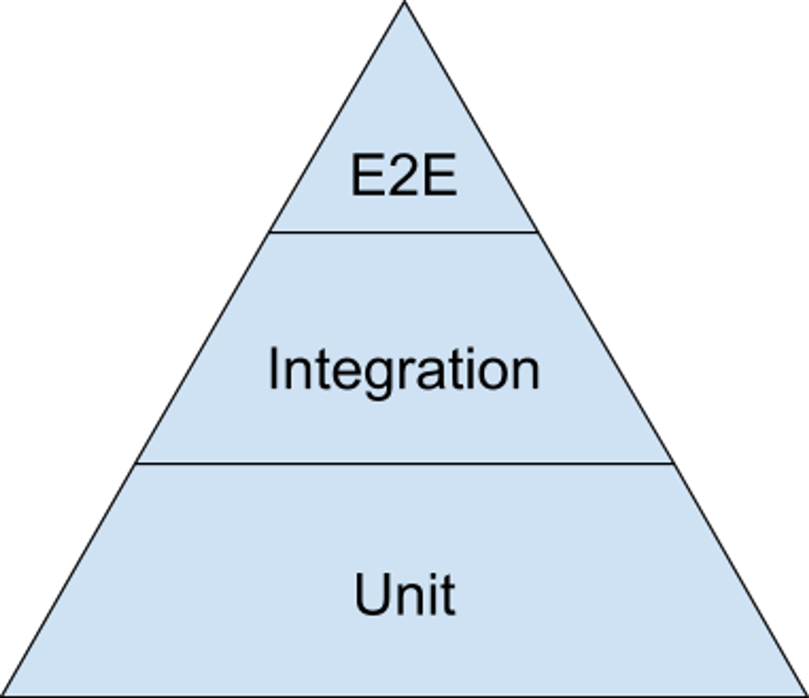
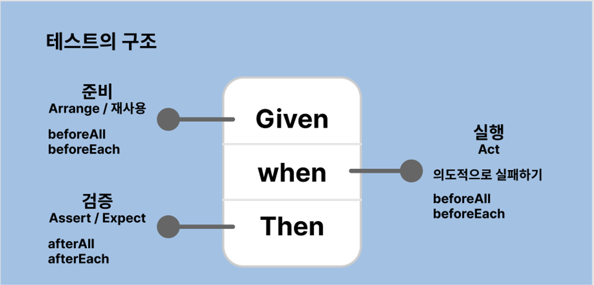
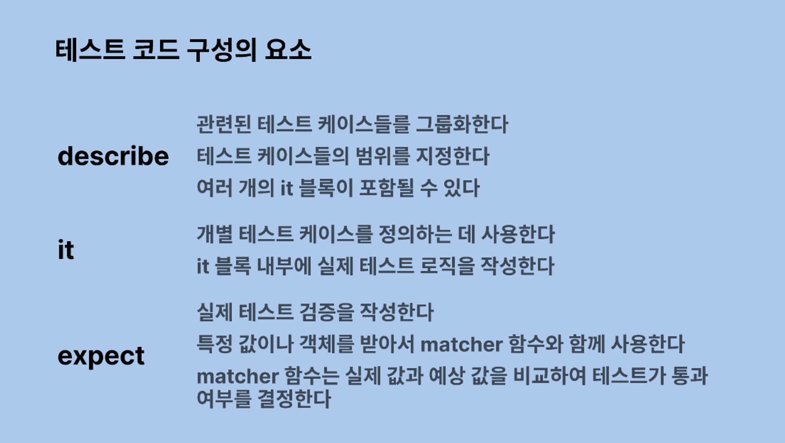
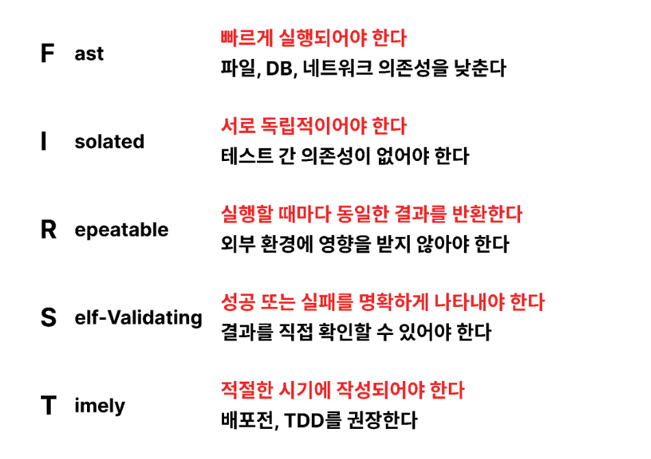
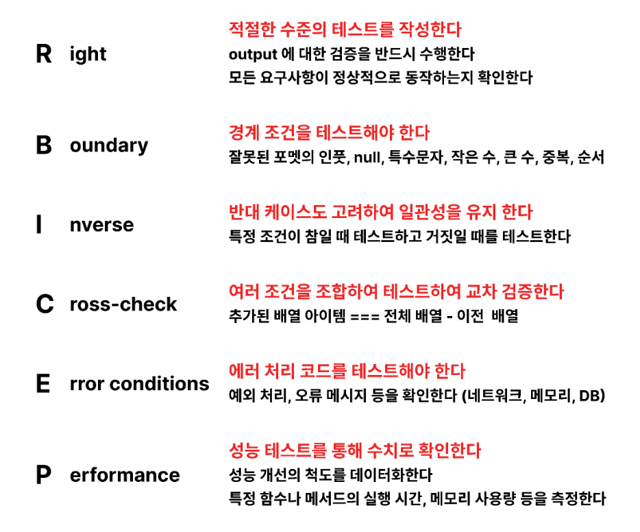
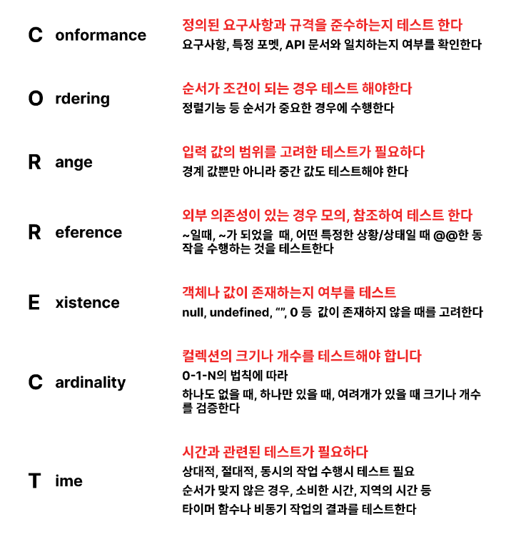

# 테스트란?

**제품**이 **예상하는 대로** 동작하는지 검증하는 작업

- 제품 ( === 함수, 특정 기능, UI, 성능, API 스펙)
- 예상하는 대로 ( === 요구사항에 맞게)

## 테스트의 주요 flow

1. Arrange (준비)
2. Act (실행)
3. Assertion (검증)

## 테스트 시작 시점

개발과 동시에 진행한다

## 테스트를 하는 이유

- 제품이 정상적으로 요구사항대로 동작하는 증거가 된다.
- 이슈에 대한 예측이 가능하여 버그를 빠르게 발견 가능하다.
- 코드 리팩토링시 CI 에 대한 걱정을 하지 않아도 된다.
- 코드의 의존성을 낮출 수 있다.
- 테스트 코드가 일종의 문서화 효과를 가진다.
- 개발 시간을 절약할 수 있다.

## 테스트 피라미드


**[image credit](https://en.m.wikipedia.org/wiki/File:Testing_Pyramid.png)**

테스트의 범위와 비용에 따라 세 가지 주요 유형의 테스트를 계층화한 개념

### **단위 테스트(Unit Tests)**

- 소프트웨어의 가장 작은 단위인 클래스나 함수, 컴포넌트를 독립적으로 테스트한다.
- 각 단위의 기능이 올바르게 동작하는지 확인하는 것이 목적
- 단위 테스트는 개발 단계에서 수행되며, 자동화되어 있어 반복 실행이 용이하다.

### **통합 테스트(Integration Tests)**

- 통합 테스트는 두 개 이상의 단위가 상호작용할 때 올바르게 동작하는지 확인
- 모듈, 컴포넌트, 서비스 등 더 큰 범위의 코드 부분을 통합하여 테스트
- 시스템의 여러 부분이 함께 동작하는지 검증하는 것이 목적

### **E2E (End-to-End) 테스트**

- E2E 테스트는 전체 애플리케이션 또는 시스템을 실제 사용자의 관점에서 테스트한다.
- 사용자의 시나리오를 시뮬레이션하여 애플리케이션의 각 계층이 통합되어 예상대로 동작하는지 확인한다.
- 프론트엔드, 백엔드, 데이터베이스, 외부 서비스 등 모든 구성 요소의 상호 작용을 검증한다.
- regression (회귀) 테스트에 적합하다
- 회귀(regression)는 소프트웨어 테스팅 용어로, 새로운 코드 변경이나 기능 추가 등으로 인해 이전에 정상적으로 작동하던 기존 기능이 예기치 않게 중단되거나 오작동하는 현상을 말한다.

### 비교

|  | 실행비용 | 수행시간 |
| --- | --- | --- |
| 단위테스트 | 하 | 빠름 |
| 통합테스트 | 중 | 중간 |
| E2E 테스트 | 상 | 느림 |

contract, a/b, stress 테스트 등 여러 테스트 개념도 있다

개발자가 어디 까지 테스트 하는지는 회사마다 다름

## 좋은 테스트 구조

### Given - When - Then




## 좋은 테스트 원칙

### FIRST

테스트 케이스를 작성할 때 고려해야 할 원칙



내부 구현 사항을 자세히 테스트하지 않는다 

내부 구현 사항은 자주 변경되기 때문에 실행 결과를 테스트하는 데 집중한다

## 좋은 테스트 범위

### Right-BICEP

테스트의 범위를 결정할 때 고려해야 할 요소들을 나타내는 원칙



## 좋은 테스트 조건

### CORRECT

테스트 케이스를 작성할 때 고려해야 할 조건들을 나타내는 원칙



## 프론트엔드에서의 테스트

프론트엔드 테스트는 일반 사용자와 동일하거나 유사한 환경에서 수행된다
사용자가 프로그램에서 수행할 비즈니스 로직이나 모든 경우의 수를 고려해야 하며

## CI/CD 와 테스트

### Github Actions 으로 구축한 CI

참고 : claude, [DaleSeo 님의 github actions JS 셋업](https://www.daleseo.com/github-actions-setup-node/)

```yaml
name: CI

on:
  push:
    branches: [ main ]
  pull_request:
    branches: [ main ]

jobs:

  # 빌드 작업 정의
  build:
    runs-on: ubuntu-latest
    
    steps:
    # 워크플로우가 실행되는 가상 환경에 리포지토리의 최신 소스 코드의 특정 버전을 가져오는 작업
    - uses: actions/checkout@v3 
    - name: Use Node.js
      uses: actions/setup-node@v3
      with:
        node-version: '16'
    - run: npm ci # 보다 엄격한 npm i 명령어
    - run: npm run build # React 프로젝트 빌드 명령어 실행
    - uses: actions/upload-artifact@v3 # 빌드 결과물(아티팩트) 업로드
      with:
        name: build-output
        path: build # 빌드 결과물이 있는 디렉터리 경로

  # 테스트 작업 정의
  test:
    needs: build # 빌드 작업 후에 실행됨
    runs-on: ubuntu-latest
    
    steps:
    - uses: actions/checkout@v3
    - name: Use Node.js
      uses: actions/setup-node@v3
      with:
        node-version: '16'
    - run: npm ci
    - run: npm test # 또는 npm run 직접 설정한 test script
    - uses: actions/download-artifact@v3 # 빌드 작업에서 업로드된 아티팩트 다운로드
      with:
        name: build-output
    # 다운로드한 빌드 결과물로 추가 작업 수행 가능 (예: 배포)
```

### Github Actions 키워드 정리
<details>
<summary>Github workflow 키워드 정리</summary>

1. **name**
    - `name: CI Workflow` (워크플로우 이름 지정)
2. **on**
    - `on: push` (코드 푸시 시 워크플로우 트리거)
    - `on: pull_request` (Pull Request 생성 시 워크플로우 트리거)
    - `on: schedule` (예약에 따라 워크플로우 트리거)
        - `cron: '0 2 * * *'` (매일 오전 2시에 실행)
3. **jobs**
    - `jobs:` 키워드 아래에 작업들을 정의합니다.
4. **runs-on**
    - `runs-on: ubuntu-latest` (Ubuntu 최신 버전에서 실행)
    - `runs-on: windows-latest` (Windows 최신 버전에서 실행)
    - `runs-on: self-hosted` (셀프 호스팅 러너에서 실행)
5. **steps**
    - `steps:` 키워드 아래에 단계들을 정의합니다.
6. **uses**
    - `uses: actions/checkout@v3` (소스코드 체크아웃 액션 사용)
    - `uses: actions/setup-node@v3` (Node.js 환경 설정 액션 사용)
7. **run**
    - `run: npm ci` (npm ci 명령어 실행)
        - claude 에게 물어본 npm ci
            
            `run: npm ci` 명령은 GitHub Actions 워크플로우에서 다음과 같은 역할을 합니다.
            
            1. **npm ci 실행**
                - `npm ci`는 `npm install`의 보다 엄격한 버전입니다.
                - 이 명령은 프로젝트의 `package-lock.json` 또는 `npm-shrinkwrap.json` 파일에 기록된 정확한 의존성 버전을 설치합니다.
                - 이를 통해 설치된 종속성 트리가 어디서든 동일하게 유지되므로 재현 가능한 빌드가 가능해집니다.
            2. **깨끗한 의존성 설치**
                - `npm ci`는 `node_modules` 폴더를 삭제하고 새로 생성합니다.
                - 이전에 설치된 잔여물이 없는 깨끗한 환경에서 의존성을 설치합니다.
            3. **오프라인 모드**
                - `npm ci`는 오프라인 모드로 실행됩니다.
                - 이미 `package-lock.json`에 지정된 버전만 설치하므로 원격 레지스트리에 접속할 필요가 없습니다.
            4. **프로덕션 환경 최적화**
                - `npm ci` 명령은 개발 의존성(devDependencies)을 설치하지 않습니다.
                - 배포를 위한 프로덕션 환경에 최적화된 의존성만 설치합니다.
            
            GitHub Actions 워크플로우는 매번 새로운 가상 환경에서 실행되므로, `npm ci`를 사용하면 깨끗하고 일관된 의존성 설치 환경을 제공합니다. 이를 통해 빌드 및 테스트의 재현성과 안정성이 향상됩니다.
            
    - `run: npm test` (npm test 명령어 실행)
8. **with**
    - `with: { node-version: '16' }` (Node.js 버전 16 사용)
9. **env**
    - `env: { NODE_ENV: 'production' }` (NODE_ENV 환경 변수 설정)
10. **secrets**
    - `${{ secrets.DEPLOY_TOKEN }}` (DEPLOY_TOKEN 비밀 값 사용)
11. **if**
    - `if: success()` (이전 단계가 성공했을 때만 실행)
    - `if: failure()` (이전 단계가 실패했을 때만 실행)
12. **needs**
    - `needs: build` (build 작업이 성공적으로 완료된 후 실행)
13. **strategy**
    - `strategy: { matrix: { node: [10, 12, 14] } }` (Node.js 10, 12, 14 버전에서 병렬 실행)
14. **continue-on-error**
    - `continue-on-error: true` (오류 발생 시에도 워크플로우 계속 진행)
</details>