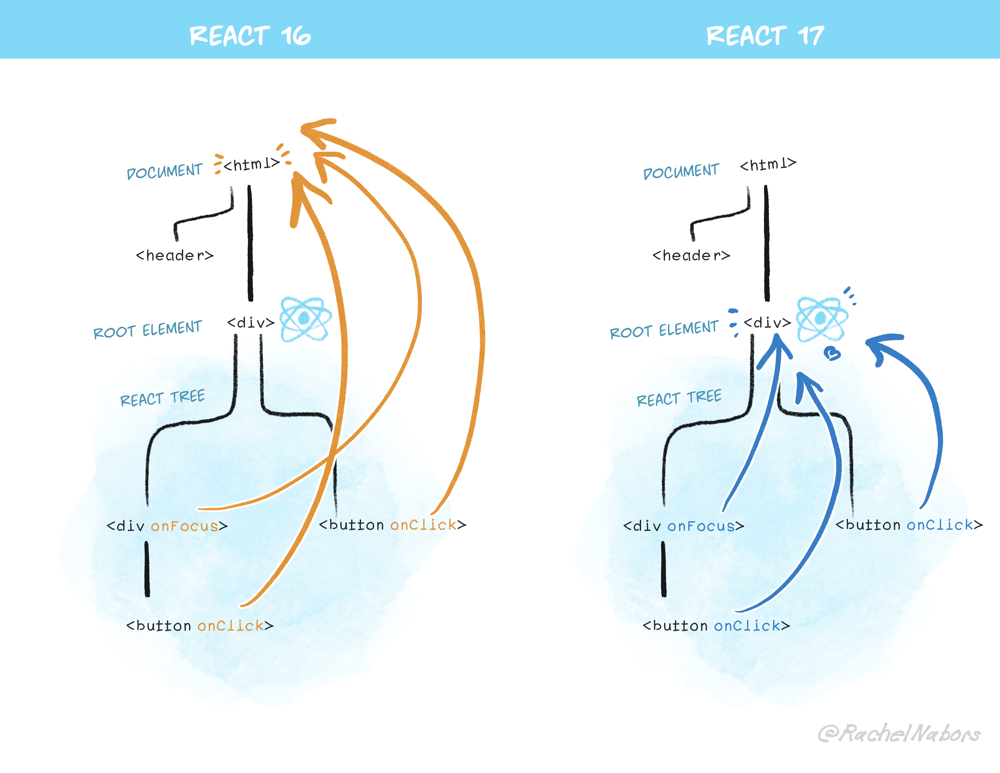

# 리액트 17버전
## 이벤트 위임 방식의 변경

리액트 17 이전 버전에서는 이벤트 위임을 위해 문서의 최상위 노드에 이벤트를 등록했습니다. 하지만 17버전부터는 렌더링된 리액트 루트(Root)에 이벤트를 위임하는 방식으로 변경되었습니다. 이를 통해 이벤트 버블링 단계가 줄어들어 성능이 개선되었습니다.

### React v16 에서 이벤트가 추가되는 방식

```typescript
import {useEffect, useRef } from "react"

export default function Button() {
  const buttonRef = useRef<HTMLButtonElement | null>(null)

  useEffect(() => {
    if(buttonRef.current) {
      buttonRef.current.onclick = function click() {
        alert("HI")
      }
    }
  },[])

  function Hello() {
    alert("hellow")
  }

  return (
    <>
      // document 에 부착
      <button onClick={Hello}>리액트 버튼</button>
      // button 에 부착
      <button ref={buttonRef}>그냥 버튼</button>
    </li>
  )
}
```
### React v17 에서 이벤트가 추가되는 방식


[image credit](https://legacy.reactjs.org/blog/2020/10/20/react-v17.html)

리액트는 이벤트 핸들러를 해당 이벤트 핸들러를 추가한 각각의 DOM 요소에 부탁하는 것이 아니라 이벤트 타입(click, change)당 하나의 핸들러를 **Root** 에 부착하여 이벤트를 위임한다.

16 버전에서는 document 에 이벤트를 위임했으나 이후 추가될 React 버전과의 호환을 위해 root 요소로 변경하였다.

#### 이벤트 위임과 이벤트의 단계

이벤트 위임이란 이벤트 단계를 활용해 이벤트를 상위 컴포넌트에만 붙이는 것

1. 캡쳐(capture) : 이벤트 핸드럴가 트리 최상단 요소에서 부터 시작해서 실제 이벤트가 발생한 타깃 요소까지 내려가는 것.

2. 타깃(target) : 이벤트 핸들러가 타깃 노드에 도달하는 단계, 이 단계에서 이벤트가 호출된다.

3. 버블링(bubbling) : 이벤트가 발생한 요소에서부터 시작해 최상위 요소까지 다시 올라간다.


## import React from "react" 삭제: 새로운 JSX 변환

이전 버전에서는 JSX 코드를 사용하기 위해 import React from "react"를 해야 했다. 

17버전부터는 Babel 관리 팀과 협력해 새로운 JSX 변환 과정이 도입되어 import 구문없이 Babel 이 JSX를 올바르게 변환해주기 떄문에 더는 작성하지 않아도 된다. 

## 이벤트 폴링제거

### 이벤트 풀링

리액트는 이벤트를 처리하기 위해 브라우저의 기본 이벤트를 Wrapping 한 SyntheticEvent 라는 이벤트 객체를 사용한다.

이 SyntheticEvent 는 이벤트가 발생할 때 마다 이벤트를 새로 감싸 이벤트를 새로 만들기 때문에 이벤트 생성 시 추가적인 메모리 할당 작업이 일어난다

React의 이벤트 풀링이란 SyntheticEvent 풀을 만들어서 이벤트가 발생할 때마다 가져오는 것을 의미한다


[image credit](https://hub.packtpub.com/how-to-perform-event-handling-in-react-tutorial/)

언뜻 보기에 메모리도 아낄 수 있고, 불필요하게 GC가 자주 동작할 필요도 없어서 효율적으로 보인다.

하지만 이벤트가 트리거 되었을 때 인스턴스 풀을 받아오고 이벤트 핸들러가 종료되자마자 다시 인스턴스를 release 하는 방식은 *비동기 이벤트에 대한 추가적인 대응* (e.persist())이 필요했다. 

동기 이벤트와 비동기 이벤트 콜백을 동일한 방식으로 작성하면 문제가 발생하여 `비직관적인 개발 경험`을 주게 되었다.

17버전에서는 이 폴링 방식이 제거되고 네이티브 이벤트 기반으로 바뀌었습니다.

## useEffect 클린업 함수의 비동기 실행

16버전까지 useEffect의 클린업 함수는 동기적으로 실행되었습니다. 하지만 17버전부터는 컴포넌트가 마운트 해제될 때 비동기적으로 실행됩니다. 

클린업 함수는 커밋 단계가 완료될 때까지(화면 업데이트가 완전히 끝날 때 까지) 지연되어 약간의 성능적인 이점과 메모리 누수 위험을 줄여준다.

## 컴포넌트의 undefined 반환에 대한 일괄처리

16버전 이전에는 컴포넌트에서 undefined를 반환하면 오류가 발생되었다.

17버전부터는 undefined 반환 시 리액트가 이를 무시하고 렌더링하지 않게 되었다.

18 버전 부터는 undefined 를 반환하면 개발 모드에서 콘솔 경고를 출력하고 배포환경에서는 무시된다.