# WebPageTest

WebPageTest 는 온라인 웹 사이트 성능 분석 tool 이다

무료로 제공하는 기능만으로도 웹사이트 성능 분석에는 충분하다

## WebPageTest 에서 제공하는 분석 tool
- Site Performance : 웹 사이트 성능 분석 tool
- Core Web Vitals : 웹 사이트 핵심 웹 지표 분석 tool
- Lighthouse : 구글 라이트하우스
- Visual Comparison : 
  - 2개 이상의 사이트를 동시에 실행하고 시간의 흐름에 따른 로딩 과정을 비교하는 tool
  - 비슷한 사이트를 비교하는 용도
- Traceroute : 네트워크 경로 확인 tool

Core Web Vitals 와 Lighthouse 는 크롬 개발자 도구와 같다
Site Perfomance 를 중점으로 활용해 보았다.

## 테스트 수행
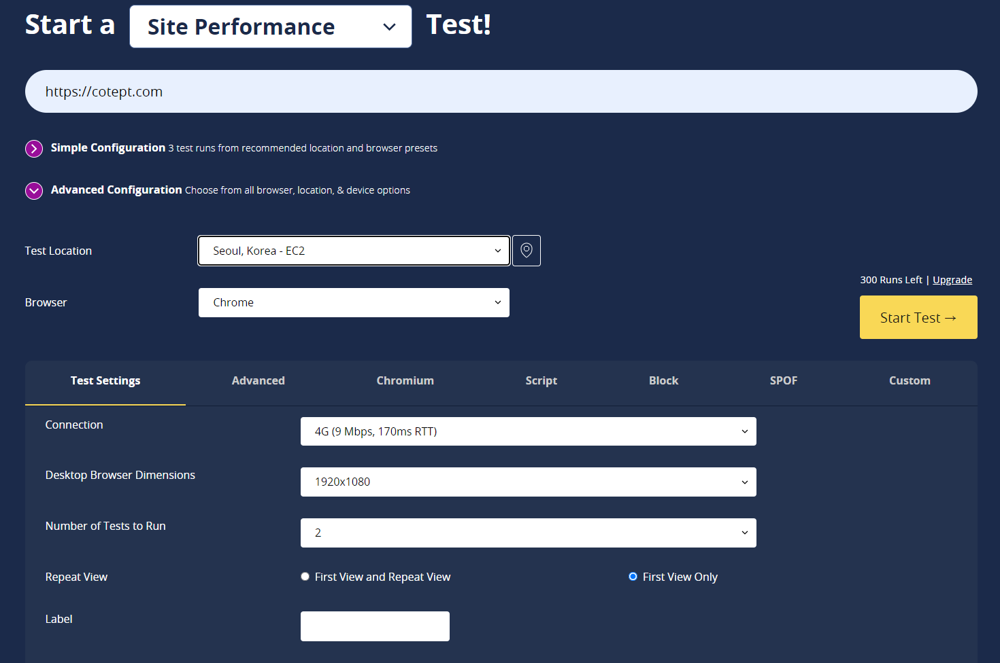

무료 플랜에 가입한 뒤 테스트하고 싶은 웹 페이지 url 을 입력한다

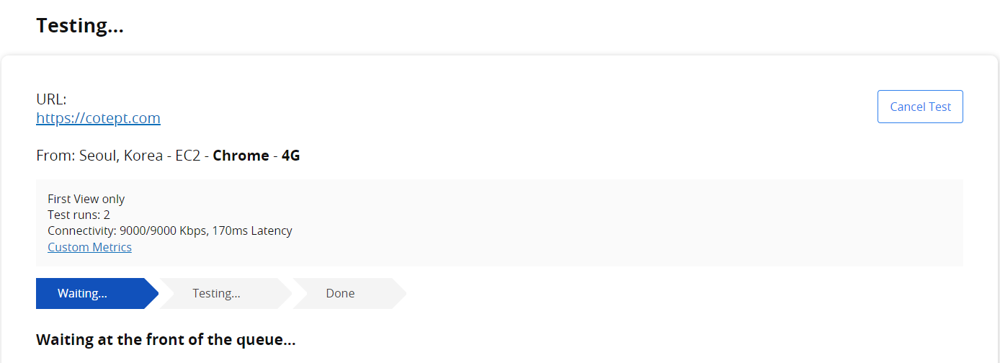
테스팅 중

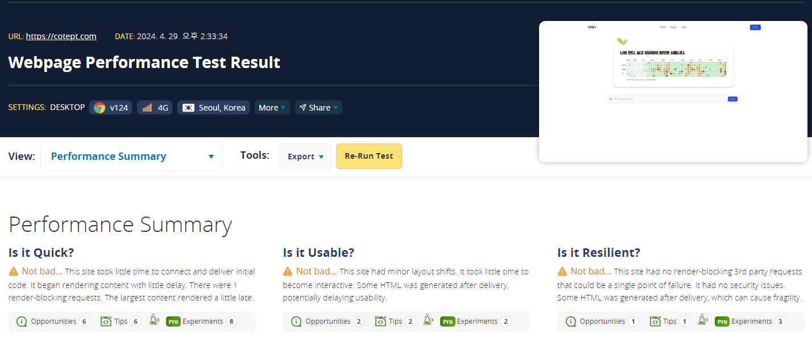
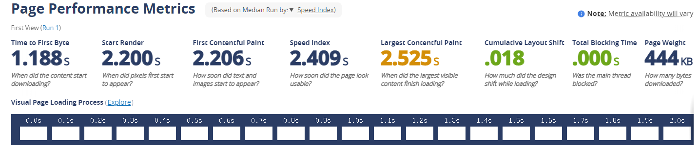
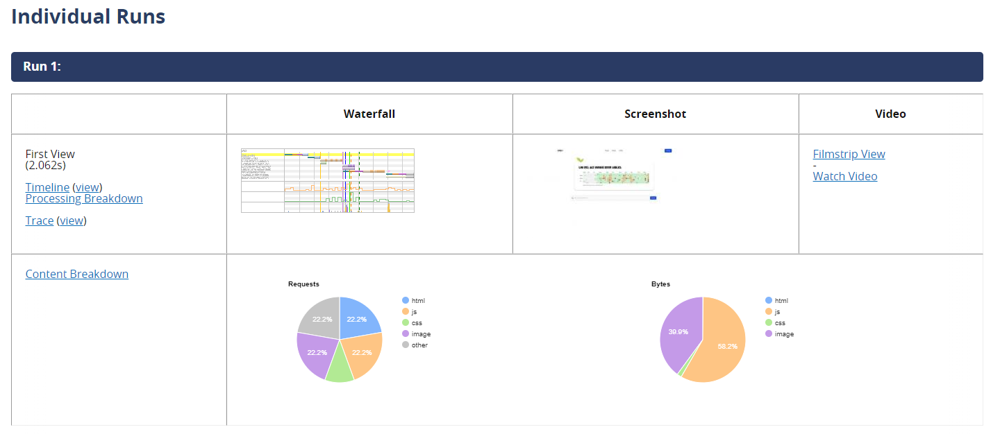
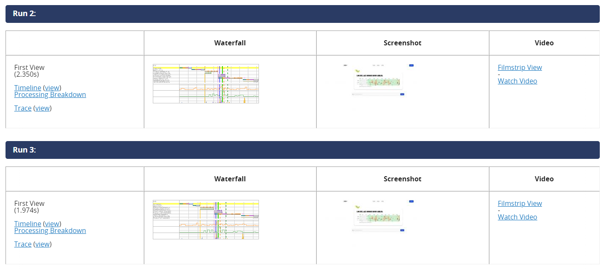
기본적으로 테스트를 3회 수행한다

## 테스트 분석 영역

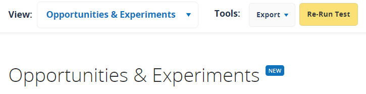

view 드롭 박스 버튼을 클릭하여 분석 영역을 선택할 수 있다

측정 결과는 크게 세가지 영역으로 나눠져 있다

### Opportunities & Experiments

#### is it Quick

- TTFB (최초 바이트 응답 시간) 을 측정
- 렌더링을 블로킹하는 JS 가 있는지 검사
- 랜더링을 블로킹하는 CSS 가 있는지 검사
- LCP 가 2.5초 이내인지 확인하고 개선 방법을 리포트
- viewport 내부에 lazy loading 존재 여부 검사
- viewport 외부의 이미지가 lazy loading 되고 있는지 검사
- 문자의 노출을 지연시키는 커스텀 폰트가 있는지 검사
- 3rd party 폰트를 로딩하는지 검사
- 사용하지 않는 리소스를 preload 하는지 검사
- HTTP 리다이렉트 되는 요소가 없는지 검사

#### is it Usable

- 이미지로 인한 layout shift 를 검사
- JS 메인 스레드 블로킹 여부 검사
- viewport meta tag 가 있는지 검사
- 접근성 이슈 검사

### is it Reslient

- 렌더링을 블로킹하는 3rd party 라이브러리 요청 검사
- Snyk (JS 라이브러리의 보안 위협 검사 도구) 에서 검출된 보안 위협 여부 검사
- 모든 요청이 HTTPS 를 사용하는지 검사

### Page Performance Metrics 

TTFB, 렌더링 소요시간, LCP 등 측정할 수 있는 다양한 시간 지표에 대해 나타낸다

시간의 흐름에 따라 0.1초 단위로 페이지가 어떻게 렌더링됐는지 확인가능

- 주황색 실선 : 웹 사이트의 모습이 변경
- 주황색 점선 : 웹 사이트의 모습이 변경 + CLS
- 빨간색 실선 : LCP
- 빨간색 점선 : LCP + CLS

### Individual Runs

content 와 Flimstrip 을 보여준다

### Filmstrip

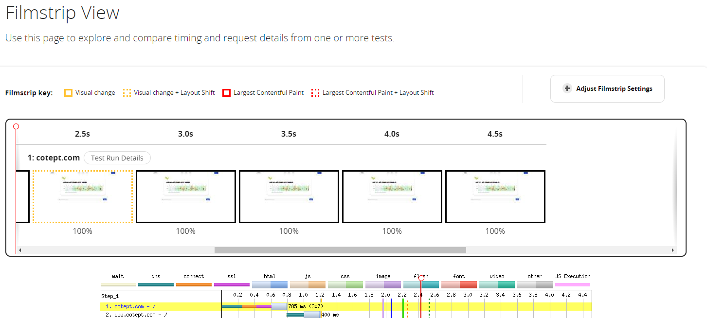

웹 사이트를 필름처럼 시간의 흐름에 따라 렌더링 과정과 리소스 로딩을 확인할 수 있다

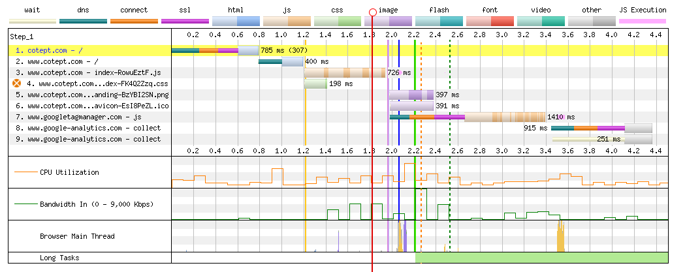

왼쪽 패널안에 주황색 X 가 있는 리소스는 렌더링을 블로킹하는 리소스이다

다수의 image 리소스를 다운로드 하는 경우 네트워크 오버헤드를 줄이기 위해 CSS 스프라이트 기법을 활용해 이미지를 하나로 묶을 수 있다

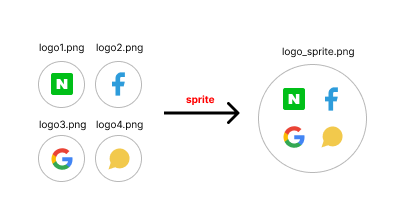

배너 이미지는 LCP 지표에 악영향을 가장 크게 미치므로  background-image 속성 대신 컨텐츠 로딩 우선순위가 높은 `` 태그를 사용하여 불러온다

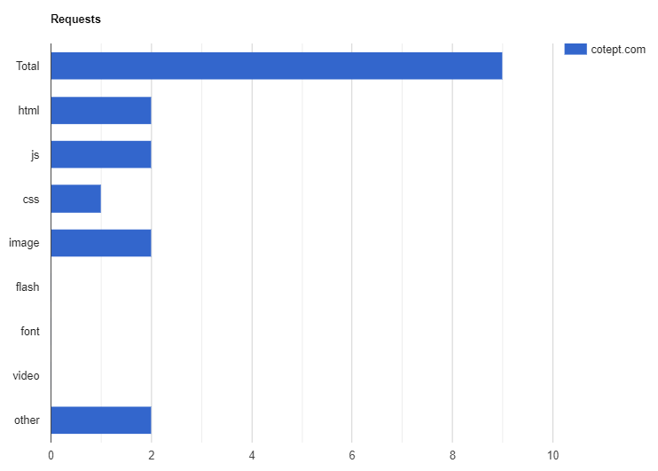
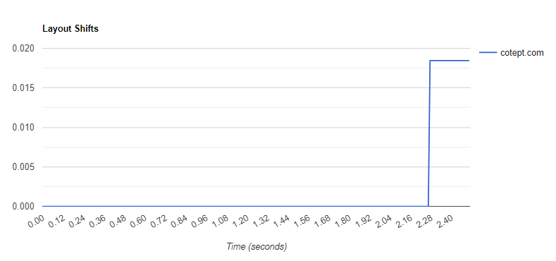

페이지 내의 리소스에 대해 몇 번의 요청이 발생했는지와 layout shift가 발생한 횟수와 시점도 알 수 있다.

### Detail

filmstrip 에서 보여준 내용을 자세히 보여준다

### WebVitals

최대 콘텐츠풀 페인트 (LCP), 누적 레이아웃 이동 (CLS),  총 블로킹 시간 (TBT) 에 대한 자세한 내용을 확인할 수 있다 

### Optimizations

최적화와 관련된 메뉴로 리소스들이 얼마난 최적화 되었는지 나타낸다

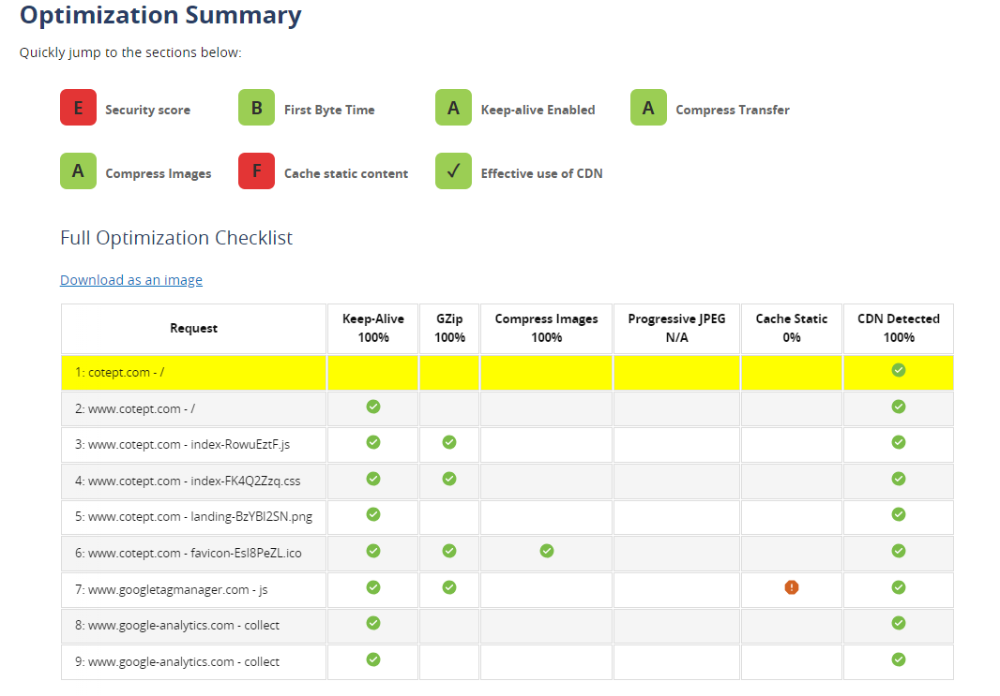

#### 확인 가능한 내용

- keep-Alive 설정으로 서버와의 연결을 계속 유지하고 있는지
- Gzip 으로 리소스를 압축하고 있는지
- 이미지를 적절하게 압축했는지
- progressive JPEG (이미지를 흐리게 로딩하고 서서히 또렸하게 렌더링하는 기법) 을 적용했는지
- 리소스 캐시 정책이 올바르게 수립돼 있는지
- 리소스가 CDN 을 거치고 있는지

### Content

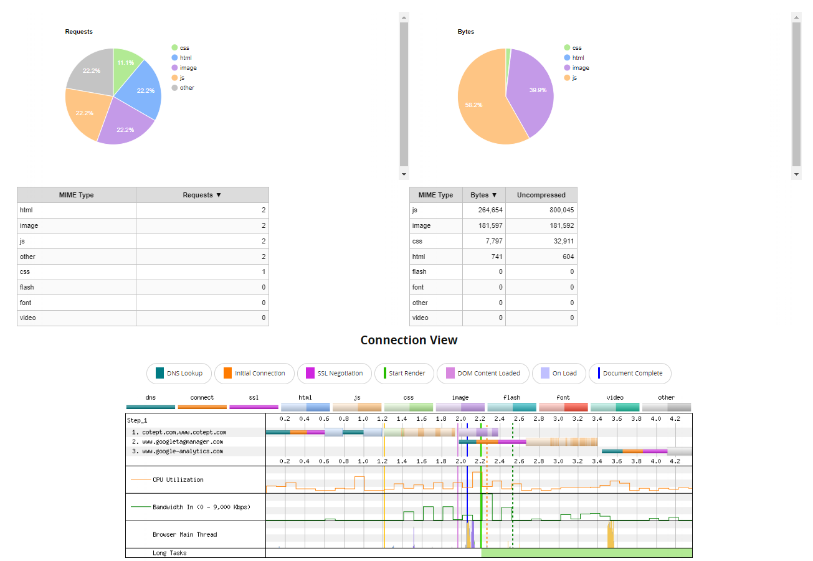

웹 사이트에서 제공하는 콘텐츠 및 asset 을 종류별로 묶어 통계를 보여준다

asset 의 종류별 크기와 로딩 과정을 확인할 수 있고 시간의 흐름에 따라 asset 이 로딩되는지 확인할 수 있다

### Domain

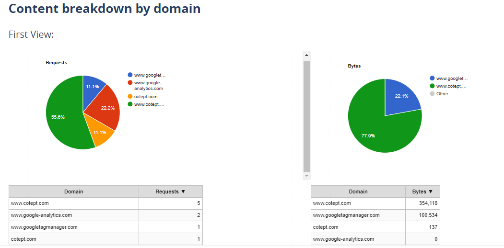

Content 에서 보여준 asset 들이 어느 도메인에서 왔는지 도메인 별로 확인가능하다.

### Console Log

웹 사이트의 콘솔에 기록된 Log 를 보여준다

### Detected Technologies

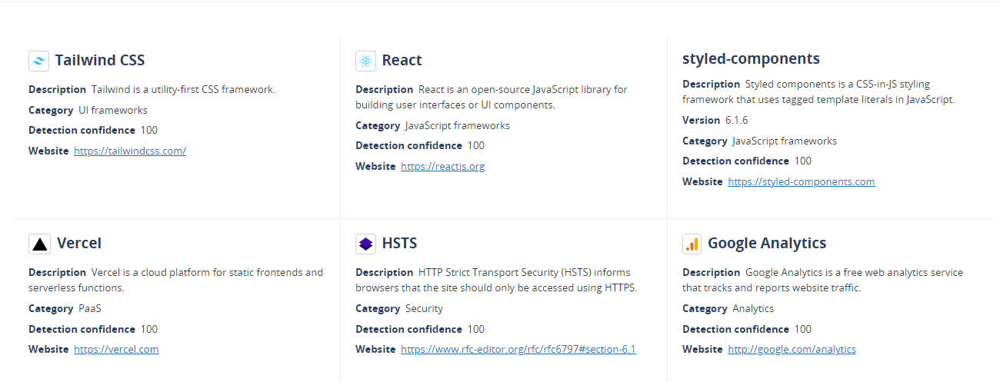

웹 사이트를 어느 기술로 만들었는지 확인할 수 있는 메뉴

### Processing

브라우저의 JS 메인 스레드가 어떤 작업을 처리했는지 확인할 수 있다

### Lighthouse Reporting

테스트 PC의 브라우저 환경에서 구글 라이트하우스 리포트를 확인할 수 있다.

### 기타

WebPageTest 외부에서 제공하는 서비스로 링크로 대체된다

#### Image Analysis
  - Cloudinary 로 연결되며 해당 웹 사이트에 어떠한 이미지가 있는지 그리고 이 이미지들이 최적화 된다면 리소스를 어느 정도 아낄 수 있는지 볼 수 있다

#### Request Map
  - 웹 사이트 요청이 어떻게 일어나고 있는지 시각화 도구로 보여준다
  - 각 리소스의 크기와 특정 리소스가 다른 리소스를 불러오는 등의 요청 연쇄 작용을 확인할 수 있다

#### Data Cost
  - 각 국가별로 가장 저렴한 요금제를 기준으로 이 웹 사이트를 로딩했을 때 실제로 얼마의 가격이 예상하는 사이트

#### Security Score
  - Snyk 에서 제공하는 기능으로 해당 사이트의 보안 취약점을 보여준다