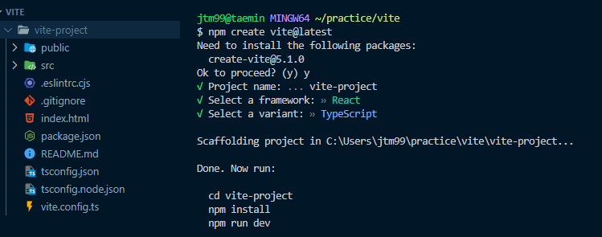

리액트를 다루는 기술 서적을 읽고 단순 내용 정리가 아닌 읽으면서 궁금한 내용을 보충하여 정리했습니다.

# 리액트가 나오게 된 배경

리액트가 나오기 이전에도 자바스크립트를 통해 수많은 애플리케이션을 개발했다. (Jquery, AngularJS ...)

점점 자바스크립트가 발전하면서 자바스크립트만으로도 대규모 애플리케이션을 만들 수 있게 되었고, 복잡한 구조를 가진 대규모 애플리케이션을 어떻게 관리 해야할 지가 중요해졌다.

그 중 페이스북도 유사한 고민을 하고 있었고, 이를 해결하기 위해 개발한 것이 리액트 라이브러리다.

## Virtual DOM
웹 애플리케이션의 규모가 점차 커지면서 페이지 리로딩 시간도 늘어나게 됐다. DOM은 정적인 페이지 로드하는데 최적화되어있지, 동적인 페이지 로드에는 최적화 되어있지 않기 때문에 성능이 떨어지게 된다.
> 성능이 저하되는 이유는 브라우저 렌더링 과정을 이해해야 한다.

DOM을 최소한으로 조작하여 작업 처리하기 위해 Virtual DOM 방식을 사용하게 된다.

Virtual DOM은 실제 DOM을 추상화하여 어떤 변화가 일어나면 다음과 같은 과정이 이루어진다.
1. Virtual DOM에 한 번 렌더링한다.
2. 이전 Virtual DOM과 비교한다.
3. 바뀐 부분만 실제 DOM에 적용한다.

이런 방식을 통해 데이터가 바뀌었을 때 어떻게 관리할 지 고민하는 것이 아니라, 일단 Virtual DOM으로 변경된 데이터로 그려놓고 비교 후 바뀐 부분만 업데이트 해주는 방식이다.

### 그렇다면 무조건 리액트를 써야하는가?
Virtual DOM을 사용해서 무조건 빠른 것은 아니다. 리액트는 `지속적으로 데이터가 변화하는 대규모 어플리케이션에서 발생하는 문제를 해결`하기 위해 등장한거지 그렇지 않다면 굳이 리액트를 사용하지 않아도 된다.

## Component
- 재사용이 가능한 API로 수많은 기능들을 내장하며, 이 컴포넌트들이 모여 하나의 페이지를 구성하게 된다.
- 자바스크립트 함수 또는 객체이며, state를 세팅하고 이를 기반으로 화면에 어떻게 보여질지 작성하여 하나의 컴포넌트를 구성한다.
- `props`라는 임의의 입력을 받을 수 있고, props는 읽기 전용이라 수정할 수 없다.

## 렌더링
사용자 화면에 View를 보여주는 것을 렌더링이라고 한다.

### 초기 렌더링
맨 처음에 어떻게 보일지를 정하는 렌더링을 의미한다.

렌더링은 `render` 함수를 통해 최상위 컴포넌트부터 화면을 구성하게 되며, 컴포넌트가 내부에 중첩되어 있을 경우 재귀적으로 렌더링이 된다.

렌더링을 마치면 render 함수가 객체를 반환하고 이를 이용하여 문자열 형식의 html 코드로 반환해 DOM에 주입하면 우리 화면에 보이게 되는 것이다.

### 리렌더링 (조화 과정)
리액트에서 View를 업데이트 할 때 리렌더링이 일어났다고 한다. (reconciliation)

View를 변형시키는 것처럼 보이지만 사실 render 함수로 인해 반환된 새로운 요소로 갈아끼우는 것이다.

## 리액트는 라이브러리다.
리액트는 View를 담당하는 라이브러리로써 다른 프레임워크들과는 달리 라우팅, 상태 관리와 같은 기능들을 지원해주지 않는다.

따라서 리액트와 호환되는 라이브러리 생태계에서 원하는 라이브러리를 자유롭게 선정해서 개발할 수 있다는 장점이 있다.

# nvm (node version manager)
프로젝트별로 node 버전을 다르게 해줘야할 때가 있다.

그럴때마다 노드를 변경하는게 어렵기 때문에 nvm으로  노드 버전을 변경해서 관리할 수 있다.
## Install
[nvm 설치](https://github.com/nvm-sh/nvm#installing-and-updating)

위 링크를 참고해서 설치하면 된다.

Git bash 창에서 다음 명령어를 입력해주면 nvm을 설치할 수 있다.
```bash
curl -o- https://raw.githubusercontent.com/nvm-sh/nvm/v0.39.7/install.sh | bash
```

만약 설치가 안돼서 실행이 안된다면 다음 명령어를 실행해주면 된다.
```bash
export NVM_DIR="$([ -z "${XDG_CONFIG_HOME-}" ] && printf %s "${HOME}/.nvm" || printf %s "${XDG_CONFIG_HOME}/nvm")"
[ -s "$NVM_DIR/nvm.sh" ] && \. "$NVM_DIR/nvm.sh" # This loads nvm
```

## Usage - 명령어

- `nvm install [version]` : 원하는 버전의 노드를 설치할 수 있다.
    - `nvm install node` : 가장 최신 버전의 노드 설치
    - `nvm install v18.17.0` : 18.17.0 버전의 노드 설치
    - `nvm install --lts or nvm install --lts=Gallium` : LTS 버전 설
- `nvm uninstall [version]` : 원하는 버전의 노드를 삭제할 수 있다.
    - `nvm install node` : 가장 최신 버전의 노드 삭제
- `nvm ls-remote` : 설치 가능한 노드 버전 목록을 확인할 수 있다.
- `nvm use 18.17.1` : 18.17.1 버전으로 스위칭할 수 있다.
- `nvm alias default 18.17.1` : 해당 프로젝트에 18.17.1 버전으로 기본 노드 버전 설정할 수 있다.

# Create React App이 등장한 배경
프론트엔드 도구 환경은 통합되지 않은 상태였고, 리액트 개발 환경을 구축하기 위해서는 여러 설정들을 요구했었다.

이러한 설정을 올바르게 수행하기에는 되게 까다로운 작업이었고, 사람들은 `보일러 플레이트`를 만들어 공유하고 복제해서 사용했었다.

이러한 문제를 해결하기 위해 Create React App이 등장하였고, CRA는 여러 도구를 하나의 패키지로 결합하여 기본 구성을 설정해줬고 쉽게 리액트 새 프로젝트를 시작할 수 있게 되었다.

## CRA의 문제
시간이 지나면서 점점 SSR 기술을 요구하게 되는데 CRA는 CSR 프로젝트만 생성해주고, 이 문제를 해결하려면 `eject`를 한 뒤에 상당한 설정을 수정해줘야 되므로 간편하게 프로젝트를 생성해주던 CRA의 장점이 사라지게 됐다.

또한 프로젝트의 규모가 커지면서 Webpack이나 Babel과 같은 설정을 수정해야할 필요가 있을 때, 필요한 설정을 수정하기가 어렵다.

## Vite의 등장
Vite는 GO 기반 번들러인 esbuild를 사용하여 빠르고 단순하며 효율적으로 설계된 최신 프론트엔드 빌드 도구이다.
> vite는 HMR을 지원하는데, HMR(Hot Module Replacement)이란? 앱을 종료하지 않고 갱신된 파일만을 교체하는 방식이다.
> 우리가 파일을 수정 후 저장하면 반영된 내용을 확인하기 위해서는 앱을 종료하고 다시 실행해야하는데
> HMR 방식을 통해 View가 바로 업데이트 되는 것이다.
[HMR 소스 코드 뜯어보기](https://velog.io/@woohm402/vite-react-hmr)

### Vite로 첫 프로젝트 만들어보기
```bash
npm create vite@latest
```
위 명령어를 입력해서 원하는 프레임워크와 JS or TS를 선택하면 순식간에 해당 프로젝트가 생성된다.


그리고 `npm run dev` 명령어를 입력하면 vite로 빌드한 리액트 프로젝트 페이지를 확인할 수 있다.