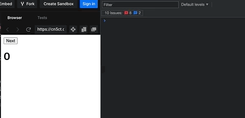
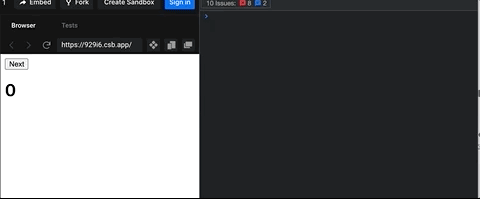
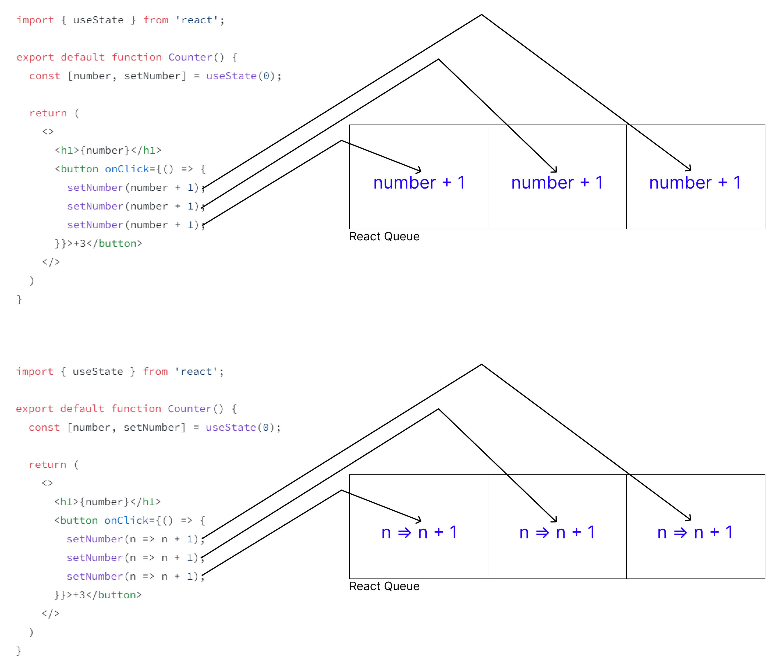

# Automatic Batching
React 18로 업데이트 되면서 새로운 기능들이 도입됐다.

특히 React 18에서 createRoot를 사용하면서 모든 업데이트는 Automatic Batching을 수행한다.

**React 18 이전 - Legacy root API**
```jsx
import * as ReactDOM from 'react-dom';
import App from 'App';

const container = document.getElementById('app');

// 초기 렌더링
ReactDOM.render(<App tab="home" />, container);

// 업데이트하는 동안 React는
// DOM 엘리먼트의 root에 접근한다.
ReactDOM.render(<App tab="profile" />, container);
```
[Legacy root API를 통한 리렌더링 동작](https://codesandbox.io/p/sandbox/jolly-benz-hb1zx?file=%2Fsrc%2Findex.js%3A13%2C41)


**React 18 - New root API**
```jsx 
import * as ReactDOMClient from 'react-dom/client';
import App from 'App';

const container = document.getElementById('app');

// root를 생성한다.
const root = ReactDOMClient.createRoot(container);

// 초기 렌더링: 요소를 root에 렌더링한다.
root.render(<App tab="home" />);

// 업데이트 중에는 container를 다시 전달할 필요가 없다.
root.render(<App tab="profile" />);
```
[createRoot를 통한 batching](https://codesandbox.io/p/sandbox/morning-sun-lgz88?file=%2Fsrc%2Findex.js)


두 root API 차이는 `클릭 이벤트 내에 2개 이상의 상태 업데이트가 일어날 때 하나의 리렌더링으로 처리해주는가?`이다.

### React의 업데이트가 발생하는 위치에 관계없이 Automatic Batching

다음 코드들은 동일하게 동작한다.
```js
function handleClick() {
  setCount(c => c + 1);
  setFlag(f => !f);
  // Batching을 수행하여 한 번의 리렌더링이 일어난다.
}
```

```js
setTimeout(() => {
  setCount(c => c + 1);
  setFlag(f => !f);
  // Batching을 수행하여 한 번의 리렌더링이 일어난다.
}, 1000);
```

```js
fetch(/*...*/).then(() => {
  setCount(c => c + 1);
  setFlag(f => !f);
  // Batching을 수행하여 한 번의 리렌더링이 일어난다.
})
```

```js
elm.addEventListener('click', () => {
  setCount(c => c + 1);
  setFlag(f => !f);
  // Batching을 수행하여 한 번의 리렌더링이 일어난다.
});
```

### Automatic Batching이 어떻게 동작하는가?

다음과 같은 counter 코드가 있을 때 클릭할 때마다 어떻게 동작될까요?
```jsx
import { useState } from 'react';

export default function Counter() {
  const [number, setNumber] = useState(0);

  return (
    <>
      <h1>{number}</h1>
      <button onClick={() => {
        setNumber(number + 1);
        setNumber(number + 1);
        setNumber(number + 1);
      }}>+3</button>
    </>
  )
}
```

+1을 해주는 setNumber를 3번 했으니 3개씩 늘어난다고 생각이 들지만, 실제로 실행하면 클릭 할 때마다 1개씩 늘어나게 된다.

이렇게 동작하는 이유는 각 렌더링에 상태 값은 스냅샷으로 인해 고정적이다. 즉 number라는 값은 현재 render phase에서 0으로 고정되어 있으므로 아무리 +1을 한다하더라도 0이 된다.

따라서 위 코드는 아래와 같이 동작한다.
```jsx
import { useState } from 'react';

export default function Counter() {
  const [number, setNumber] = useState(0);

  return (
    <>
      <h1>{number}</h1>
      <button onClick={() => {
        setNumber(0 + 1);
        setNumber(0 + 1);
        setNumber(0 + 1);
      }}>+3</button>
    </>
  )
}
```

그리고 Automatic Batching으로 인해 각 동작마다 처리하고 렌더링하는 것이 아니라 이벤트 핸들러의 모든 코드가 실행되고나서 리렌더링하게 된다.

그러면 왜 그렇게 동작하는지 알아보기 전에 다른 코드 하나를 보자.

이번엔 어떻게 동작할까?
```jsx
import { useState } from 'react';

export default function Counter() {
  const [number, setNumber] = useState(0);

  return (
    <>
      <h1>{number}</h1>
      <button onClick={() => {
        setNumber(n => n + 1);
        setNumber(n => n + 1);
        setNumber(n => n + 1);
      }}>+3</button>
    </>
  )
}
```

아까와 달리 클릭마다 3번씩 동작하게 된다.

setter에는 2가지 방식으로 값을 전달할 수 있다.
1. setNumber(number + 1)과 같이 값만 전달하는 방식
2. setNumber((n) => n + 1)과 같이 updater function을 전달하는 방식

`(prev) => prev + 1`와 같은 업데이터 함수는 이전 상태 값에 접근하여 새로운 값으로 반환하도록 동작시킨다.

Automatic Batching을 하기 위해 setter안에 있는 값이나 함수를 react queue에 저장한다.



더이상 실행할 setter가 없다면 저장한 react queue를 한번에 처리한 뒤 변경된 상태 값으로 한 번만 렌더링된다.

처리하는 로직은 다음 코드처럼 동작한다.
```jsx
export function getFinalState(baseState, queue) {
  let finalState = baseState;

  for (let update of queue) {
    if (typeof update === 'function') {
      // updater function 실행.
      finalState = update(finalState);
    } else {
      // 상태 값으로 변경.
      finalState = update;
    }
  }

  return finalState;
}
```

### React에서 이렇게 하는 이유
여러 컴포넌트에서 여러 상태 변수를 업데이트하더라도 많은 리렌더링을 하지 않고도 업데이트할 수 있다.

Batching을 통해 여러 상태 업데이트를 하나의 렌더링으로 그룹화하여 React 앱의 성능이 개선되고, 빠르게 실행할 수 있다.

또한 이렇게 함으로써 불필요한 재렌더링을 피하고, 컴포넌트가 하나의 상태 변수만 업데이트되는 버그 유발을 방지할 수 있다.

### flushSync
하지만, 다르게 말하면 이벤트 핸들러 안에 모든 코드가 완료될 때까지 UI가 업데이트 되지 않을 수 있다.

만약 Automatic Batching을 원하지 않는다면 `ReactDOM.flushSync()`를 사용하여 Batching을 해제할 수 있다.
```jsx
import { flushSync } from 'react-dom';

function handleClick() {
  flushSync(() => {
    setCounter(c => c + 1);
  });
  // 즉시 돔을 업데이트한다.
  flushSync(() => {
    setFlag(f => !f);
  });
  // 즉시 돔을 업데이트한다.
}
```

하지만 이런 일이 자주 발생하지 않고, 앱의 성능을 저하시킬 수 있으니 사용할 때 주의해야한다.

### 퀴즈

해당 코드는 어떻게 동작하고 결과 값은 무엇일까요?
```jsx
import { useState } from 'react';

export default function Counter() {
  const [number, setNumber] = useState(0);

  return (
    <>
      <h1>{number}</h1>
      <button onClick={() => {
        setNumber(number + 5);
        setNumber(n => n + 1);
        setNumber(42);
      }}>Increase the number</button>
    </>
  )
}

```

### 참고
- [Replacing render with createRoot](https://github.com/reactwg/react-18/discussions/5)
- [Automatic batching for fewer renders in React 18](https://github.com/reactwg/react-18/discussions/21)
- [리액트 공식문서 - State as a Snapshot](https://react.dev/learn/state-as-a-snapshot)
- [리액트 공식문서 - Queueing a Series of State Updates](https://react.dev/learn/state-as-a-snapshot)
- [리액트 공식문서 - flushSync](https://react.dev/learn/state-as-a-snapshot)
- [좋은 예시로 설명된 블로그](https://nukw0n-dev.tistory.com/33)