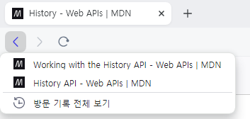
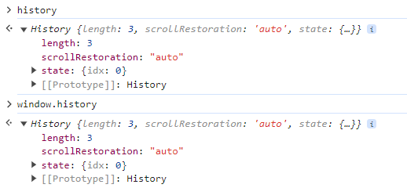

React와 Vue.js처럼 SPA에서 페이지를 이동하면 로드 없이 페이지가 이동된다. 이렇게 동작하기 위해서 라우팅 기능을 지원하는 React Router, Vue Router등을 당연하게 사용해왔다.

아무렇지 않게 써왔던 라우팅 라이브러리의 동작방식에 대해 이해해보자.

## 기존의 페이지 전환 방식
기존 페이지 전환은 HTML에 `<a>` 태그를 활용하는 방식이다.
```js
<nav>
  <a href="home.html">Home</a>
  <a href="about.html">About</a>
</nav>
```
기존 방식은 다음과 같은 문제점이 있다.
- 페이지가 늘어나는 만큼 HTML 정적 파일도 늘어난다.
- 중복되는 UI가 있어도 재사용이 불가능하다.
- 페이지 이동할 때마다 렌더링 비용이 발생한다.
- 유지 보수하기 힘들고 가독성이 좋지않다.

이러한 문제점이 있어서 기존 방식으로 더욱 복잡한 서비스를 개발하기에는 적합하지 않다.

또한 동적인 페이지를 생성하기 위해서는 JSP, PHP를 이용하여 SSR 방식으로 렌더링할 수 있지만 서버 코드와 UI 코드가 분리되지 않아 유지 보수와 가독성이 떨어지게 된다.

## History API
History API는 브라우저가 관리하는 세션 히스토리, 즉 페이지 방문 이력을 제어하기 위한 웹 표준 API다.
> 세션은 브라우저 세션이며, 사용자가 새 창이나 탭을 열 때 생성되고 닫을 때 소멸한다.


브라우저에서 왼쪽 상단 활성화 되어 있는 뒤로 가기 버튼에 우클릭 하면 내가 방문한 이력을 볼 수 있다.

또한 JavaScript에서 History API는 기본적으로 history 전역 객체를 통해 볼 수 있고, window나 document 전역 객체를 통해서도 접근할 수 있다.


### History API를 통해 이동하기
위 브라우저 사진에서 본 `뒤로 가기`와 `앞으로 가기` 기능을 JavaScript로 그대로 구현할 수 있다. 
```js
history.back(); // 뒤로 가기
history.forward(); // 앞으로 가기
```
또한 History API에는 `go()`라는 메서드를 통해 `back()`과 `forward()`를 모두 대체할 수 있다.
```js
history.go(-2); // 뒤로 2번 가기
history.go(-1); // 뒤로 1번 가기
history.go(0); // 새로 고침하기
history.go(1); // 앞으로 1번 가기
history.go(2); // 앞으로 2번 가기
```
이 메서드들은 브라우저에서 해당 페이지를 리로드시켜서 일반적으로 SPA에서는 잘 사용하지 않는다.

### History API로 URL 조작
History API는 브라우저의 현재 URL을 조작할 수 있도록 `pushState()`와 `replaceState()` 메서드를 제공한다.

위 메서드와 다른 점은 URL만 갱신되고 실제로 해당 페이지를 다시 불러오지 않는다.

`pushState()`는 브라우저 세션 스택에 항목을 추가하는 역할로 3개의 인자를 받는다.
```js
// history.pushState(state, unused, url)

// a -> b (현재 페이지) -> c -> d
history.pushState({}, "", "h");
// a -> b -> h (현재 페이지)
```
원래 페이지였던 b는 이전 페이지로 되고, url로 전달한 값이 현재 페이지가 되면서 이후에 있던 방문 이력을 지운다.

`replaceState()`는 url로 전달한 값으로 현재 페이지를 덮고, 방문한 이력은 변경되지 않는다.
```js
// history.replaceState(stateObj, title[, url])

// a -> b (현재 페이지) -> c -> d
history.replaceState({}, "", "h");
// a -> h (현재 페이지) -> c -> d
```

### PopState Event
`pushState()`, `replaceState()`메서드를 통해 페이지 리로드 없이 URL만 갱신할 수 있지만, 사용자가 `뒤로 가기`나 `앞으로 가기`를 하기 위해선 `back()`이나 `forward()`를 호출해야 한다.

그러면 다시 브라우저는 페이지를 불러오면서 리로딩이 되고, SPA에 맞지 않는다.

이러한 문제는 History API에서 `PopState Event`를 통해 해결할 수 있다.

PopState 이벤트는 사용자가 브라우저에서 뒤로 가기나 앞으로 가기를 할 때 `window` 전역 객체에서 발생하는데, JavaScript 이벤트 핸들러를 통해 처리할 수 있다.
```js
window.addEventListener("popstate", (event) => {
  // 이벤트에 들어 있는 상태 객체를 읽어서 클라이언트 단 라우팅 처리
});
```
하지만 이 이벤트는 pushState나 replaceState를 호출한 경우에는 이벤트가 발생하지 않는다.

그렇기 때문에 이를 감지할 수 있는 객체가 필요하고, React Router에서 제공하는 History 객체를 사용하면 URL 변경에 따라 적절한 처리를 할 수 있다.

```js
let history = createBrowserHistory()
history.listen(({ location, action }) => {
  // this is called whenever new locations come in
  // the action is POP, PUSH, or REPLACE
})
```

React Router에서 BrowserRouter로 감싸주는데 BrowserRouter가 History API 기반으로 동작한다.

## Location
내장된 브라우저의 `window.location`을 통해 접근할 수 있고, Location 객체는 사용자 URL 정보를 갖고 있다.

```js
window.location.pathname //url의 패스 값을 가져옵니다.
window.location.hash // 해쉬값 이후의 텍스트를 가져옵니다.
window.location.reload() // 리로드
window.location.assign('https://www.naver.com'); // 네이버로 이동
```

React Router에서는 일반적으로 window.location을 사용하지 않고, React Router에서 제공하는 location을 사용한다.

```json
{
  pathname: "/bbq/pig-pickins",
  search: "?campaign=instagram",
  hash: "#menu",
  state: null,
  key: "aefz24ie"
}
```


## 클라이언트 사이드 라우팅 직접 구현

!codesandbox[p377lj?view=Editor+%2B+Preview&module=%2Fsrc%2FApp.js]


### 참고
- [MDN - History API](https://developer.mozilla.org/ko/docs/Web/API/History_API)
- [MDN - History](https://developer.mozilla.org/ko/docs/Web/API/History)
- [HTML5 History API, history 패키지](https://it-eldorado.tistory.com/111)
- [자바스크립트의 History API와 클라이언트 단 라우팅](https://www.daleseo.com/js-history-api/)
- [History Type - Browser, Hash](https://developer-alle.tistory.com/354)
- [리액트 라우터 이해하기](https://code-reading.tistory.com/123)