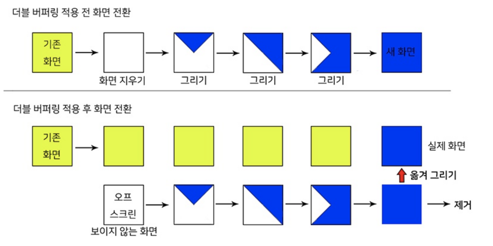
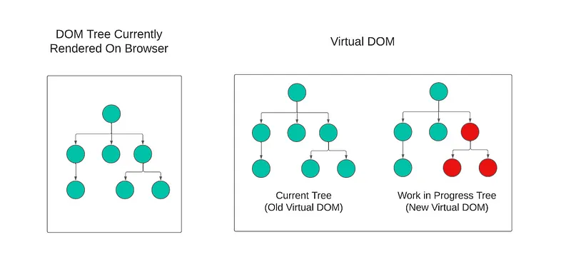
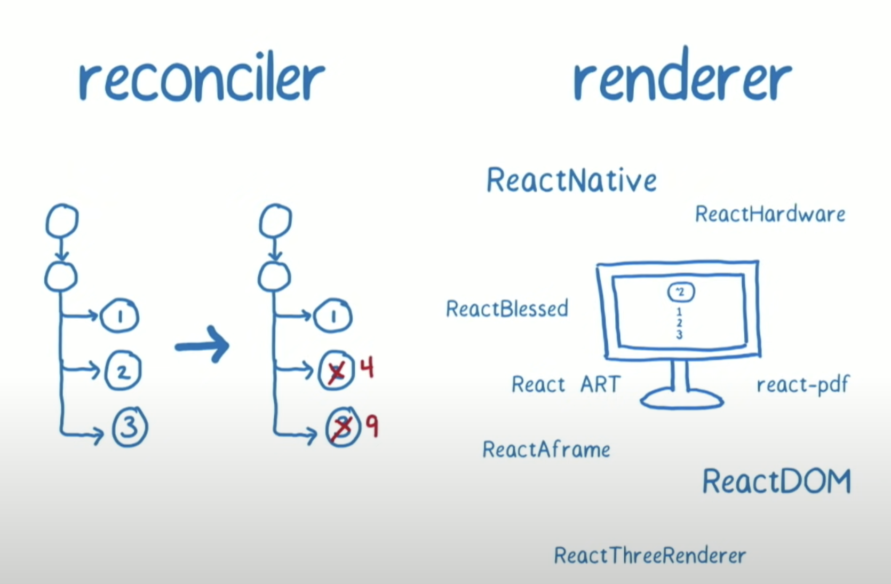
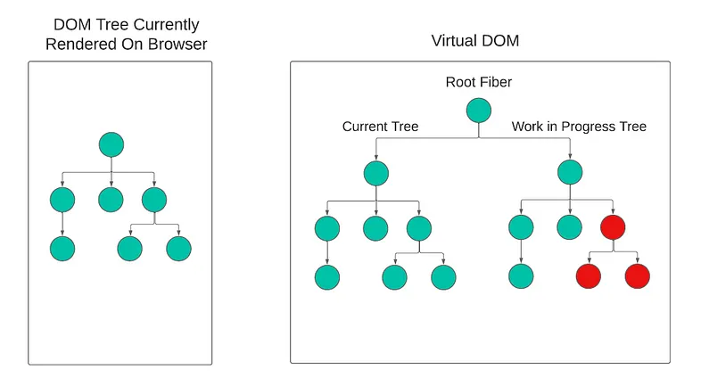
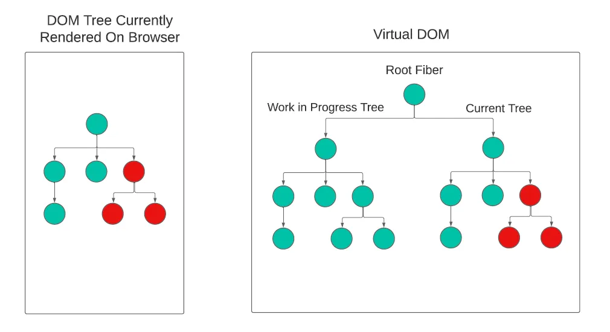

# Chapter 1 & 2

##  mvc mvvm mvw
https://brunch.co.kr/@oemilk/113
## Virtual DOM & Reconciliation

 DOM을 JavaScript 객체로 표현한 것

#### VDOM의 사용목적
DOM의 변경사항을 직접 DOM을 조작하여 반영하는 것이 아니라, 메모리상의 실제 DOM과 같은 JS객체 VDOM을 조작하여 연산한 결과를 실제 DOM과 비교하여 변경된 부분을 한번에 반영하여 사용자 인터랙션에 따른 **리플로우와 리페인팅 연산을 최소화**하기 위해 사용됩니다. 

####  VDOM의 필요성
- 하나의 트리를 가지고 다른 트리로 변환하기 위한 최소 연산 수를 구하는 알고리즘의 최첨단 알고리즘도 n개의 엘리먼트를 가지는 트리에 대해 **O(n<sup>3</sup>)**의 복잡도를 가진다.

- 리액트에 2가지 가정을 적용하여 **O(n)** 복잡도로 만들 수 있다.
1. 서로 다른 타입의 두 엘리먼트는 서로 다른 트리를 만들어 낸다
2. 개발자가 key prop을 통해, 여러 렌더링 사이에서 어떤 자식 엘리먼트가 변경되지 않아야 할지 표시 할 수 있다.

#### VDOM 작동 원리
React는 Diffing Algorithm을 사용하여 2개의 Virtual DOM 트리를 비교합니다. 

2개의 VDOM을 사용하는 이유
[React Fiber Deep Dive with Dan Abramov](https://www.youtube.com/watch?v=aS41Y_eyNrU)
그는 2개의 Virtual DOM 트리을 사용하게 된 동기가 초기 게임 개발에 사용되었던 [Double Buffering Technique](https://namu.wiki/w/%EB%8D%94%EB%B8%94%20%EB%B2%84%ED%8D%BC%EB%A7%81)에서 유래했다고 설명했습니다.




렌더링 이전 UI를 나타내는 VDOM을 **current**라고 부르겠습니다.

렌더링 이후 UI를 나타내는 VDOM을 **work In Progress**라고 부르겠습니다

리액트는 리랜더링이 발생하면 어떤 부분을 새롭게 렌더링해야 하는 지 실제 DOM과 VDOM을 비교하는 재조정(reconciliation)과정을 통해 실제 DOM과 VDOM을 동기화 합니다.

### Reconciliation (조정)

React에서 어떤 부분들이 변해야하는지 서로 다른 두 개의 트리를 비교하는 데 사용하는 알고리즘

2개의 DOM 트리를 동기화 상태로 유지하는 프로세스로 **Reconciler** (조정자)와 **Renderer** (렌더러를) 사용하여 수행됩니다.

출처 https://velog.io/@jangws/React-Fiber
- Reconciler는 비교 알고리즘을 사용하여 현재 트리와 진행 중인 작업 트리 간의 차이점을 찾고 계산된 변경 사항을 렌더러에 보냅니다

- Renderer는 앱의 UI를 업데이트합니다.

#### 리액트 16버전 이전의 stack reconciler
- stack 자료구조를 사용
- 동기식으로 동작하며 많은 실행이 동시에 발생하게 된다
- 애니메이션에서 프레임 드롭이 발생하고 UI 경험이 저하
- VDOM이 1개만 있었고 Suspense 및 Concurrent 모드와 같은 일부 기능은 비동기식으로 작동하는 Reconciler의 기능에 의존하기 때문에 구현이 불가능
- 업데이트의 우선순위를 정할 수 없다 (애니메이션이 데이터의 저장보다 우선된다)

#### 리액트 16버전 이후의 fiber reconciler
  - 작업 별 우선 순위 지정
  - 작업을 일시 중지하고 나중에 다시 시작
  - 더 이상 필요하지 않은 경우 작업 중단
  - 이전에 완료된 작업 재사용

##### fiber란 무었인가?
- 단일 연결리스트의 fiber node(스택) 트리
  단일 fiber는 가상의 스택프레임(virtual stack frame)이라 볼 수 있다.
  스택을 재구현하는 것의 장점은 스택 프레임을 메모리에 저장하고 원할 때 실행할 수 있다는 것이다. 이것은 스케쥴링 목표를 달성하기 위해 중요

출처 react-core 팀의 Andrew Clark의 React fiber를 개발한 목적
  - [React Fiber Architecture
  ](https://immigration9.github.io/react/2021/05/29/react-fiber-architecture.html)

### Reconciliation Process

rendering/reconciliation 단계

current tree와 WIP tree의 포인터를 swap한 상태

1. 상태가 변경되면 React는 브라우저 메인 스레드가 idle 상태가 될 때까지 기다린 다음 WIP(Work In Progress) 트리를 구축하기 시작

2. WIP 트리는 fiber를 사용하여 구축되었고 트리의 구조는 코드의 컴포넌트 구조와 일치

3. rendering/reconciliation 단계
    - WIP 트리를 구축하고 변경 사항을 파악하는 단계는 비동기적이며 메인 스레드에 완료해야 할 다른 작업이 있는 경우 일시 중지될 수 있다. 
    - 기본 스레드는 priority list의 priority에 따라 해당 업데이트 작업을 시작.
    - 메인 스레드가 다시 idle 상태가 되면 마지막으로 중단된 위치에서 WIP 트리 구축을 다시 시작합니다.

4. commit 단계 
    - 전체 WIP 트리의 구축이 완료되면 시작된다. 이 단계는 동기적이며 중단될 수 없다.
    - React는 DOM에 변경을 적용한다.
    - current tree와 WIP tree의 포인터를 swap한다
    - 그 후 해당 fiber를 DOM에 렌더링한다.

5. 포인터 swap 후 새로운 WIP 트리를 향후 새로운 상태 변경 작업에 사용할 수 있다.

출처 https://namansaxena-official.medium.com/react-virtual-dom-reconciliation-and-fiber-reconciler-cd33ceb0478e

## 시각화 및 좀 더 자세한 설명
- https://codepen.io/ejilee/pen/eYMXJPN
- https://velog.io/@tnghgks/React-Fiber%EC%97%90-%EB%8C%80%ED%95%B4%EC%84%9C

#### 리액트의 상태 업데이트가 비동기적으로 작동하는 이유
웹 사이트는 동적이므로 변경 사항마다 DOM을 업데이트하는 대신 렌더링 비용을 최소화 하기 위해 work In Progress 트리를 사용해 일괄적(batch)으로 업데이트하기 때문이다 

###

## jsx
 JSX(JavaScript XML)라는 JavaScript에 XML을 추가하여 확장한 문법으로
 JSX는 React “엘리먼트(element)” 를 생성한다. 
 React 엘리먼트는 브라우저 DOM 엘리먼트와 달리 **일반 객체**다

 자바스크립트의 정식문법은 아니며 babel같은 트랜스파일러에 의해 자바스크립트 코드로 변환되어 사용된다

## var const let
### var
- 중복선언가능
- 값의 재할당 가능
- 함수레벨 스코프
- 변수 호이스팅 발생 변수의 선언과 초기화가 동시에 진행됨
### let
- 중복선언 불가능
- 값의 재할당 가능
- 블록레벨 스코프
- 호이스팅 발생 변수의 선언만 진행
### const
- 중복선언 불가능
- 값의 재할당 불가능
- 블록레벨 스코프
- 호이스팅 발생 변수의 선언만 진행

## 조건부 렌더링
``` typescript
// if statement
if(){}
// && operator
isEmpty && <Item/>
// tertinary operator
isEmpty ? <Item/> : null
```


## 3줄 요약

virtual dom과 조정 과정의 사용 목적과 동작 원리

단일 연결리스트와 fiber 스택으로 구현된 자바스크립트 트리 객체

2개의 vdom과 diff알고리즘을 사용하여 DOM의 변경점을 비동기적으로 일괄 업데이트한다

어려운 단어를 풀어서 설명해라