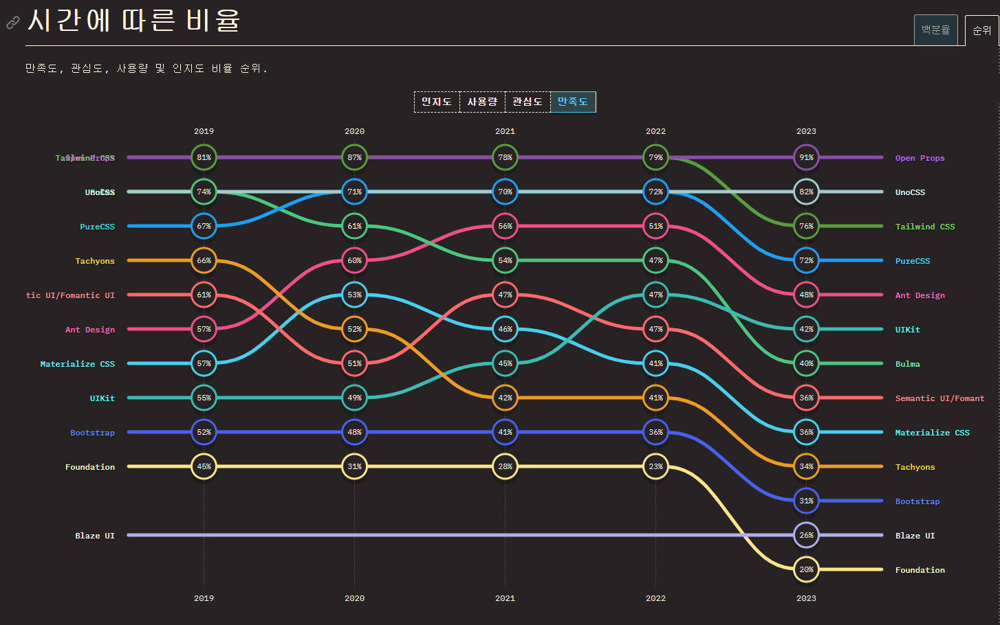
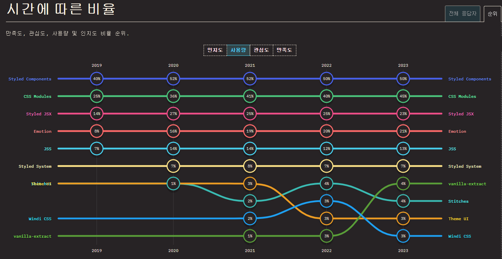
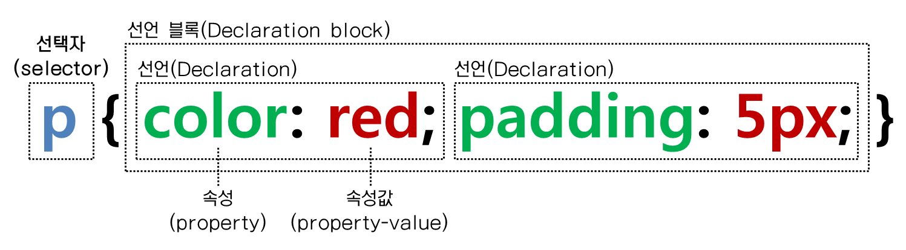
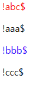

# 컴포넌트 스타일링

매년 최단기 퇴물 소리 듣는 기술이 나오고 그 기술을 내가 딥 다이브하며 학습했던 기술이라면 삼성전자 8층에 물린 사람의 심정을 이해 할 수 있습니다.

또한 수 많은 개발 유투버들이 ***"### is game changer!"*** 라는 제목에 낚여 ### 가 뜬다는 여론에 휩쓸리는 경우도 있습니다. 

그저 기도 메타로 새롭게 배울 기술을 선택하기에는 매몰 비용을 무시할 수 없고,

***모든 기술을 배우면 되지!*** 라는 의견은 시간, 돈, 체력이 모자랍니다.

때문에 새롭게 학습할 기술을 선택하는 것은 최소 2년간의 state of ### 설문의 결과 지표를 보고 선택하는 것이 안전하다고 생각합니다.

## State of CSS 2023

[State of CSS](https://stateofcss.com/en-US) 웹 개발자 대상 설문조사 프로젝트 State of ### 직접 연말 설문에 참여할 수 있고 이메일을 등록한 경우 설문이 시작되면 알림을 받을 수 있습니다.
최근 3년간 설문에 참여한 개발자는 평균 1만명으로 다양한 연차와 나이를 가지고 있어 신뢰성있는 기술 동향 파악이 가능 합니다.

올해 실시한 설문 [State of CSS 2023](https://2023.stateofcss.com/ko-KR/)에서 이번 챕터의 주제와 관련된 정보를 공유하고자 합니다.

### CSS framework

총 4가지의 지표가 있습니다.
- 인지도
- 사용량
- 관심도 
- 만족도 

개인적으로 새로운 기술을 학습하고 싶은 경우 사용량과 관심도의 증감 추이와 만족도(retention) 를 가지고 학습 여부를 판단합니다.



***"내가 학습한 기술이 새로운 기술에 따잇 당했네?"***

open props와 uno css가 tailwind css를 만족도 측면에서 유의미하게 상회하는 결과입니다.

당장 open props를 배워야 하는 것은 아닙니다. 5%의 사용률을 보여주기 때문이고 4~5년간 정체기를 보내고 있기 때문입니다.

하지만 변화무쌍한 프론트엔드 기술 동향에서 무시하기에는 ***혹시 내가 방치한 사이 이 기술이 대세가 되지 않을까?*** 란 생각이 듭니다.

### CSS in JS

CSS in JS는 style-component와 css module 둘 중 하나를 선택하는 것이 당연해보입니다.



## 결론

최신 CSS 기능의 사용이 증가하는 추세에 따라 CSS 프레임워크의 사용은 감소세를 보이고 있습니다.

W3C(월드와이드 컨소시엄, 특 CSS개발하고 추가하고 있음)에서 sass less에서 지원하는 nesting과 같은 기능을 빠르게 추가하고 있기 때문입니다.

개발자들이 "바닐라 CSS에 추가되길 ***"존버"*** 하는 경향이 강해진 것" 이라는 분석입니다.

## 학습 및 기술 도입시 생각해 볼만한 지표

- 기술의 인지도 사용량 관심도 만족도가 증가하는 추세인가?
- 해당 기술의 관리가 꾸준히 이루어지는가?
- 개발 인플루언서 (개발 유투버및 X계정)가 떡밥을 물었는가?
- ECMAScript와 W3C의 새로운 JS와 CSS feature가 기존 기술(라이브러리 및 프레임워크)과 겹치는가?
- 가장 널리 쓰이는 기술과 호환이 되는가?

## CSS 선택자

&가 뭐지?

선택자란 CSS로 UI 의 어느 부분을 디자인할지, 즉 표현할 대상이 되는 부분을 말합니다.



## 선택자의 종류

### 전체 선택자 (Universal Selector)
```css
* {margin : 0 ; text-decoretion : none;}
```
HTML페이지 내부의 모든 요소에 속성을 지정하는 선택자
많이 사용하면 페이지 로딩속도가 느려짐

### 태그 선택자 (Type Selector)
```css
p {background : bule; color : red;}
```
HTML tag 이름을 사용한 선택자

### 클래스 선택자 (Class Seletor)
```html
<p class="class1">클래스 선택자</p>
<div class="class2">태그 선택자</div>
```
```css
.class1 {background : bule; color : red;}
div.class2 {background : green; color : yellow;}
```
앞에 마침표를 추가한 class 속성을 사용한 선택자

### ID 선택자 (ID Selector)
```html
<p id="id1">ID 선택자</p>
<div id="id2">ID 선택자</div
```
```css
#id1 {background : bule; color : red;}
div#id2 {background : green; color : yellow;}
```
앞에 #를 추가한 id 속성을 사용한 선택자

#### Class Selector & ID Selector
유니크한 스타일을 적용해야하는가? -> Id 선택자

class 선택자는 다른 곳에도 적용할 수 있는 스타일을 지정

ID 선택자는 페이지의 레이아웃을 지정할 때 자주 사용.

### 하위 선택자
```html
<div class="red">
  <p>하위 선택자</p>
</div>
```
```css
.red p {color:red;}
```

### 자식 선택자
```html
<div class="red">
  <p>A</p>
  <ul class="">
    <li>B</li>
    <li>C</li>
  </ul>
</div>
```
```css
.red > p {color:red;}
```

### 인접 선택자
```html
<h2>1</h2>
<p>A</p>
<p>B</p>
<h2>2</h2>
<p>C</p>
<p>D</p>
```
```css
h2 + p {color:red;}
```
### 형제 선택자
```html
<h2>1</h2>
<p>A</p>
<ul>
  <li>B</li>
</ul>
<p>C</p>
```
```css
h2 ~ p {color:red;}
```
### 그룹 선택자
```html
<h1>1</h1>
<h2>2</h2>
<p>A</p>
<ul>
  <li>
    <p>B</p>
  </li>
</ul>
```
```css
h2, p {color:red;}
```
### 속성 선택자
|속성 값|설명|
|---|---|
|h1[class]|clss명을 가진 h1요소|
|img[alt]|alt 속성을 가진 img요소|
|p[class="abc"]|class명이 유일하게 'abc'인 p요소|


|속성명|설명|
|---|---|
|p[class~="abc"]|class명이 유일하게 'abc'이거나 여러 개의 class명 중 하나가 'abc'인 p 요소|
|p[class|="abc"]	|class명이 'abc' 이거나 'abc-' 로 시작하는 p 요소|
|p[class^="abc"]	|class명이 철자 'abc'로 시작하는 p 요소|
|p[class$="abc"]	|class명이 철자 'abc'로 끝나는 p요소|
|p[class*="abc"]	|class명에 철자 'abc'가 포함되어 있는 p요소|
|a[href^="mailto"]	|href 속성값이 'mailto'로 시작하 a요소 |


```html
<p class="red">A</p>
<p class="redblue">B</p>
<p class="red-1">C</p>
<p class="blue">D</p>
```
```css
p[class |= "red"] {color:red;}
p[class $= "blue"] {color:blue;}
```
### 가상 클래스 선택자
- :link
- :visited
- :hover
- :active
- :focus
- :checkded

등 클래스마다 적용 가능한 클래스가 많음

### 가상 요소 선택자 
|||
|---|---|
|:first-letter|	요소의 첫글자|
|:first-line|	요소의 첫 줄|
|:first-child|	같은 요소 중 첫 번째 요소|
|:last-child|	같은 요소 중 마지막 요소|
|:nth-child(n)|	같은 요소 중 n번째 요소|
|:before|	요소 안 맨 앞에 배치될 요소 (마크업에는 없는 가상 요소)|
|:after|	요소 안 맨 뒤에 배치될 요소 (마크업에는 없는 가상 요소)|

```html
<div>
  <p>abc</p> 
  <p>aaa</p> 
  <p>bbb</p> 
  <p>ccc</p> 
</div>
```
```css
P:first-child {color:red;}
p:nth-child(3) {color:blue;}
P:before {content:"!"}
P:after {content:"$"}
```


## 선택자 우선순위

1. 속성 값 뒤에 !important를 붙인 속성
2. HTML의 각 태그에서 style을 직접 지정한 속성
3. ID Selector
4. class Selector
5. tag Selector
6. 상위 객체에 의해 상속된 속성

```html
head>
    <style>
        span{
            color: blue;
        }
        .menu {
            color: red;
        }
        #me {
            color: green;
        }
    </style>
</head>
<body>
    <span class="menu" id="me">무슨 색일까요?</span>
```