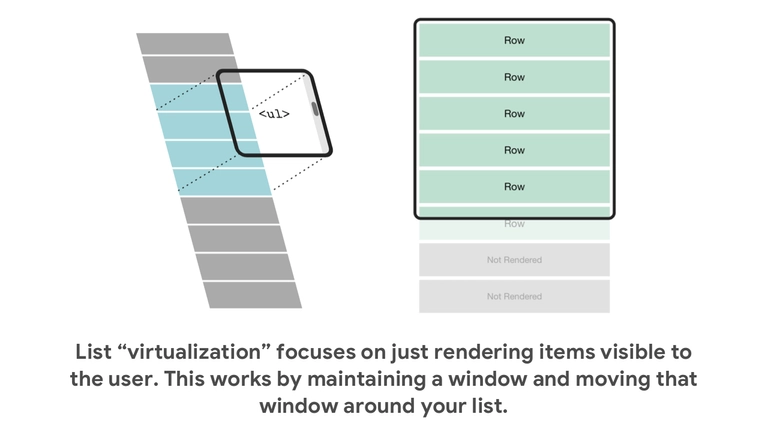
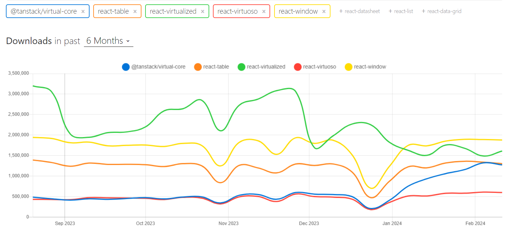
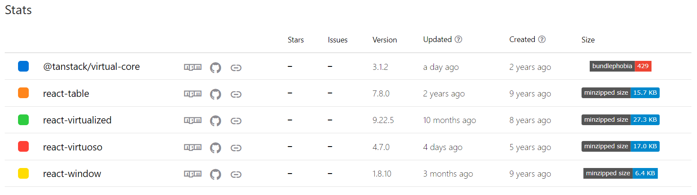
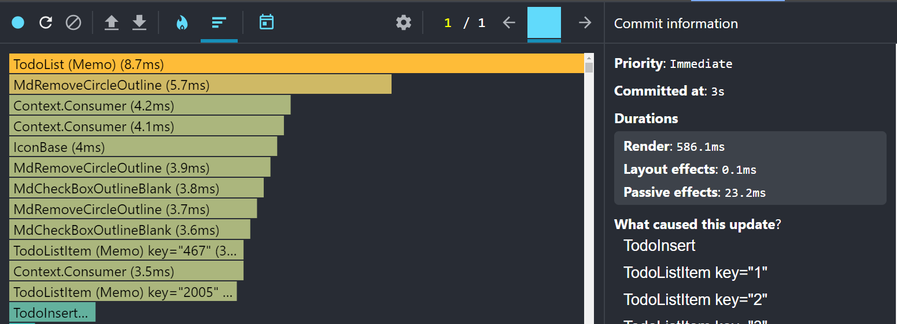
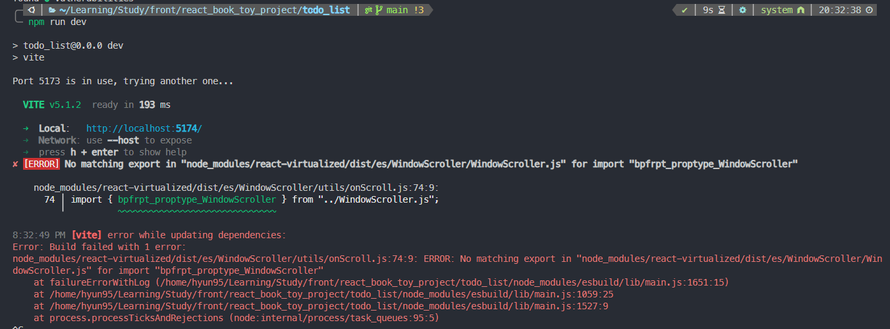
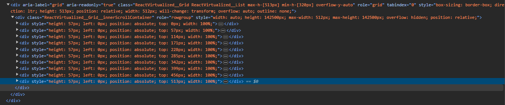
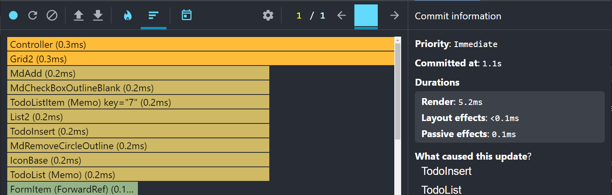
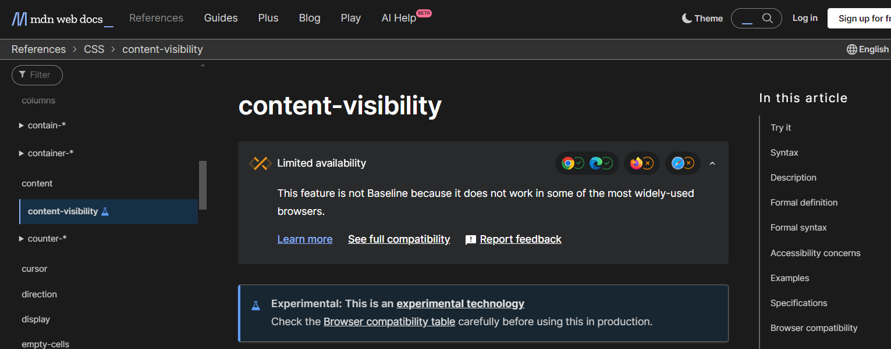

# 리스트 렌더링 최적화

## windowing 기법



### 정의

list 중 viewport 에 보이는 부분만 렌더링하고 나머지는 스크롤 할 때 보이도록 하는 것

### 동작및 효과

- 윈도우 스크롤을 리스트 스크롤에 적용
- 페이지 재방문 시 스크롤 위치 유지
- 아이템의 높이가 자동으로 조절
- 화면에 보이는 아이템만 렌더링
- 열의 수를 반응형 으로 조정
- 양방향 무한 데이터 불러오기과 연결

## virtual list library

### [npm trends](https://npmtrends.com/@tanstack/virtual-core-vs-react-table-vs-react-virtualized-vs-react-virtuoso-vs-react-window)에서 확인한 지난 반 년간의 가상 리스트 라이브러리 비교 및 현 상황





react-virtualized의 마지막 업데이트는 10개월 전 이슈 대응을 멈춘 듯 함

Tanstack 관련 라이브러리를 사용한다면 @tanstack/virtual-core를 고려해볼 만 함

react-window의 번들 사이즈가 압도적으로 작지만 필요한 라이브러리가 추가적으로 요구되기 때문에 비슷함

react-virtuoso, react-window, @tanstack/virtual-core 이슈 대응을 해주는 라이브러리 이므로 3중 하나를 선택할 것 같다.

정리하자면, 세부적인 기능까지 필요한 경우 react-virtualized와 react-virtuoso를 비교하여 원하는 라이브러리를 선택하면 되고, 간단한 기능 구현은 react-window를 활용하면 좋을 듯 합니다.

## 적용전 성능 측정
```typescript
function TodoList() {
  const { todos } = useTodoStore()
  return (
    <div className="max-h-[513px] min-h-[320px] overflow-y-auto">
      {todos.map((item: TodoItem) => (
        <TodoListItem key={item.id} content={item} />
      ))}
    </div>
  )
}

export default React.memo(TodoList)
```




## react-virtualized 적용 후 vite 빌드시 import 오류 발생 및 해결



### vite 빌드시 import 오류

**문제 원인**

[react-virtualized repo issue link](https://github.com/bvaughn/react-virtualized/issues/1632)

```javascript
import { bpfrpt_proptype_WindowScroller } from "../WindowScroller.js";
```

[Vite의 사전 번들링 기능은 Esbuild를 사용하고 있습니다. Go로 작성된 Esbuild는 Webpack, Parcel과 같은 기존의 번들러 대비 10-100배 빠른 속도를 제공합니다.](https://ko.vitejs.dev/guide/why.html#slow-server-start)

브라우저에서 ESM 모듈(require)을 가져올 때와 같이
export 되지 않은 존재 하지 않는 모듈을 import 하고 있어 발생한 오류

import 오류가 발생했을 때 CRA에서 사용한 webpack은 존재하지 않는 모듈의 import를 무시하고 번들링을 진행하고 브라우저와 esbuild/rollup과 같은 엄격한 번들러는 번들링을 중단한다.

react-virtualized의 저장소 issue를 보면 관리자가 수정하지 않은 것 같습니다.

**해결 방법**

1. [node_modules/react-virtualized/dist/es/WindowScroller/utils/onScroll.js 74번째 행을 주석처리](https://blog.csdn.net/Sheng_zhenzhen/article/details/134695860)

- 장점: 순정 라이브러리 사용
- 단점: 버전 업데이트 되면 잊지말고 주석처리 해야 함(but 업데이트가 거의 없는 라이브러리 차라리 vite혹은 esbuild가 고치는게 더 빠를지도)

2. [다른 사람이 1번으로 수정한 임시 패키지 배포을 사용하기](https://disco-biscuit.tistory.com/56)
- 장점: 간단하게 바로적용 가능
- 단점: 원본 라이브러리가 업데이트 된 경우 다시 원본으로 바꿔야 함

3. [vite혹은 esbuild config 파일 설정으로 해당 파일의 import문을 무시하기](https://github.com/bvaughn/react-virtualized/issues/1722#issuecomment-1872544019)
- 장점 : 순정 라이브러리 사용 + 패키지파일을 수정할 필요가 없음
- 단점 : 번거롭고 안되는 레퍼런스가 많음

### react-virtualized <List/> style props 문제

**문제 정의 및 원인**

key 값이 루프되거나 뜬금 없는 값이 전달되고 렌더링이 일부만 된다.

```typescript
function TodoList() {
  const { todos } = useTodoStore()

  const rowRenderer: ListRowRenderer = useCallback(
    ({ index, key, style }) => {
      const todo = todos[index]
      return (
        // key값 : "1-0" -> "2-0" -> ... -> "11-0" -> "1-0" or "36-0"
          <TodoListItem key={key} content={todo} />
      )
    },
    [todos],
    ...
}
```
**해결 방법**



ListRowRenderer의 파라미터로 gird container에 사용될 style 속성을 반드시 props로 전달하거나 감싸주어야 한다. 

```typescript
function TodoList() {
  const { todos } = useTodoStore()

  const rowRenderer: ListRowRenderer = useCallback(
    ({ index, key, style }) => {
      const todo = todos[index]
      return (
        <div key={key} style={style}>
          <TodoListItem key={todo.id} content={todo} />
        </div>
      )
    },
    [todos],
    ...
}
```

## react-virtualized 적용 후 성능 측정

```typescript
function TodoList() {
  const { todos } = useTodoStore()

  const rowRenderer: ListRowRenderer = useCallback(
    ({ index, key, style }) => {
      const todo = todos[index]
      return (
        <div key={key} style={style}>
          <TodoListItem key={todo.id} content={todo} />
        </div>
      )
    },
    [todos],
  )
...
}
export default React.memo(TodoList)
```


## CSS content-visibility 속성을 사용한 렌더링 최적화



[mdn](https://developer.mozilla.org/en-US/docs/Web/CSS/content-visibility)

[참조 블로그](https://mong-blog.tistory.com/entry/CSS-%EB%A0%8C%EB%8D%94%EB%A7%81-%ED%8D%BC%ED%8F%AC%EB%A8%BC%EC%8A%A4%EB%A5%BC-%EB%86%92%EC%97%AC%EC%A3%BC%EB%8A%94-content-visibility)

content-visibility는 페이지 로드 성능을 향상시킬 수 있는 CSS 속성이다.
큰 엘리먼트의 요소 중 일부가 아직 화면에 보이지 않는 경우, 보이지 않는 요소의 렌더링과 페인팅을 막을 수 있다.

|속성|설명|
|---|---|
|visible|- 요소가 정상적으로 배치되고 렌더링된다.
|| - 별다른 성능 향상이 없다.|
|hidden|- 콘텐츠에 display: none 속성을 적용하는 것과 유사하게 요소의 콘텐츠 렌더링을 건너뛴다.
|| - 검색, 탭 순서 탐색 등의 사용자 에이전트 기능에서도 접근할 수 없어야 한다.|
|auto|- 요소가 화면 밖에 있으면 하위 항목이 렌더링되지 않는다.
||- 초기 로드 속도를 향상시킬 수 있다.|


```css
  content-visibility: auto; 
  contain-intrinsic-size: 100px 1000px; /* 너비 높이 */
```


## 결론

최적화 결과: 586.1ms -> 5.2ms

windowing 기법을 지원하는 라이브러리를 적용하면 렌더링 최적화 효과가 뛰어나기 때문에 무한 스크롤을 사용한다면 무조건 적용 해야 한다.

CSS의 실험기능인 content-visibility 속성을 적용하여 렌더링 최적화가 가능하지만 크로스 브라우징 문제가 있다